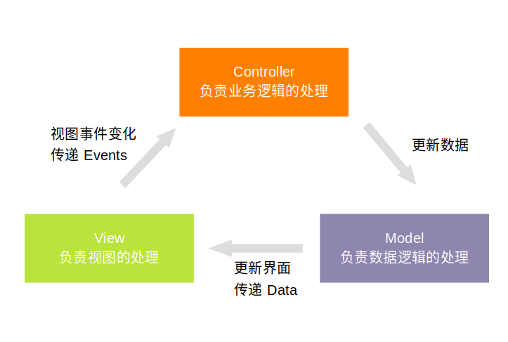
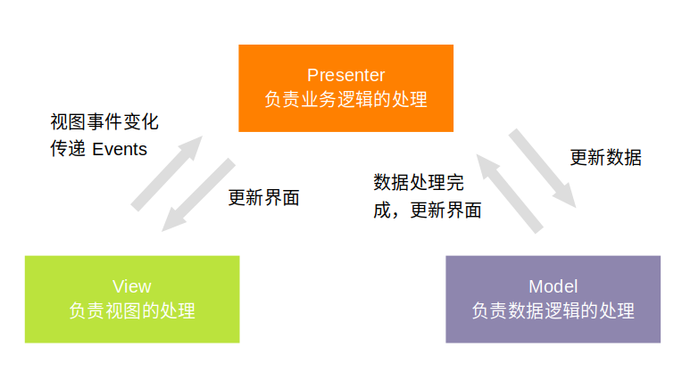
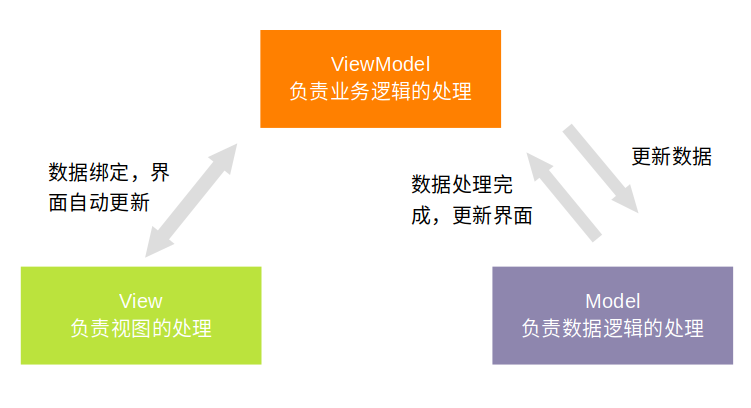

# 盘点那些年我们使用过的架构模式


说到架构模式，这些年来流行过的几种模式分别是：MVC、MVP、MVVM

### 开始前思考一个问题

为什么要有架构模式

1. 解决的问题是什么
2. 角色是如何划分的
3. 各角色之间是如何通信的

一个例子：

> 一个 EditText，一个 TextView，一个 Button。在 EditText 中输入内容，内容会展示在 TextView 上；点击 Button，TextView 上的内容清空

### 如果没有架构模式

```kotlin
class NormalFragment : Fragment() {
    companion object {
        fun newInstance(): Fragment {
            return NormalFragment()
        }
    }
    private val handler: Handler = Handler()

    override fun onCreateView(inflater: LayoutInflater, container: ViewGroup?, savedInstanceState: Bundle?): View? {
        return inflater.inflate(R.layout.architecture, container, false)
    }

    override fun onViewCreated(view: View, savedInstanceState: Bundle?) {
        super.onViewCreated(view, savedInstanceState)
        titleText.text = "NORMAL"
        edit.addTextChangedListener(object : TextWatcher {
            override fun afterTextChanged(s: Editable?) {
                handleData(s.toString())
            }

            override fun beforeTextChanged(s: CharSequence?, start: Int, count: Int, after: Int) {
            }

            override fun onTextChanged(s: CharSequence?, start: Int, before: Int, count: Int) {
            }
        })
        clearText.setOnClickListener {
            edit.setText("")
        }
    }

    // 数据的处理，真实情况下可能是网络请求，磁盘存取，大量计算逻辑等等
    private fun handleData(data: String) {
        if (TextUtils.isEmpty(data)) {
            msgText.text = "default msg"
            return
        }
        msgText.text = "handle data ..."
        handler.removeCallbacksAndMessages(null)
        // 延迟来模拟网络或者磁盘操作
        handler.postDelayed({
            msgText.text = "handled data: $data"
        }, 3000)
    }
}

```

分析下这么写有什么缺点：

- 所有的逻辑处理，视图更新，网络请求等逻辑都在 Fragment/Activity/View 里，逻辑臃肿，职责不清晰
- 不易扩展，牵一发而动全身

### 如果使用 MVC



1. 解决什么问题？

   没有架构模式的情况下，存在代码耦合职责不清晰等问题，MVC 解决的就是通过把控制逻辑、视图更新、数据处理等分离到不同的角色进行代码的解耦

2. 角色如何划分

   按照视图更新、数据处理、逻辑控制划分为 View、Model 和 Controller

3. 如何通信

   View 产生事件，通知 Controller，Controller 处理逻辑并通知 Model 更新数据，Model 更新完数据通知 View 刷新界面

#### Show me the code

接口定义

```kotlin
// 数据模型接口，定义了数据模型的操作
interface IModel {
    fun setView(view: IView)
    // 数据模型处理输入的数据
    fun handleData(data: String)
    // 清空数据
    fun clearData()
}

// 视图接口，定义视图的操作
interface IView {
    fun setController(controller: IController)
    // 数据处理中状态
    fun dataHanding()
    // 数据处理完成，更新界面
    fun onDataHandled(data: String)
}

// 控制器接口，定义控制器的逻辑
interface IController {
    fun setModel(model: IModel)
    // EditText 数据变化，通知控制器
    fun onDataChanged(data: String)
    // 清空按钮点击事件
    fun clearData()
}

```

Model 实现

```kotlin
class HandleModel : IModel {
    private var view: IView? = null
    private val handler: Handler = Handler(Looper.getMainLooper())

    override fun setView(view: IView) {
        this.view = view
    }

    // 接受到数据后，进行处理，这里设置了 3 秒的延迟，模拟网络请求处理数据的操作
    override fun handleData(data: String) {
        if (TextUtils.isEmpty(data)) {
            return
        }
        view?.dataHanding()
        handler.removeCallbacksAndMessages(null)
        // 延迟来模拟网络或者磁盘操作
        handler.postDelayed({
            // 数据处理完成，通知 View 更新界面
            view?.onDataHandled("handled data: $data")
        }, 3000)
    }

    // 接收到清空数据的事件，直接清空数据
    override fun clearData() {
        handler.removeCallbacksAndMessages(null)
        // 数据清空后，通知 View 更新界面
        view?.onDataHandled("")
    }
}

```

Controller 实现

```kotlin
class HandleController : IController {
    private var model: IModel? = null

    override fun onDataChanged(data: String) {
        model?.handleData(data)
    }

    override fun clearData() {
        model?.clearData()
    }

    override fun setModel(model: IModel) {
    }
}

```

View 实现

```
class MVCFragment : Fragment(), IView {

    companion object {
        fun newInstance(): Fragment {
            return MVCFragment()
        }
    }

    private val model: IModel = HandleModel()
    private var controller: IController = HandleController()

    override fun onCreateView(inflater: LayoutInflater, container: ViewGroup?, savedInstanceState: Bundle?): View? {
        return inflater.inflate(R.layout.architecture, container, false)
    }

    override fun onViewCreated(view: View, savedInstanceState: Bundle?) {
        super.onViewCreated(view, savedInstanceState)
        setController(controller)
        model.setView(this)

        titleText.text = "MVC"
        edit.addTextChangedListener(object : TextWatcher {
            override fun afterTextChanged(s: Editable?) {
                // 通知 Controller 输入的数据产生变化
                controller?.onDataChanged(s.toString())
            }

            override fun beforeTextChanged(s: CharSequence?, start: Int, count: Int, after: Int) {
            }

            override fun onTextChanged(s: CharSequence?, start: Int, before: Int, count: Int) {
            }
        })
        clearText.setOnClickListener {
            // 通知 Controller 清空数据事件
            controller?.clearData()
        }
    }

    // Model 数据变化，进行界面更新
    override fun onDataHandled(data: String) {
        if (TextUtils.isEmpty(data)) {
            edit.setText("")
            msgText.text = "default msg"
        } else {
            msgText.text = data
        }
    }

    // Model 数据变化，进行界面更新
    override fun dataHanding() {
        msgText.text = "handle data ..."
    }

    override fun setController(controller: IController) {
        this.controller = controller
    }
}
```

#### 优缺点分析

优点：

1. 结构清晰，职责划分清晰
2. 降低耦合
3. 有利于组件重用

缺点：

1. Model 直接操作 View，View 的修改会导致 Controller 和 Model 都进行改动
2. 增加了代码结构的复杂性

### 如果使用 MVP



1. 解决什么问题

   MVC 中的问题是 Model 中持有 View，所以 MVP 解决的问题是 View 和 Model 的耦合

2. 角色如何划分

   View 负责使用更新，Model 负责数据处理，Presenter 负责控制逻辑并且作为 View 和 Model 的通信桥梁

3. 如何通信

   View 产生事件通知 Presenter 处理逻辑，Presenter 同时 Model 更新数据，Model 更新完数据通知 Presenter，Presenter 再告诉 View 让 View 做视图更新

#### Show me the code

接口定义

```kotlin
// 模型接口，定义了数据模型的操作
interface IModel {
    fun setPresenter(presenter: IPresenter)
    // 梳理数据
    fun handleData(data: String)
    // 清除数据
    fun clearData()
}

// 视图接口，定义了视图的操作
interface IView {
    fun setPresenter(presenter: IPresenter)
    // 数据处理中视图
    fun loading()
    // 数据展示
    fun showData(data: String)
}

// 控制器，定义了逻辑操作
interface IPresenter {
    fun setView(view: IView)
    fun setModel(model: IModel)
    // Model 处理完成数据通知 Presenter
    fun dataHandled(data: String)
    // Model 清除数据后通知 Presenter
    fun dataCleared()
    // View 中 EditText 文字变化后通知 Presenter
    fun onTextChanged(text: String)
    // View 中 Button 点击事件通知 Presenter
    fun onClearBtnClicked()
}

```

Model 实现

```kotlin
class HandleModel : IModel {
    private var presenter: IPresenter? = null
    private var handler = Handler(Looper.getMainLooper())

    override fun handleData(data: String) {
        if (TextUtils.isEmpty(data)) {
            return
        }
        handler.removeCallbacksAndMessages(null)
        // 延迟来模拟网络或者磁盘操作
        handler.postDelayed({
            // 数据处理完成，通知 Presenter
            presenter?.dataHandled("handled data: $data")
        }, 3000)
    }

    override fun clearData() {
        handler.removeCallbacksAndMessages(null)
        // 数据清理完成，通知 Presenter
        presenter?.dataCleared()
    }

    override fun setPresenter(presenter: IPresenter) {
        this.presenter = presenter
    }

}

```

Presenter 实现

```kotlin
class Presenter : IPresenter {
    private var model: IModel? = null
    private var view: IView? = null

    override fun setModel(model: IModel) {
        this.model = model
    }

    override fun setView(view: IView) {
        this.view = view
    }

    override fun dataHandled(data: String) {
        view?.showData(data)
    }

    override fun dataCleared() {
        view?.showData("")
    }

    override fun onTextChanged(text: String) {
        view?.loading()
        model?.handleData(text)
    }

    override fun onClearBtnClicked() {
        model?.clearData()
    }
}
```

View 实现

```kotlin
class MVPFragment : Fragment(), IView {

    companion object {
        fun newInstance(): Fragment {
            val presenter = Presenter()
            val fragment = MVPFragment()
            val model = HandleModel()
            fragment.setPresenter(presenter)
            model.setPresenter(presenter)
            presenter.setModel(model)
            presenter.setView(fragment)
            return fragment
        }
    }

    var mpresenter: IPresenter? = null

    override fun onCreateView(inflater: LayoutInflater, container: ViewGroup?, savedInstanceState: Bundle?): View? {
        return inflater.inflate(R.layout.architecture, container, false)
    }

    override fun onViewCreated(view: View, savedInstanceState: Bundle?) {
        super.onViewCreated(view, savedInstanceState)
        titleText.text = "MVP"

        edit.addTextChangedListener(object : TextWatcher {
            override fun afterTextChanged(s: Editable?) {
                // 传递 文字修改 事件给 Presenter
                mpresenter?.onTextChanged(s.toString())
            }

            override fun beforeTextChanged(s: CharSequence?, start: Int, count: Int, after: Int) {
            }

            override fun onTextChanged(s: CharSequence?, start: Int, before: Int, count: Int) {
            }
        })
        clearText.setOnClickListener {
            // 传递按钮点击事件给 Presenter
            mpresenter?.onClearBtnClicked()
        }
    }

    override fun setPresenter(presenter: IPresenter) {
        this.mpresenter = presenter
    }

    // 展示数据处理中的视图
    override fun loading() {
        msgText.text = "handling data ..."
    }

    // 展示处理后的数据
    override fun showData(data: String) {
        msgText.text = data
    }
}

```

#### 优缺点分析

优点：

1. 结构清晰，职责划分清晰
2. 模块间充分解耦
3. 有利于组件的重用

缺点：

1. 会引入大量的接口，导致项目文件数量激增
2. 增大代码结构复杂性

### 如果使用 MVVM



1. 解决什么问题

   MVP 中已经将 View 和 Model 进行隔离，但是 Presenter 中还是需要持有 View，MVVM 解决的问题是进一步将 View 和 Presenter 进行解耦

2. 角色如何划分

   View 负责视图更新，Model 负责数据处理，ViewModel 负责处理控制逻辑

3. 如何通信

   View 产生事件通知 ViewModel 控制逻辑，ViewModel 通知 Model 更新数据，Model 更新数据之后通知 ViewModel，而 View 能够感知 ViewModel 的变化而自动更新自己的 UI (这需要借助 LiveData)

#### Show me the code（DataBinding 版本）

接口定义

```kotlin
// ViewModel 接口，定义了逻辑操作
interface IViewModel {
    fun setModel(model: IModel)
    fun handleText(text: String?)
    fun clearData()
    fun dataHandled(data: String?)
    fun dataCleared()
}

// 模型接口，定义了数据操作
interface IModel {
    fun setViewModel(viewModel: IViewModel)
    fun handleData(data: String?)
    fun clearData()
}
```

Model 实现

```kotlin
class HandleModel : IModel {
    private var viewModel: IViewModel? = null
    private var handler = Handler(Looper.getMainLooper())

    override fun handleData(data: String?) {
        if (TextUtils.isEmpty(data)) {
            return
        }
        handler.removeCallbacksAndMessages(null)
        // 延迟来模拟网络或者磁盘操作
        handler.postDelayed({
            // 数据处理完成通知 ViewModel
            viewModel?.dataHandled("handled data: $data")
        }, 3000)
    }

    override fun clearData() {
        handler.removeCallbacksAndMessages(null)
        // 数据清理完成通知 ViewModel
        viewModel?.dataCleared()
    }

    override fun setViewModel(viewModel: IViewModel) {
        this.viewModel = viewModel
    }
}
```

ViewModel 实现

```kotlin
class ViewModel : IViewModel {
    private var model: IModel? = null
    // View 绑定的数据，inputText 和 handledText 更新后会自动通知 View 更新界面
    var inputText: MutableLiveData<String> = MutableLiveData()
    var handledText: MutableLiveData<String> = MutableLiveData()

    init {
        // 注册数据监听，数据改变后通知 Model 去处理数据
        inputText.observeForever {
            handleText(it)
        }
        handledText.value = "default msg"
    }

    override fun handleText(text: String?) {
        if (TextUtils.isEmpty(text)) {
            handledText.value = "default msg"
            return
        }
        handledText.value = "handle data ..."
        model?.handleData(text)
    }

    // 清空按钮的点击事件绑定
    override fun clearData() {
        model?.clearData()
    }

    override fun setModel(model: IModel) {
        this.model = model
        model.setViewModel(this)
    }

    // Model 数据处理完成，设置 handledText 的值，自动更新到界面
    override fun dataHandled(data: String?) {
        handledText.value = data
    }

    // Model 数据处理完成，设置 inputText 的值，自动更新到界面
    override fun dataCleared() {
        inputText.value = ""
    }
}
```

View 的实现

```kotlin
class MVVMFragment : Fragment() {
    companion object {
        fun newInstance(): Fragment {
            return MVVMFragment()
        }
    }

    override fun onCreateView(inflater: LayoutInflater, container: ViewGroup?, savedInstanceState: Bundle?): View? {
        // 使用 databind 进行数据绑定
        var binding: ArchitectureBindingBinding = DataBindingUtil.inflate(inflater, R.layout.architecture_binding, container, false)
        binding.lifecycleOwner = this
        val viewModel = ViewModel()
        viewModel.setModel(HandleModel())
        binding.viewmodel = viewModel
        return binding.root
    }
}

```

```xml
<?xml version="1.0" encoding="utf-8"?>
<layout xmlns:android="http://schemas.android.com/apk/res/android"
    xmlns:app="http://schemas.android.com/apk/res-auto"
    xmlns:tools="http://schemas.android.com/tools">

    <!--定义 View 中绑定的数据-->
    <data>
        <variable
            name="viewmodel"
            type="com.zy.architecture.mvvm.ViewModel" />
    </data>

    <LinearLayout
        android:layout_width="match_parent"
        android:layout_height="match_parent"
        android:orientation="vertical"
        android:padding="10dp"
        tools:context=".MainActivity">

        <TextView
            android:id="@+id/titleText"
            android:layout_width="match_parent"
            android:layout_height="wrap_content"
            android:text="MVVM" />

        <!--双向绑定 inputText 到 EditText-->
        <EditText
            android:id="@+id/edit"
            android:layout_width="match_parent"
            android:layout_height="50dp"
            android:text="@={viewmodel.inputText}" 
            android:textColor="@android:color/darker_gray" />

        <!--绑定 handledText 到 TextView-->
        <TextView
            android:id="@+id/msgText"
            android:layout_width="wrap_content"
            android:layout_height="30dp"
            android:layout_marginTop="10dp"
            android:text="@{viewmodel.handledText}"
            android:textColor="@android:color/darker_gray" />

        <!--绑定清空数据的点击事件 到 TextView-->
        <TextView
            android:id="@+id/clearText"
            android:layout_width="match_parent"
            android:layout_height="30dp"
            android:layout_marginTop="10dp"
            android:background="@color/colorPrimary"
            android:gravity="center"
            android:onClick="@{() -> viewmodel.clearData()}"
            android:text="clear"
            android:textColor="@android:color/white" />
    </LinearLayout>
</layout>

```

#### 优缺点分析

优点：

1. 结构清晰，职责划分清晰
2. 模块间充分解耦
3. 在 MVP 的基础上，MVVM 把 View 和 ViewModel 也进行了解耦

缺点：

1. Debug 困难，由于 View 和 ViewModel 解耦，导致 Debug 时难以一眼看出 View 的事件传递
2. 因为数据直接绑定到 XML 上，单测难写
3. 代码复杂性增大

#### Show me the code（非 DataBinding 版本）

Model 和 ViewModel 都不用变，View 的实现需要稍微改一改

```kotlin
class MVVMFragment : Fragment() {
    companion object {
        fun newInstance(): Fragment {
            return MVVMFragment()
        }
    }
  
  	private lateinit var textView: TextView
  	private lateinit var editText: EditText
  	private lateinit var button: Button
		
  	private val viewModel = ViewModels.of() // 获取 ViewModel
  
    override fun onCreateView(inflater: LayoutInflater, container: ViewGroup?, savedInstanceState: Bundle?): View? {
        val veiw = inflater.inflate( R.layout.architecture_binding, container, false)
        // 普通的 findViewById 找到要控制的 View
      	// ...
        return view
    }
  	
  	override fun onResume() {
      viewModel.handledText.observe({
        // 当 handleredText 发生变化就会回调这里
      })
    }
}
```

#### 优缺点分析

DataBinding 版本的实现中，DataBinding 自动帮我们处理了事件的监听和分发逻辑，好处是减少了很多模板代码，使得 View 的逻辑更加简洁，但是导致的另外一个问题是 Debug 困难和单侧比较难写；

如果使用非 DataBinding 版本，以上两个问题得以解决，还有一个好处是不需要额外引入 DataBinding，但是就体验不到 DataBinding 带来的便捷，这两种版本的实现可以视情况而定。


## 结语

架构模式是一种 「模式」，是一种「设计思想」，以上的代码示例只是为了展示架构的设计思路，并非最佳实践，落实到真实编码中，各种模式的实现可以有很多中，就拿 MVP 来说，也可以有很多版本，比如一个比较好的 MVP 的可能是

- P 里面不能有 M 的实例化
- M 不能依赖 P，P 操作 M 的回调应该通过 P 传递一个 callback 来实现
- P 中尽量不要依赖 android 包的代码
- 等等...

> 抛开具体场景谈架构都是耍流氓