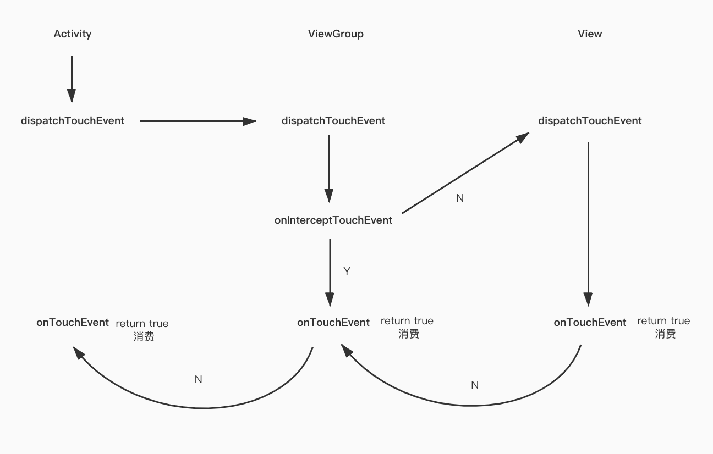

# 彻底搞懂 View 事件分发机制

## 事件传递流程（硬件 ViewRootImpl -> Window -> Activity -> ViewGroup -> View）

从上往下的顺序：

* 硬件
* `ViewRootImpl#processPointerEvent`
  这里完成了「硬件」到「软件」的传递
* `ViewRootImpl.mView(DecorView)#dispatchPointerEvent`
  这里是 ViewRootImpl 到 DecorView 的传递
* `DecorView#dispatchTouchEvent`
* `DecorView.mWindow(PhoneWindow).getCallback(Window#Callback)#dispatchTouchEvent`
  这里的 callback 其实就是 window 中的 Activity;Activity 实现了 Window#Callback，并在创建 Window 的时候，通过 window.setCallback(this) 将自己赋值给 window 的 mCallback 成员变量了
* `Activity(Window#Callback)#dispatchTouchEvent`
  这里已经传递到 Activity 了
* `Activity.getWindow().superDispatchTouchEvent()`
* `PhoneWindow#superDispatchTouchEvent()`
* `PhoneWindow.mView(DecorView)#superDispatchTouchEvent`
* `DecorView#super.dispatchTouchEvent`
  这里又回到了 DecorView，这里和上面不一样，这里是调用了 super. 方法，也就是 DecorView 的父类 ViewGroup 的方法，这是就事件就传递到了 ViewGroup 了
* `ViewGroup#dispatchTouchEvent`
* `View#dispatchTouchEvent`

整个事件的传递顺序依次是：硬件 -> ViewRootImpl -> DecorView -> Activity -> ViewGroup -> View

## Activity -> ViewGroup -> View 的事件分发机制



##### 伪代码

**Activity**

```Kotlin
dispatchTouchEvent(): Boolean {
 if(super.dispatchTouchEvent()) {
    return true
 }
 return onTouchEvent()
}
```

**ViewGroup**

```Kotlin
dispatchTouchEvent(): Boolean {
 val intercepted = onInterceptTouchEvnet();
 if(intercepted) {
    return onTouchEvent()
 }
 if(super.dispatchTouchEvent()) {
    return true
 }
 return onTouchEvent()
}
```

**View**

```Kotlin
dispatchTouchEvent(): Boolean { 
    return onTouchEvent()
}
```

## View 的事件分发机制

```java
public boolean dispatchTouchEvent(MotionEvent event) {  
    if (mOnTouchListener != null && (mViewFlags & ENABLED_MASK) == ENABLED &&  
            mOnTouchListener.onTouch(this, event)) {  
        return true;  
    }  
    return onTouchEvent(event);  
}
```

只有当以下条件满足，dispatchTouchEvent 才返回 true
第一个条件：mOnTouchListener != null；
第二个条件：(mViewFlags & ENABLED_MASK) == ENABLED；
第三个条件：mOnTouchListener.onTouch(this, event) 返回 true；

所以，onTouchListener 优先于 onTouchEvent 和 onClickListener；onClick 的回调是在 performClick() 里面，而 performClick() 是在 onTouchEvent 里面被调用的。所以：

* 如果 enable 为 false，不会走 onTouch、onTouchEvent 和 onClick
* 如果设置了 onTouchListener 且在 onTouch 里面返回了 true，代表消费事件，那么 onTouchEvent 和 onClick 都不会被执行；
* 如果没有设置 onTouchListener 或者设置了 onTouchListener 但是在 onTouch 里面返回了 false，或者 enable 为 false，那么将会走 onTouchEvent，当 enable 为 true 时也会回调 onClick（如果设置了 OnClickListener 的话）

## 同级的两个 View 之间是怎么分发事件的

View1 和 View2 是同一层级的两个 View，彼此没有包含关系，而且在位置上重叠，View2 盖在 View1 上面

1、ViewGroup 在向子 View 分发事件的时候，会根据触摸 xy 的坐标，计算出所有可以接收该坐标事件的子 View，然后按照从前往后的顺序排序，也就是最上层的子 View 会先收到事件
2、ViewGroup 会遍历上述找出的所有子 View，然后分发事件 child.dispatchTouchEvent，只要有一个子 View 返回了 true，代表事件在该子 View 上消费，循环结束，后续所有事件 ACTION_MOVE、ACTION_UP 都将在该 View 上直接消费
3、如果子 View child.dispatchTouchEvent 返回 false，则循环遍历继续找下一个子 View，当所有子 View 都返回 false 代表所有子 View 都不消费事件，事件将回溯到 ViewGroup 的 onTouchEvent

## 当所有 View 都不处理 ACTION_DOWN

后续所有事件 ACTION_MOVE、ACTION_UP 都将在 Activity 处理

## 同时对父 View 和子 View 设置点击方法，优先响应哪个？为什么会这样？

子 View 先响应点击事件。因为 onClick 事件是在 onTouchEvent 中被调用的（performClick()）,所以事件分发顺序是父 View dispatchTouchEvent -> 子 View onTouchEvent -> 子 View onClick() 返回 true     

## 在 ViewGroup 中的 onTouchEvent 中消费 ACTION_DOWN 事件（onInterceptTouch 默认设置），那么 ACTION_MOVE 和 ACTION_UP 事件是怎么传递的

```java
dispatchTouchEvent(): ACTION_DOWN --> Activity
dispatchTouchEvent(): ACTION_DOWN --> view_group
onInterceptTouchEvent(): ACTION_DOWN --> view_group
dispatchTouchEvent(): ACTION_DOWN --> view_2
onTouchEvent(): ACTION_DOWN --> view_2
dispatchTouchEvent(): ACTION_DOWN --> view_1
onTouchEvent(): ACTION_DOWN --> view_1
onTouchEvent(): ACTION_DOWN --> view_group

dispatchTouchEvent(): ACTION_MOVE --> Activity
dispatchTouchEvent(): ACTION_MOVE --> view_group
onTouchEvent(): ACTION_MOVE --> view_group
onTouchEvent(): ACTION_MOVE --> Activity

dispatchTouchEvent(): ACTION_UP --> Activity
dispatchTouchEvent(): ACTION_UP --> view_group
onTouchEvent(): ACTION_UP --> view_group
onTouchEvent(): ACTION_UP --> Activity
```

onInterceptTouchEvent 只在 ACTION_DOWN 的时候才会被调用

## 为什么子 View 不消费 ACTION_DOWN,之后的所有事件都不会向下传递了

答案是：mFirstTouchTarget。当子 view 对事件进行处理的时，那么 mFirstTouchTarget 就会被赋值，若是子 view 不对事件进行处理，那么 mFirstTouchTarget 就为 null，之后 ViewGroup 就会默认拦截所有的事件。我们可以从 dispatchTouchEvent 中找到如下代码，可以看出来，若是子 View 不处理 ACTION_DOWN,那么之后的事件也不会给到它了

```java
// 检查是否拦截
            final boolean intercepted;
            if (actionMasked == MotionEvent.ACTION_DOWN
                    || mFirstTouchTarget != null) {
                    
                // 省略和问题无关代码
            } else {
            
                // 默认拦截
                intercepted = true;
            }
```

