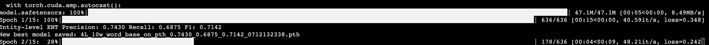

## 引言：踏上修仙之路

> 修仙路漫漫，炼丹不易，唯有借助仙师指点，方能事半功倍。

在这个 AI 技术日新月异的时代，作为一个机器学习领域的"凡人"，我却接到了一个颇具挑战的任务：开发一个能在用户输入文本时**实时识别文本实体**的功能。简单来说，就是当用户输入"我是一只**小猪**"这样的文字时，系统能够立刻识别出"小猪"是一个实体词。
这种任务交给大模型处理自然不在话下，但产品对性能提出了苛刻要求：**实时性高，准确率高**。这意味着我需要训练一个能在移动端本地运行的模型，而不是依赖云端 API。
就这样，我这个从未接触过模型训练的"凡人"，踏上了 AI "炼丹"（模型训练）之旅。面对这座陡峭的技术高山，我决定借助一位特殊的"仙师"—— AI 大模型，来帮助我学习并完成这个任务。

### 求道之心：为何选择 AI 辅助学习 AI

为什么选择用 AI 来学习 AI？这个问题很简单：在面对全新领域时，我们需要快速获取知识、理清思路。而 AI 大模型恰好能提供这种帮助：

- **知识广博**：AI 大模型已经学习了海量的机器学习相关知识
	
- **解释清晰**：能够将复杂概念用通俗易懂的方式解释
	
- **代码能力**：可以提供完整的训练脚本和部署代码
	
- **全天候**：随时可以请教，不用等待人类专家的回复

在这篇"修仙游记"中，我将分享如何借助 AI 大模型从零开始学习模型训练，以及如何一步步解决实际问题的全过程。

## 初入门派：基础概念与知识准备

刚入"修仙门派"，首先要了解基本的"法诀"（技术概念）。面对陌生的领域，我直接向我的"仙师"——AI 大模型请教：

> 我：有哪些方案可以实现文本实体词识别，方案要支持运行在移动端，识别实体精度高，运行速度快，占用内存小...

> AI："仙师"沉思片刻，给出了两条可行的修炼路径：**基于** **BERT** **模型微调**或**训练** **CRF** **模型**。

这两个方案听起来都很专业，但作为一个"凡人"，我对这些概念一无所知。于是，我需要先向"仙师"请教这些基础概念。

### 修仙基础法诀：核心概念解析

> GPT 解释：见文末附录

#### 什么是 BERT？

BERT（Bidirectional Encoder Representations from Transformers）可以理解为一位已经修炼多年的"仙家大能"。它通过阅读海量文本，已经积累了丰厚的"内力"（语言理解能力）。
想象一下，如果把语言理解比作修仙世界中的"悟道"，那么 BERT 就像是一位已经参透了大道玄机的高人。

#### 什么是微调（Fine-tuning）？

微调就像是在前辈留下的"仙家传承"（预训练模型）基础上，针对特定任务进行"小范围修炼"。
比如，BERT 已经学会了理解人类语言的基本规律，但它并不专精于识别文本中的实体。通过微调，我们可以让它专注学习这一特定技能，而不必从零开始修炼。

#### 什么是 CRF（条件随机场）？

如果说 BERT 像是一位靠强大"内力"解决问题的仙家大能，那么 CRF 则更像是一种精巧的"连环法阵"，通过规则和结构来解决问题。
CRF 特别擅长处理**序列标注**任务，它会考虑整个句子的上下文关系，为每个词分配最合理的标签。

#### BERT 和 CRF 的区别？

| 方面 | CRF | BERT |
| :-- | :-- | :-- |
| 上下文建模 | 局部上下文+标签依赖，靠特征 | 全局上下文，自动提取语义 |
| 表达能力 | 依赖手工特征，表达能力有限 | 深层语义理解，表达能力极强 |
| 训练需求 | 数据量要求较低，特征工程重要 | 需要大数据、大算力预训练 |
| 推理速度 | 非常快 | 较慢，资源消耗大 |
| 适用场景 | 资源受限、对标签序列依赖要求高 | 追求高精度、复杂语义理解 |
| 上限 | 有限，受特征影响大 | 极高，当前主流 SOTA |

#### 什么是 BIO 标注体系？

BIO 标注是实体识别任务中常用的一种标注方法，就像修仙者用特定的符号标记不同种类的灵草灵药：

- **B-ENT**：Begin，实体的开始，如"**北**京烤鸭"中的"北"
	
- **I-ENT**：Inside，实体的内部，如"北**京烤鸭**"中的"京烤鸭"
	
- **O**：Outside，非实体部分，如"我喜欢吃"这几个字
	

这种标注方式使模型能够学会识别实体的边界，就像修仙者能够准确辨认出灵药与普通草木的分界。

### 修炼评价标准：准确率与召回率

在修仙世界中，炼丹的成功与否需要评价标准。在实体识别任务中，我们主要关注两个指标：

#### 准确率（Precision）

准确率就像是"炼丹成功率"：在模型识别出的所有实体中，真正正确的比例。
计算公式：准确率 = 正确识别的实体数 ÷ 模型识别出的所有实体数
举例：如果模型从 100 段文本中识别出了 80 个实体，但其中只有 60 个是真正的实体，那么准确率就是 60÷80=75%。

#### 召回率（Recall）

召回率则像是"灵药采集率"：在所有应该被识别的实体中，模型成功识别出的比例。
计算公式：召回率 = 正确识别的实体数 ÷ 文本中实际存在的所有实体数
举例：如果文本中实际有 100 个实体，但模型只识别出了其中的 60 个，那么召回率就是 60÷100=60%。

#### F1 值

F1 值是准确率和召回率的调和平均数，提供了一个综合评价指标：
F1 = 2 × （准确率 × 召回率） ÷ （准确率 + 召回率）
就像是评价一位炼丹师的综合能力，既要看丹药的品质（准确率），也要看灵药的利用效率（召回率）。

### 炼丹口诀：模型训练的主要步骤

- 数据集准备：准备好用于训练的数据，这里主要是对文本进行打标，划分为训练集和验证集
	
- 数据编码：将输入转化成模型可识别的格式，例如先将文本进行分词、转成 id （模型只识别数字不识别文本）
	
- 训练：输入训练集、训练参数，开始“炼丹”
	
- 模型导出：将训练好的模型权重导出为可部署运行的模型格式，例如 onnx、tflite、bytenn 等
	

## BERT 模型微调之路——从入门到放弃

根据"仙师"的指点，我首先选择了 BERT 微调这条路径。毕竟，AI 告诉我这是当前最先进的方案，理论上能达到最高的准确率。

### 选择合适的"仙家传承"：模型基座

就像选择修仙功法一样，首先要选择一个适合的 BERT 模型作为基座。AI 推荐了以下几个候选：

| 模型名称 | 参数量 | 量化后大小 | 优势 | 劣势 |
| --- | --- | --- | --- | --- |
| BERT-base | 1.1 亿 | 约 400MB | 精度高 | 体积大，推理慢 |
| BERT-mini | 1100 万 | 约 40MB | 体积适中 | 精度降低 |
| TinyBERT | 1400 万 | 约 50MB | 针对移动端优化 | 需要额外蒸馏训练 |
| ALBERT | 1200 万 | 约 45MB | 参数共享，体积小 | 训练复杂 |

考虑到移动端的性能限制，在实际体验之后我最终选择了 TinyBERT 作为基座模型，它在模型大小和精度之间取得了较好的平衡，同时还提供了中文预训练版本。

### 炼丹材料收集：训练数据准备

有了功法，还需要"灵丹妙药"（训练数据）。但作为一个刚入门的"凡人"，我面临一个难题：没有足够的标注数据。
这时，我想到了一个妙计：何不让"大仙师"（大语言模型）来帮"小仙师"（TinyBERT）修炼？

**让大模型给小模型生成训练集——先富带动后富**
利用大语言模型的强大能力，为专用小模型生成训练数据，这是 AI 辅助学习 AI 的典型案例。

我向 AI 请教如何实现这一点，它给我提供了完整的数据生成方案：

1. 准备一批原始文本（prompt）
	
2. 使用大模型对这些文本进行分词和实体标注
	
3. 将标注结果转换为训练数据格式
	

以下是一个实际的例子：
原始文本：

```Plain
我想做一个关于小猫的表情包
```

大模型标注后：

```Plain
我 O
想 O
做 O
一个 O
关于 O
小猫 ENT
的 O
表情包 ENT
```

通过这种方式，我很快生成了 1.6w、10w、100w 条训练数据。这种"先富带动后富"的方式，极大地加速了我的"修仙"进程。

### 初试炼丹：模型训练与评估

有了模型基座和训练数据，接下来就是正式"炼丹"（训练模型）了。在这个过程中，AI "仙师"帮我编写了完整的训练脚本，并推荐了以下训练参数：

> 关于这些参数具体含义和影响，可见文末 GPT 问答

- 学习率：3e-5
	
- Batch size: 16
	
- 训练轮数：15 轮
	
- 优化器：AdamW
	

经过训练，我得到了第一个模型，在验证集上的表现如下：

- 准确率：75.01%
	
- 召回率：71.86%
	
- F1 值：73.40%
	

这个结果看起来还不错，但在实际测试中，我发现模型存在一些问题：

1. 对于句首的实体词识别效果不佳
	
2. 对单独的实体词（没有上下文）识别率很低
	

我向 AI "仙师"请教原因，它分析道：

> "训练数据中，大部分实体词都位于一段句子中间，模型对于这种开头就是实体词的学习效果并不好。需要准备一份数据集，把纯实体词也训练给模型。"

这就像修仙者初学法术，只能在特定环境下施展，而无法应对各种复杂情况。

### 不断优化：迭代训练过程

根据 AI 的建议，我开始了一系列优化尝试：

1. **数据增强**：添加了单独的实体词作为训练样本
	
2. **标注方式改进**：从简单的 ENT 标签升级到 BIO 标注体系
	
3. **输入处理优化**：将长文本按标点符号和空格分割，分段处理
	
4. **训练数据扩充**：从 1.6w 万条扩充到 10w 条
	

每次优化后，我都会记录模型表现，并向 AI 请教下一步改进方向。经过多轮迭代，最终模型在验证集上的表现提升到：

- 准确率：81.15%
	
- 召回率：78.77%
	
- F1 值：79.95%
	

> 当训练数据量级上去之后，训练速度越来越慢了，我的 macbookpro m3 都快撑不住了，最后无奈之下祭出究极炼丹炉 —— A100！
> 我的电脑：跑完 15 epoch 需要将近 30 个小时！
> 
> A100：只需要不到 3 分钟！
> 

### 道路崎岖：移动端部署碰壁

当我得到一个表现效果还不错的模型之后，开始尝试在移动端（Android）上部署，首先遇到的第一个问题是移动端上的推理框架选择。AI 告诉我的可选项有 onnxruntime、tflite 等；在经过一顿尝试和碰壁之后（此处省略踩坑辛酸史）最终选择将模型导出为 onnx 然后使用 onnxruntime 来进行推理部署。
接着又遇到第二个问题，之前模型的训练和推理都在电脑上借助 pytorch 运行，这些 python 的代码在移动端上无法复用，而推理时必须保证数据编码方式和训练时一致，于是又请教 AI 大师：

> 我：根据我 python 的训练代码和推理代码，写一份 c++ 版本的推理代码，供移动端部署推理，注意需要保持分词器，编码器实现完全一致
> AI: blablabla

AI 给出了一个可行方案：使用 huggingface 开源的 [tokenizer](https://github.com/huggingface/tokenizers) 的 rust 版本，编译成 c++ 接口，供推理层使用，然后在训练的时候导出分词器词典，作为推理时的 tokenizer 初始化参数，这样就能够实现和训练时保持完全一致的分词和编码逻辑。
经过一通操作和反复与 AI 大师深度交换 prompt 之后，跑通了最终部署方案：c++ 封装好实现分词、推理、后处理等逻辑，提供 ffi 给 Android（JNI）和 iOS 使用

### 遇到瓶颈：BERT 方案的局限

当终于在移动端跑起来之后，又遇到了一个严重问题：**推理速度太慢**！而且推理速度随着输入文本的长度增长线性增长，在高端机上处理一条 300 字文本需要 1200ms，低端机甚至需要 5000ms，远远无法满足实时交互的需求。

**理论最优不等于实际最优**
尽管 BERT 在理论上精度更高，但在移动端实际应用中，性能瓶颈可能成为致命问题。

面对 BERT 模型在移动端的性能瓶颈，我尝试了多种优化方法：

1. **模型量化**：将模型从 FP32 量化到 INT8，减小模型体积，对推理速度提升不高
	
2. **GPU 加速：** 尝试开启 GPU 推理，多线程等，效果不佳，模型中的大多数算子不支持 GPU 预算，开多线程反而降低了性能
	
3. **推理引擎优化**：尝试了 TFLite 和 ONNX Runtime 等不同推理引擎，尝试无效
	
4. **文本分段处理：** 将长文本按照标点符号分割成多个片段分批推理，但是又遇到精度影响问题
	

然而，这些优化后，推理速度仍然降不下来，无法满足实时交互需求。同时在识别单个输入的词时效果不佳，远远没有输入一长串文本效果好，然而后者又和性能问题相冲。这就像修炼了一门威力强大但施法时间过长的法术，在实战中难以施展。
到这一步，我不得不考虑 AI "仙师" 提到的另一条路径—— CRF 模型。

## 柳暗花明又一村：CRF 模型训练

在 BERT 方案遇到瓶颈后，我重新向 AI 请教 CRF 模型的相关知识。这就像修仙者在一条路上遇阻后，转而尝试另一种修炼方法。

### CRF 模型的原理与优势

CRF（条件随机场）是一种专门用于序列标注的算法模型。与 BERT 这种深度学习模型不同，CRF 更像是一种统计模型，它的特点是：

1. **考虑标签之间的依赖关系**：CRF 会考虑相邻标签之间的转移概率，如 B-ENT 后面更可能是 I-ENT
	
2. **全局最优解**：CRF 会寻找整个序列的全局最优标注结果
	
3. **特征工程**：CRF 依赖于人工设计的特征，而非自动学习特征
	

CRF 模型的最大优势在于**推理速度快**和**模型体积小**，非常适合移动端部署。但它也有缺点：需要精心设计特征，且理论上的准确率上限低于深度学习模型。

### 特征设计：CRF 模型的核心

在 AI 的指导下，我为 CRF 模型设计了以下特征：

1. **词本身特征**：当前词的字面值
	
2. **上下文特征**：前后几个词的信息
	
3. **位置特征**：词在句子中的位置
	

这些特征的设计就像布置"法阵"的关键点，每一个特征都对最终的识别效果有重要影响。

### 模型训练与评估

有了特征设计，接下来就是训练 CRF 模型。在 AI 的帮助下，我使用了 crfsuite 库来实现 CRF 模型的训练。
训练数据沿用了之前为 BERT 准备的 10w 条数据，但需要进行特征提取处理。训练过程出奇地快，在普通笔记本上几分钟就完成了，这与 BERT 需要数小时甚至数天形成鲜明对比。
训练完成后，CRF 模型在验证集上的表现如下：

- 准确率：79.53%
	
- 召回率：76.21%
	
- F1 值：77.84%
	

虽然这个结果略低于优化后的 BERT 模型，但差距并不大。而当我测试推理速度时，惊喜地发现 CRF 模型处理一条 300 字文本仅需 10 - 20 ms，比 BERT 模型快了近 100 倍！

**速度与准确率的平衡**
在实际应用中，有时候"够用"的准确率加上极快的速度，比高准确率但速度慢的方案更实用。

### 模型优化与迭代

尽管 CRF 模型的初始表现已经不错，但我仍然进行了一系列优化：

1. **特征组合优化**：尝试不同的特征组合，找到最佳平衡点
	
2. **窗口大小调整**：调整上下文窗口大小，从 1 到 5 进行实验
	
3. **训练数据优化**：针对错误案例，增加相应的增强训练数据
	

经过多轮优化，最终 CRF 模型在验证集上的表现提升到：

- 准确率：91.62%
	
- 召回率：72.35%
	
- F1 值：80.85%
	

这个结果已经非常接近 BERT 模型的表现甚至略好一些，而速度优势则保持不变。
且从实际的体验下看，不管是单个词输入还是长文本输入效果都比 BERT 要好很多！

### 移动端部署实现

有了训练好的 CRF 模型，下一步是将其部署到移动端。这一过程中，我遇到了一个挑战：crfsuite 库没有现成的移动端版本。
我再次向 AI "仙师"请教，它给我提供了详细的编译指南，帮助我将 crfsuite 编译为可在 Android 和 iOS 上使用的库。

**AI** **辅助解决技术难题**
当遇到具体技术实现问题时，AI 可以提供详细的操作指南，帮助跨越技术障碍。

最终的移动端部署方案包括：

1. **模型文件**：经过训练的 CRF 模型（约 2MB 大小）
	
2. **分词器**：简单的单字分割
	
3. **特征提取**：在移动端实现与训练时相同的特征提取逻辑
	
4. **推理引擎**：编译后的 crfsuite 库
	
5. **JNI** **封装**：提供上层调用接口，封装推理结果
	

部署完成后，在实际应用中测试，CRF 模型能够在 50ms 内完成一条 800 字文本的实体识别，完全满足实时交互的需求。

## 修炼总结：AI 辅助学习的心得

**最终效果展示：**


经过这段"修仙"之旅，我不仅成功开发了一个能在移动端实时识别文本实体的模型，还积累了宝贵的经验。

### 两条技术路径的对比

- 基于 BERT 微调：Transform 模型，推理精准度上限高；但移动端推理速度很慢，实际效果不佳
	
- CRF 模型：条件随机场，算法简单；推理速度快，模型小，适合移动端推理**移动端部署：** 
	

| 方面 | BERT 微调方案 | CRF 模型方案 |
| :-- | :-- | :-- |
| 推理精度 | 理论上限更高，模型泛化能力更强 | 强依赖训练集和特征工程，最终效果也非常不错 |
| 推理速度 | 慢（40ms-1200ms） 输入越长速度越慢 | 极快（10-50ms） |
| 模型大小 | 大（40-50MB） | 小（约 2MB） |
| 训练难度 | 高（需要 GPU 资源） | 低（普通电脑即可） |
| 部署复杂度 | 中等 | 较高（需要自行编译） |

实践证明，尽管 AI"仙师"最初推荐 BERT 方案为最佳选择，但在实际应用场景中，CRF 模型因其极快的推理速度和较小的体积，成为了更适合的方案。

**实践是检验真理的唯一标准**
AI 给出的建议虽然有价值，但始终需要结合实际场景验证。理论最优解不一定是实践最优解。

### AI 作为学习伙伴的优势与局限

**优势：** 

- **知识获取**：快速提供领域知识，解释复杂概念
	
- **代码支持**：提供完整的训练脚本和部署代码
	
- **问题诊断**：帮助分析模型表现不佳的原因
	
- **方案建议**：提供多种可行的技术路径
	

**局限：** 

- **理论与实践的差距**：AI 推荐的"最佳方案"可能不适合特定场景
	
- **经验缺乏**：无法提供真实项目中的"踩坑"经验
	
- **上下文限制**：处理复杂问题时需要多次交互
	

### 给其他"凡人"的修炼建议

如果你也是 AI 领域的"凡人"，希望借助 AI 来学习和解决问题，以下是我的一些建议：

1. **明确问题定义**：向 AI 清晰描述你的问题和约束条件
	
2. **循序渐进**：先了解基础概念，再深入技术细节
	
3. **实践验证**：不要盲信 AI 的建议，一定要通过实践验证
	
4. **持续迭代**：根据实际效果不断调整方案
	
5. **结合多种资源**：AI 是好帮手，但也要结合其他学习资源
	

## 路漫漫其修远兮：未来展望

回首这段"炼丹"之路，我从一个完全不懂机器学习的"凡人"，成长为能够独立训练和部署模型的"修炼者"。这一过程中，AI 大模型扮演了"仙师"的角色，提供知识、指导方向、解决难题。
虽然我已经成功完成了任务，但在 AI 这个浩瀚的"修仙世界"中，我学到的知识仍然只是冰山一角。

好在我们正处于一个 AI 爆发式发展的时代，借助 AI 来帮助我们了解 AI 以及其他不熟悉的领域，将成为未来的常态。
AI 这把利剑，已经开始指向那些可被代替的简单基础工作，我们要成为执剑者，才能有效防止被 AI 代替。而学会利用 AI 来辅助学习和工作，正是成为"执剑者"的第一步。

**对了，本文也是 AI+Agent 辅助生成的哦～ **


**都看到这了，各位彦祖亦菲们点点赞吧！ღ（ ´･ᴗ･\` ）比心❤️**


## 附录：修炼法器与材料

### 术语表

| 术语 | 解释 | "修仙"比喻 |
| :-- | :-- | :-- |
| BERT | 双向编码器表示转换器，一种预训练语言模型 | 已积累丰厚内力的仙家传承 |
| CRF | 条件随机场，一种序列标注算法 | 精巧的连环法阵 |
| 微调 | 在预训练模型基础上针对特定任务进行小范围训练 | 在前辈功法基础上修炼特定法术 |
| BIO 标注 | 实体标注方式，B（开始）、I（内部）、O（外部） | 标记灵药的特殊符号 |
| 准确率 | 模型预测为正的样本中真正为正的比例 | 炼丹成功率 |
| 召回率 | 真正为正的样本中被模型预测为正的比例 | 灵药采集率 |
| 量化 | 降低模型数值精度以减小体积和提高速度 | 将繁复法术简化为核心咒语 |

### AI 问答

#### 一、什么是 BERT 模型，为什么叫 BERT，在文本实体识别中，BERT 是怎么做到识别的，举例说明

##### 1. 什么是 BERT 模型？

BERT（Bidirectional Encoder Representations from Transformers）是一种基于 Transformer 结构的预训练语言模型，由 Google 于 2018 年提出。BERT 能够通过“预训练-微调”范式，在大量文本上预训练后，再针对具体任务（如文本分类、命名实体识别等）进行微调，取得了非常优秀的效果。
核心特点：

- 双向编码：BERT 能同时考虑一个词左边和右边的上下文（而不像传统的语言模型只考虑单向）。
- 预训练+微调：先在大规模语料上预训练，然后针对具体任务微调。
##### 2. 为什么叫 BERT？

BERT 的全称是 Bidirectional Encoder Representations from Transformers，意思是“基于 Transformer 的双向编码表示”。
- Bidirectional：双向的（同时看前后文）
- Encoder Representations：编码器得到的表示（Transformer 的编码器部分）
- from Transformers：基于 Transformer 架构
所以简称为 BERT。
##### 3. 在文本实体识别中，BERT 是怎么做到识别的？

文本实体识别（Named Entity Recognition, NER）是指识别文本中具有特定意义的实体（如人名、地名、机构名等）。

**BERT 的做法：**

1. 输入处理
  - 将文本分词，加入特殊符号（如 [CLS], [SEP]）。
  - 每个词/子词转换为向量输入 BERT。
2. 上下文编码
  - BERT 的多层 Transformer 编码器会为每个词生成一个上下文相关的向量（embedding），这个向量同时考虑了该词左右的全部上下文。
3. 分类标签
  - 在实体识别任务中，通常会在 BERT 的输出后面加一层分类器（如全连接层+softmax），对每个词进行分类（比如 BIO 标注法：B-人名，I-人名，O-其他）。
  - 训练时，用标注好的数据微调整个模型。
4. 输出结果
  - 每个词被分配一个标签，最终得到实体识别结果。
##### 4. 举例说明

假设有一句话：
“李雷在北京工作。”
目标：识别出“李雷”是人名，“北京”是地名。

**步骤如下：**

1. 分词：["李雷", "在", "北京", "工作", "。"]
2. 加标签（BIO 标注）：
  - 李雷：B-PER（人名的开头）
  - 在：O（其他）
  - 北京：B-LOC（地名的开头）
  - 工作：O
  - 。：O
3. 输入 BERT
  - 每个词（或子词）输入 BERT，得到上下文相关的向量。
4. 分类
  - 对每个词的向量，分类器判断其标签（B-PER, I-PER, B-LOC, O等）。
5. 输出
  - “李雷”被识别为人名，“北京”被识别为地名。
##### 5. 总结

- BERT 是一种基于 Transformer 的双向预训练语言模型。
- 名字来源于其全称（Bidirectional Encoder Representations from Transformers）。
- 在实体识别中，BERT 通过对每个词进行上下文编码，再加分类器进行标签预测，实现实体识别。
- 例如“李雷在北京工作。”，BERT 可以识别出“李雷”为人名，“北京”为地名。

#### 二、什么是 CRF 模型，为什么叫 CRF，在文本实体识别中，CRF 是怎么做到识别的，举例说明

##### 1. 什么是 CRF 模型？

CRF（Conditional Random Field，条件随机场）是一种判别式概率图模型，常用于序列标注任务，比如分词、词性标注、命名实体识别（NER）等。
CRF 的核心思想：
- 给定一个输入序列（如一句话），预测每个位置的标签（如每个字/词的实体类别）。
- 不仅考虑当前词的特征，还考虑标签之间的依赖关系（比如“人名”标签后面通常还是“人名”标签）。
##### 2. 为什么叫 CRF？

CRF 的全称是 Conditional Random Field，意思是“条件随机场”。
- Conditional：条件的，表示模型是给定输入序列的条件下，建模输出标签序列的概率。
- Random Field：随机场，是概率图模型的一种。
所以简称为 CRF。
##### 3. 在文本实体识别中，CRF 是怎么做到识别的？

在 NER 任务中，CRF 主要用于序列标注，即为输入的每个词（或字）分配一个标签，同时考虑前后标签的依赖关系。

**具体流程：**

1. 特征提取
  - 对每个词/字提取特征（如词本身、上下文、词性等）。
  - 这些特征作为输入。
2. 建模标签依赖
  - CRF 不仅考虑当前词的特征，还建模标签之间的转移概率（比如“B-PER”后面更可能是“I-PER”）。
  - 这样可以避免不合理的标签序列（如“B-PER”后直接跟“O”）。
3. 训练
  - 用带标签的数据训练模型，学习特征和标签之间、标签和标签之间的权重。
4. 解码
  - 预测时，CRF 会找到概率最大的标签序列（通常用 Viterbi 算法实现）。
##### 4. 举例说明

假设有一句话：
“李雷在北京工作。”
目标：识别“李雷”为人名，“北京”为地名。

**步骤如下：**

1. 分词/分字：["李", "雷", "在", "北", "京", "工", "作", "。"]
2. 特征提取：
  - 当前字是什么？
  - 前后字是什么？
  - 词性、字形等（可选）
3. 标签序列（BIO 标注）：
  - 李：B-PER
  - 雷：I-PER
  - 在：O
  - 北：B-LOC
  - 京：I-LOC
  - 工：O
  - 作：O
  - 。：O
4. CRF 建模：
  - CRF 计算每个可能标签序列的概率，综合考虑特征和标签之间的转移概率。
  - 比如“B-PER”后面更可能是“I-PER”，而不是“O”。
  - 最后用 Viterbi 算法找出概率最大的标签序列。
5. 输出：
  - “李雷”被标记为人名，“北京”被标记为地名。
##### 5. 总结

- CRF 是条件随机场，是一种序列标注的概率模型，擅长建模标签之间的依赖关系。
- 名字来源于其全称（Conditional Random Field）。
- 在实体识别中，CRF 通过特征和标签转移概率，找到最合理的标签序列，实现实体识别。
- 例如“李雷在北京工作。”，CRF 能正确标注“李雷”为人名，“北京”为地名。

**补充说明**

- 传统 NER 任务常用“BiLSTM+CRF”结构：先用 BiLSTM 提取上下文特征，再用 CRF 解码标签序列。
- CRF 适合需要考虑标签间依赖的任务，能有效避免不合理的标签组合。

#### 三、CRF 和 BERT 都会考虑上下文，主要区别是什么？

##### 1. 上下文建模方式不同

- CRF：
  - 主要依赖于手工特征和标签之间的依赖性来建模上下文。
  - 通常只考虑局部上下文（如前后1-2个词/字），并通过“标签转移概率”建模标签之间的关系。
  - 本身不具备深层语义理解能力，特征设计很重要。
- BERT：
  - 通过**深层神经网络（Transformer）**自动学习上下文信息。
  - 能够捕捉全局上下文，即每个词的表示都能感知到整句话的所有词。
  - 不需要手工设计特征，语义理解能力极强。
##### 2. 模型结构和表达能力

- CRF：
  - 是一种判别式概率图模型，本身不具备深层表达能力，主要靠输入特征。
  - 优势在于对标签序列的建模，能有效避免不合理的标签组合。
- BERT：
  - 是一种深度预训练语言模型，本身就能自动提取丰富的语义特征。
  - 通常在 BERT 最后加一层 CRF，结合两者优点。
#### 四、BERT 上限更高吗？

是的，BERT 的上限通常更高。
- 原因：
  - BERT 能自动学习复杂的语义和上下文关系，尤其在大规模数据预训练后，泛化能力极强。
  - 在绝大多数 NLP 任务（包括实体识别）中，BERT 及其变种的表现远超传统 CRF 或 BiLSTM-CRF。
  - BERT 可以捕捉长距离依赖、歧义消解等复杂语言现象。
- 但：
  - BERT 需要大量计算资源和数据，训练和推理成本高。
#### 五、CRF 速度更快吗？

一般来说，CRF 推理速度比 BERT 快很多。
- 原因：
  - CRF 通常是浅层模型，参数量小，计算量低。
  - 只要特征提取不是瓶颈，CRF 推理非常快，适合资源受限场景或对速度要求极高的应用。
- 但：
  - 如果特征需要复杂的神经网络提取（如 BiLSTM-CRF），速度会慢一些，但还是比纯 BERT 快。

**总结对比表**

| 方面       | CRF                            | BERT                       |
| ---------- | ------------------------------ | -------------------------- |
| 上下文建模 | 局部上下文+标签依赖，靠特征    | 全局上下文，自动提取语义   |
| 表达能力   | 依赖手工特征，表达能力有限     | 深层语义理解，表达能力极强 |
| 训练需求   | 数据量要求较低，特征工程重要   | 需要大数据、大算力预训练   |
| 推理速度   | 非常快                         | 较慢，资源消耗大           |
| 适用场景   | 资源受限、对标签序列依赖要求高 | 追求高精度、复杂语义理解   |
| 上限       | 有限，受特征影响大             | 极高，当前主流 SOTA        |
**实际应用**

- 小数据、实时、资源有限：用 CRF 或 BiLSTM-CRF。
- 大数据、高精度、复杂语义：用 BERT 或 BERT+CRF（BERT 负责特征，CRF 负责标签解码）。

**例子**

- CRF：适合公司内部小型项目、嵌入式设备、移动端等。
- BERT：适合云端服务、大型文本处理、智能客服等高要求场景。

#### 六、BERT 模型训练中，学习率、Batch size、训练轮数、优化器 分别是什么意思，数组该如何确定，是否影响训练精度和训练时长

##### 1. 学习率（Learning Rate）

定义：
学习率是指模型参数在每次迭代时更新的步长。简单来说，就是模型在每一步“走多远”去最小化损失函数。
影响：

- 过大： 可能导致训练过程不稳定，损失函数震荡甚至发散，模型无法收敛。
- 过小： 训练速度非常慢，可能陷入局部最优，难以达到最佳效果。
如何选择：
- 一般从 `1e-5` 到 `5e-5` 之间尝试（BERT 微调时常用）。
- 可以用学习率调度器（如Warmup、CosineAnnealing等）动态调整学习率。
- 也可以通过实验，画出学习率与损失的关系曲线，选择合适的学习率。
##### 2. Batch Size（批大小）

定义：
每次参数更新时，所用的样本数。比如 Batch Size=32，表示每次用32个样本计算梯度并更新参数。
影响：
- 大 Batch Size：
  - 优点：训练速度快（硬件允许时），梯度估计更稳定。
  - 缺点：内存消耗大，可能导致模型泛化能力下降。
- 小 Batch Size：
  - 优点：更容易跳出局部最优，泛化能力好。
  - 缺点：训练慢，梯度噪声大。
  如何选择：
- 受限于显存，常用 8、16、32、64。
- BERT 微调常用 16 或 32。
- 大型任务/硬件允许时可以用更大 Batch Size，但要适当调整学习率。
##### 3. 训练轮数（Epochs）

定义：
一个 Epoch 表示所有训练数据被模型完整“看”一遍的次数。
影响：
- 轮数太少： 模型未充分学习，欠拟合。
- 轮数太多： 模型学习过度，过拟合。
如何选择：
- 一般 2~4 轮对 BERT 微调就足够（数据量大时甚至1轮）。
- 通过观察验证集的损失/准确率，选择最佳轮数（早停 Early Stopping）。
##### 4. 优化器（Optimizer）

定义：
优化器是用来根据损失函数的梯度来更新模型参数的算法。
常见优化器：
- Adam/AdamW： BERT 及大多数NLP任务的首选，收敛快，效果好。
- SGD、RMSprop 等： 也可用，但BERT推荐AdamW。
如何选择：
- BERT 官方推荐 AdamW。
- 一般不用调整，除非有特殊需求。
##### 这些参数如何影响训练精度和训练时长？

- 训练精度（模型最终表现）：
  - 学习率、Batch Size、训练轮数影响很大。
  - 优化器选择也有影响，但一般 AdamW 就很好。
- 训练时长：
  - Batch Size 越大，单步训练快，但总步数少；越小，训练慢但更细致。
  - 训练轮数越多，训练时间越长。
  - 学习率过小，训练时间变长。
##### 参数选择的建议流程

1. 先确定硬件条件（显存），决定最大 Batch Size。
2. 学习率从 2e-5、3e-5、5e-5 试起。
3. 训练轮数一般 2~4，配合 Early Stopping。
4. 优化器用 AdamW，beta、epsilon 用默认值。
5. 通过验证集表现微调参数。
##### 示例

假设你在做文本分类任务，数据集有 10,000 条数据，使用 BERT 微调：
- Batch Size: 16
- 学习率: 3e-5
- 训练轮数: 3
- 优化器: AdamW
训练时监控验证集准确率和损失，如果发现过拟合，可以减少轮数或加正则化；如果欠拟合，可以适当增加轮数或调整学习率。
##### 总结表

| 参数       | 作用           | 常用设置（BERT） | 影响       | 如何选择             |
| ---------- | -------------- | ---------------- | ---------- | -------------------- |
| 学习率     | 步长           | 2e-5 ~ 5e-5      | 精度、时长 | 试不同值、用调度器   |
| Batch Size | 每批样本数     | 16, 32           | 精度、时长 | 受显存限制，适当调整 |
| 训练轮数   | 全数据遍历次数 | 2~4              | 精度、时长 | 监控验证集表现，早停 |
| 优化器     | 参数更新方式   | AdamW            | 精度、时长 | 一般默认即可         |