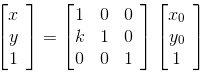

> 摘要：介绍了 Matrix 图形变换的原理，关于平移、缩放、旋转、错切的计算原理，学生时期学习的线性代数和三角函数终于派上用场了...

## Matrix 简介

Android 图形库中的 [android.graphics.Matrix](https://developer.android.com/reference/android/graphics/Matrix?hl=id) 是一个 3×3 的 float 矩阵，其主要作用是坐标变换

它的结构大概是这样的


其中每个位置的数值作用和其名称所代表的的含义是一一对应的

- MSCALE_X、MSCALE_Y：控制缩放
- MTRANS_X、MTRANS_Y：控制平移
- MSKEW_X、MSKEW_X：控制错切
- MSCALE_X、MSCALE_Y、MSKEW_X、MSKEW_X：控制旋转
- MPERSP_0、MPERSP_1、MPERSP_2：控制透视


在 Android 中，我们直接实例化一个 `Matrix`，内部的矩阵长这样：


是一个左上到右下为 1，其余为 0 的矩阵，也叫[单位矩阵](https://zh.wikipedia.org/zh-hans/%E5%96%AE%E4%BD%8D%E7%9F%A9%E9%99%A3)，一般数学上表示为 I

## Matrix 坐标变换原理

前面说到 Matirx 主要的作用就是处理坐标的变换，而坐标的基本变换有：平移、缩放、旋转和错切

> 这里所说的基本变换，也称[仿射变换](https://zh.wikipedia.org/wiki/%E4%BB%BF%E5%B0%84%E5%8F%98%E6%8D%A2) ，透视不属于仿射变化，关于透视相关的内容不在本文的范围内

当矩阵的最后一行是 0,0,1 代表该矩阵是仿射矩阵，下文中所有的矩阵默认都是仿射矩阵

### 线性代数中的矩阵乘法

在正式介绍 Matrix 是如何控制坐标变换的原理之前，我们先简单复习一下线性代数中的[矩阵乘法](https://zh.wikipedia.org/wiki/%E7%9F%A9%E9%99%A3%E4%B9%98%E6%B3%95)，详细的讲解可参见维基百科或者翻翻大学的《线性代数》，这里只做最简单的介绍

- 两个矩阵相乘，前提是第一个矩阵的列数等于第二个矩阵的行数

- 若 A 为 m × n 的矩阵，B 为 n × p 的矩阵，则他们的乘积 AB 会是一个 m × p 的矩阵，表达可以写为

  

- 由定义计算，AB 中任意一点（a,b）的值为 A 中第 a 行的数和 B 中第 b 列的数的乘积的和

  

  

  

了解矩阵乘法的基本方法之后，我们还需要记住几个性质，对后续的分析有用

- 满足结合律，即 `A(BC)=(AB)C`
- 满足分配律，即 `A(B + C) = AB + AC` `(A + B)C = AC + BC`
- 不满足交换律，即 `AB != BA`
- 单位矩阵 `I` 与任意矩阵相乘，等于矩阵本身，即 `IA = A`，`BI = B`

### 缩放（Scale）

我们先想想，让我们实现把一个点 (x0, y0) 的 x 轴和 y 轴分别缩放 k1 和 k2 倍，我们会怎么做，很简单

```kotlin
val x = k1 * x0
val y = k2 * y0
```

那如果用矩阵怎么实现呢，前面我们讲到 Matrix 中 `MSCALE_X`、`MSCALE_Y` 是用来控制缩放的，我们在这里填分别设置为 k1 和 k2，看起来是这样的


而点 (x0, y0) 用矩阵表示是这样的


有些人会疑问，最后一行这里不是还有一个 1 吗，这是使用了[齐次坐标系](https://zh.wikipedia.org/wiki/%E9%BD%90%E6%AC%A1%E5%9D%90%E6%A0%87)的缘故，在数学中我们的点和向量都是这样表示的 (x, y)，两者看起来一样，计算机无法区分，为了让计算机也可以区分它们，增加了一个标志位，即

```
(x, y, 1) -> 点
(x, y, 0) -> 向量
```

现在 Matrix 和点都可以用矩阵表示了，接下来我们看看怎么通过这两个矩阵得到一个缩放之后的点 (x, y). 前面我们已经介绍过矩阵的乘法，让我们看看把上面两个矩阵相乘会得到什么结果


可以看到，矩阵相乘得到了一个（k1x0, k2y0,1）的矩阵，上面说过，计算机中，这个矩阵就代表点 (k1x0, k2y0)， 而这个点刚好就是我们要的缩放之后的点

以上所有过程用代码来实现，看起来就是像下面这样

```kotlin 
val xy = FloatArray(x0, y0)
Matrix().apply {
    setScale(k1, k2)   
    mapPoints(xy)
}
```

### 平移（Translate）

平移和缩放也是类似的，实现平移，我们一般可写为

```kotlin
val x = x0 + deltaX
val y = y0 + deltaY
```

而用矩阵来实现则是

```kotlin
val xy = FloatArray(x0, y0)
Matrix().apply {
    setTranslate(k1, k2)   
    mapPoints(xy)
}
```

换成数学表示


根据矩阵乘法

```
x = 1 × x0 + 0 × y0 + deltaX × 1 = x0 + deltaX
y = 0 × x0 + 1 × y0 + deltaY × 1 = y0 + deltaY
```

可得和一开始的实现也是效果一致的

### 错切（Skew）

错切相对于平移和缩放，可能大部分人对这个名词比较陌生，直接看三张图大家可能会比较直观

**水平错切**

```
x = x0 + ky0
y = y0
```

矩阵表示


**垂直错切**

```
x = x0
y = kx0 + y0
```

矩阵表示




**复合错切**

```
x = x0 + k1y0
y = k2x0 + y0
```

矩阵表示


### 旋转（Rotate）

旋转相对以上三种变化又有一点复杂，这里涉及一些三角函数的计算，忘记的可以去[维基百科](https://zh.wikipedia.org/wiki/%E4%B8%89%E8%A7%92%E5%87%BD%E6%95%B0) 先复习下


同样我们先自己实现一下旋转，假设一个点 `A(x0, y0)`, 距离原点的距离为 r，与水平夹角为 α，现绕原点顺时针旋转 θ 度，旋转之后的点为 `B(x, y)`


用矩阵表示


## Matrix 复合操作原理

前面介绍了四种基本变换，如果我们需要同时应用上多种变化，比如先绕原点顺时针旋转 90° 再 x 轴平移 100，y 轴平移 100， 最后 x、y 轴缩放0.5 倍，那么就需要用到复合操作

还是先用自己的实现来实现一下

```
x = ((x0 · cosθ - y0 · sinθ) + 100) · 0.5
y = ((y0 · cosθ + x0 · sinθ) + 100) · 0.5
```

矩阵表示


按照前面的方式逐个推导，最终也能得到和上述一样的结果

到此，我们可以对 Matrix 做出一个基本的认识：**Matrix 基于矩阵计算的原理，解决了计算机中坐标映射和变化的问题**

下一篇文章[《Matirx 方法详解及应用场景》](https://juejin.cn/post/7038559881187557406)将介绍 Matrix 中常用的 api 以及实际开发中的应用场景


相关链接

[Matrices for developers](https://i-rant.arnaudbos.com/matrices-for-developers/)

[Understanding Android Matrix transformations](https://medium.com/a-problem-like-maria/understanding-android-matrix-transformations-25e028f56dc7)

[Android Matrix 最全方法详解与进阶](https://blog.csdn.net/gb702250823/article/details/53526149)