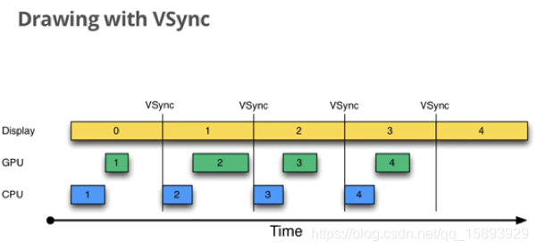

本文部分图文参考自：https://juejin.cn/post/6863756420380196877#heading-19

在开始讲解屏幕刷机制前，先回顾一下 View 的绘制流程，读过前面的文章 [从点击桌面图标到应用界面展示](../从点击桌面图标到应用界面展示) 应该都有印象，View 绘制流程开启的地方就是 `ViewRootImpl` 的 `scheduleTraversals`

```java
void scheduleTraversals() {
        if (!mTraversalScheduled) {
            mTraversalScheduled = true;
						// 添加同步屏障
            mTraversalBarrier = mHandler.getLooper().getQueue().postSyncBarrier();
            // 加入一个 callback 到 ****Choreographer****
						mChoreographer.postCallback(
                    Choreographer.CALLBACK_TRAVERSAL, mTraversalRunnable, null);
            notifyRendererOfFramePending();
            pokeDrawLockIfNeeded();
        }
    }
```

可以看到 `scheduleTraversals()` 主要做了两件事：

1. 往当前线程的 Loop 加入同步屏障，关于同步屏障详见 [Android 消息机制](../Android 消息机制)
2. 封装了一个 `mTraversalRunnable` 加入到 `mChoreographer`

```java
final class TraversalRunnable implements Runnable {
        @Override
        public void run() {
            doTraversal();
        }
    }
final TraversalRunnable mTraversalRunnable = new TraversalRunnable();

void doTraversal() {
        if (mTraversalScheduled) {
            mTraversalScheduled = false;
						// 移除同步屏障
            mHandler.getLooper().getQueue().removeSyncBarrier(mTraversalBarrier);

            if (mProfile) {
                Debug.startMethodTracing("ViewAncestor");
            }
						
						// 可以看到这里出现了熟悉的 performTraversals，这里面封装了 onMeasure、onLayout、onDraw
            performTraversals();

            if (mProfile) {
                Debug.stopMethodTracing();
                mProfile = false;
            }
        }
    }
```

可见，`TraversalRunnable` 就是一个 `Runnable`，里面做了两件事情：

1. 移除同步屏障
2. 开始真正的绘制流程。

那 TraversalRunnable 是什么时候被执行呢，这就引出本文的主角： **Choreographer**

# Choreographer

`Choreographer` 翻译为编舞者，负责从显示系统接收脉冲信号，编排渲染下一帧的绘制工作，负责获取 Vsync 同步信号并控制 UI 线程完成图像绘制的类。

怎么理解这一句话呢？ 一次完整的绘制，是需要 CPU、GPU 和显示设备的配合，但是三者是一个并行运作的状态，那怎么相互协调呢？所以引进了 VSync 信号机制：每 16ms，硬件（或者软件）会发出一个 VSync 信号，CPU 接收到这个信号，开始了一次绘制流程。再下一次 VSync 信号到来之时，Display 就可以直接显示第一帧，CPU 也开始绘制第二帧。就这样循环下去。

也就是说 CPU 和 GPU 必须要在这一次的 VSync 信号发生和下一次 VSync 信号到来之前要准备好这一帧的数据，否则就发生了掉帧的现象了。

可以看下图，大致可以了解 VSync 信号机制：



## Choreographer怎么跟Vsync信号机制相挂钩呢?

```java
// ViewRootImpl
mChoreographer.postCallback(Choreographer.CALLBACK_TRAVERSAL, mTraversalRunnable, null);

// Choreographer
public void postCallback(int callbackType, Runnable action, Object token) {
    postCallbackDelayed(callbackType, action, token, 0);
}
private void postCallbackDelayedInternal(int callbackType, Object action, Object token, long delayMillis) {
    synchronized (mLock) {
        final long now = SystemClock.uptimeMillis();
        final long dueTime = now + delayMillis;
        // 加入 mCallbackQueues
        mCallbackQueues[callbackType].addCallbackLocked(dueTime, action, token);
		
		// 这里的 delayMills 为 0，所以会走到 scheduleFrameLocked()
        if (dueTime <= now) { 
            scheduleFrameLocked(now);
        }
        ...
    }
}
private void scheduleFrameLocked(long now) {
    if (!mFrameScheduled) {
        mFrameScheduled = true;
        ...
        // 判断当前 thread 是否运行loop，这个后续会讲到
        if (isRunningOnLooperThreadLocked()) {
            scheduleVsyncLocked();
        }
   }
}
private void scheduleVsyncLocked() {
    // 注册订阅了 vsync 信号
    mDisplayEventReceiver.scheduleVsync();
}
// DisplayEventReceiver
public void scheduleVsync() {
    ...
    // 注册订阅了vsync信号
    nativeScheduleVsync(mReceiverPtr);
}
private static native void nativeScheduleVsync(long receiverPtr);
```

可以看到主要是两个动作：

1. mCallbackQueues 加入了Runnable
2. 从 jni 层注册了 Vsync 信号

## 那什么时候会收到 Vsync 信号回来呢？

在 `DisplayEventReceiver` 的 `disjpatchVsync()` 方法可以看到，该方法是 jni 层调用的

```java
// DisplayEventReceiver，由 jni 调用
private void dispatchVsync(long timestampNanos, int builtInDisplayId, int frame) {
    onVsync(timestampNanos, builtInDisplayId, frame);
}

// Choreographer 内部类 DisplayEventReceiver，重写了 onVsync 方法
@Override
public void onVsync(long timestampNanos, int builtInDisplayId, int frame) {
	mTimestampNanos = timestampNanos;
    mFrame = frame;
    Message msg = Message.obtain(mHandler, this);
    // 设置成异步消息
    msg.setAsynchronous(true);
    mHandler.sendMessageAtTime(msg, timestampNanos / TimeUtils.NANOS_PER_MS);
}

public void run() {
    mHavePendingVsync = false;
    doFrame(mTimestampNanos, mFrame);
}
```

这里可以看到，其实 mHandle r就是当前主线程的 handler，当接收到 onVsync 信号的时候，将自己封装到 Message中，等待 Looper 处理，最后 Looper 处理消息的时候就会调用 run 方法，这里是 Handler 的机制，不做解释，详见 [Android 消息机制](../Android 消息机制)。

在 `run` 方法中，调用了 `doFrame()` 方法：

```java
// Choreographer
void doFrame(long frameTimeNanos, int frame) {
	...
	doCallbacks(Choreographer.CALLBACK_TRAVERSAL, frameTimeNanos);
}
void doCallbacks(int callbackType, long frameTimeNanos) {
    CallbackRecord callbacks;
    // 从 mCallbackQueues 取出
    callbacks = mCallbackQueues[callbackType].extractDueCallbacksLocked(
                    now / TimeUtils.NANOS_PER_MS);
    for (CallbackRecord c = callbacks; c != null; c = c.next) {
         c.run(frameTimeNanos);
    }
}
// CallbackRecord
public void run(long frameTimeNanos) {
    if (token == FRAME_CALLBACK_TOKEN) {
				// 通过 postFrameCallback 或 postFrameCallbackDelayed，会执行这里
        ((FrameCallback)action).doFrame(frameTimeNanos);
    } else {
        // 这里也即是调用了 TraservalRunnable 的 run 方法，也即是三个绘制流程
        ((Runnable)action).run();
    }
}
```

可见当 vsync 信号来临的时候，主要做了两件事情

1. 从 mCallbackQueues 取出 callback
2. 执行 callback，这里最后会执行到 `TraservalRunnable` 的三大绘制流程

这里是不是说，`Choreographer` 是不是只要注册一次以后，都可以收到 `Vsync` 信号呢？

其实不是的，Vsync 信号需要每次都去注册，而且只能接收到一次。这样能保证在不需要重新绘制的情况下，Choreographer 也就不需要接收信号，就不会去注册 Vsync 信号。

- 一次 `requestLayout` 只会注册一次并且收到一次 VSYNC
- 动画会在 `doFrame` 中请求下一次 VSYNC

## Choreographer.CallbackQueue

1. 这是一个单链表，入队的时候，根据执行时间从小到大排列

```java
public void addCallbackLocked(long dueTime, Object action, Object token) {
            CallbackRecord callback = obtainCallbackLocked(dueTime, action, token);
            CallbackRecord entry = mHead;
            // 如果表头是空的，就把传入的任务当成表头
						if (entry == null) {
                mHead = callback;
                return;
            }
						// 如果传入的任务时间小于表头任务，就把任务插在前面，新任务成为表头
            if (dueTime < entry.dueTime) {
                callback.next = entry;
                mHead = callback;
                return;
            }
						// 否则遍历链表，把新任务按照时间从小到大插入链表
            while (entry.next != null) {
                if (dueTime < entry.next.dueTime) {
                    callback.next = entry.next;
                    break;
                }
                entry = entry.next;
            }
            entry.next = callback;
        }
```

1. 当 doFrame() 的时候，执行 `extractDueCallbacksLocked` 把所有当前时间需要被执行的任务都取出来，构成一个新的链表

   ```java
   public CallbackRecord extractDueCallbacksLocked(long now) {
               CallbackRecord callbacks = mHead;
               // 如果表头为空，或者时间没有到需要执行的时间，直接返回空链表
   						if (callbacks == null || callbacks.dueTime > now) {
                   return null;
               }
   					
               CallbackRecord last = callbacks;
               CallbackRecord next = last.next;
               // 遍历链表，找到所有当前时间可被执行的任务，由于链表已经是从小到大排序
   						// 所以只需要两个指针，一个指向表头，一个指向时间大于当前时间的结点就可以了
   						while (next != null) {
                   if (next.dueTime > now) {
                       // 找到了新链表的结束位置
   										last.next = null;
                       break;
                   }
                   last = next;
                   next = next.next;
               }
   						// 新表头指向截断的位置，截断位置之前的所有结点构成的链表被返回
               mHead = next;
   						// 返回新链表表头位置
               return callbacks;
           }
   ```

## 总结

1. **ViewRootImpl →** `ViewRootImpl.scheduleTraversals()` 添加同步屏障，添加一个任务到 `Choreographer` 内的队列，这个任务里面调用 `performTraversals`
2. `Choreographer` 的队列是一个单链表
3. **Choreographer →** Choreographer 添加任务到队列，通过 `FrameDisplayEventReceiver` 向 JNI 注册 VSYNC 信号，当 VSYNC 到来时，JNI 调用 `onVsync()`,
4. **Choreographer.**`FrameDisplayEventReceiver` **→**`onVsync()` 通过 Handler 发送异步消息到主线程（这个线程是初始化 Choreographer 的线程，可以是主线程也可以是其他线程，每个线程都可以有一个 Choreographer 对象）
5. **Choreographer.**`FrameDisplayEventReceiver` **→** 主线程处理 `doFrame()`
6. **Choreographer →** 取出所有这个时间内可以被执行的任务（是一个链表），这个任务里面调用 `performTraversals`，然后移除同步屏障
7. 至此一次绘制流程结束


# Choreographer 初始化的地方

在 ViewRootImpl 的构造方法里面

```java
public ViewRootImpl(@UiContext Context context, Display display, IWindowSession session,
            boolean useSfChoreographer) {
        //...
        mChoreographer = useSfChoreographer
                ? Choreographer.getSfInstance() : Choreographer.getInstance();
        // ...
    }
private static final ThreadLocal<Choreographer> sThreadInstance =
            new ThreadLocal<Choreographer>() {
        @Override
        protected Choreographer initialValue() {
            Looper looper = Looper.myLooper();
            if (looper == null) {
                throw new IllegalStateException("The current thread must have a looper!");
            }
            Choreographer choreographer = new Choreographer(looper, VSYNC_SOURCE_APP);
            if (looper == Looper.getMainLooper()) {
                mMainInstance = choreographer;
            }
            return choreographer;
        }
    };

public static Choreographer getInstance() {
        return sThreadInstance.get(); // ThreadLocal.get 方法会回调 initialValue() 来创建实例
    }
```

Choreographer 是线程内单例的

# Choreographer 的 5 种 callback 类型

```java
void doFrame(long frameTimeNanos, int frame,
            DisplayEventReceiver.VsyncEventData vsyncEventData) {
						// ...
						doCallbacks(Choreographer.CALLBACK_INPUT, frameTimeNanos, frameIntervalNanos);

            mFrameInfo.markAnimationsStart();
            doCallbacks(Choreographer.CALLBACK_ANIMATION, frameTimeNanos, frameIntervalNanos);
            doCallbacks(Choreographer.CALLBACK_INSETS_ANIMATION, frameTimeNanos,
                    frameIntervalNanos);

            mFrameInfo.markPerformTraversalsStart();
            doCallbacks(Choreographer.CALLBACK_TRAVERSAL, frameTimeNanos, frameIntervalNanos);

            doCallbacks(Choreographer.CALLBACK_COMMIT, frameTimeNanos, frameIntervalNanos);
}
```

可以看到五种 callback 类型的优先级是

1. CALLBACK_INPUT：用于处理输入事件，例如触摸事件、按键事件等。当输入事件发生时，Choreographer会在每个VSYNC信号周期内通过CALLBACK_INPUT回调来处理这些事件，例如分发触摸事件给相应的视图、处理滑动手势等。通常情况下，开发者无需直接操作CALLBACK_INPUT回调，因为Android的输入框架会自动处理这些任务
2. CALLBACK_ANIMATION：处理动画，外部通过 postFrameCallback 都是这个类型，动画也是用这个类型
3. CALLBACK_INSETS_ANIMATION：用于处理窗口插入物（如导航栏、状态栏等）的动画。在Android 11（API级别30）及更高版本中，Choreographer提供了CALLBACK_INSETS_ANIMATION回调来同步窗口插入物的动画。开发者可以使用这个回调来实现自定义的窗口插入物动画，以便在每个VSYNC信号周期内更新动画的状态。通常情况下，开发者无需直接操作CALLBACK_INSETS_ANIMATION回调，因为Android的窗口插入物框架会自动处理这些任务
4. CALLBACK_TRAVERSAL，处理绘制，measure、layout、draw
5. CALLBACK_COMMIT

> CALLBACK_INPUT 、CALLBACK_ANIMATION 会修改 view 的属性，所以要先于 CALLBACK_TRAVERSAL 执行