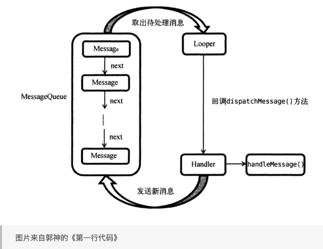
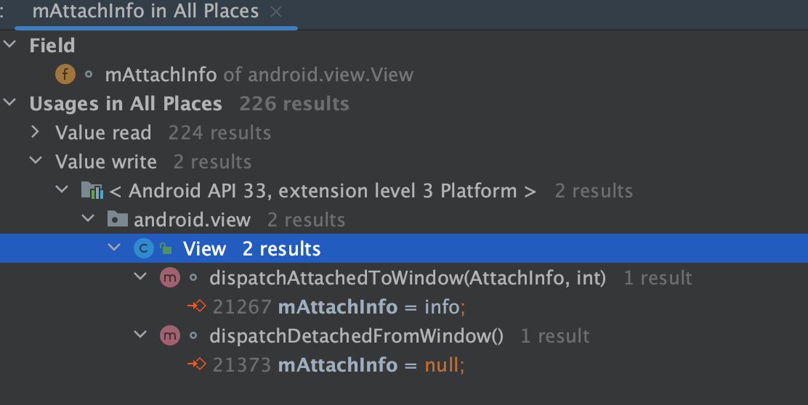

# Handler 消息机制

首先看看在 Android 中，是怎么使用 Handler 往子线程发送消息的

```kotlin
var mHandler: Handler? = null
// 1. 开启子线程
Thread(Runnable {
  	// 2. 调用 prepare
    Looper.prepare()
  	// 3. 实例化子线程 Hanlder
    mHandler = Handler()
  	// 4. 开启消息循环
    Looper.loop()
}).start()

Thread.sleep(1000)

// 5. 往子线程发送消息
mHandler?.post {
    println(Thread.currentThread())
}
```

1. 使用 Handler 之前，需要在对应的线程中调用一下 `Looper.prepare()` 方法。`prepare()` 方法内部会判断当前线程中是否已经存在 Looper 对象，如果有会抛出 `RuntimeException` 异常，否则会给创建一个 Looper 对象，保存在 Looper 的 ThreadLocal 类中，这样可以保证一个线程只对应一个 Looper 实例。

   ```java
   private static void prepare(boolean quitAllowed) {
           if (sThreadLocal.get() != null) {
               throw new RuntimeException("Only one Looper may be created per thread");
           }
           sThreadLocal.set(new Looper(quitAllowed));
   }
   ```

2. Looper 的构造方法中会实例化一个 `MessageQueue` 消息队列

   ```java
   private Looper(boolean quitAllowed) {
           mQueue = new MessageQueue(quitAllowed);
           mThread = Thread.currentThread();
   }
   ```

3. 调用了 `Looper.prepare()` 之后, 我们就可以创建一个 Handler 实例，Handler 用与向线程发送消息和处理消息。实例化 Handler 时，Handler 构造方法支持传入 Looper 也可以不传，如果外部没有传入 Looper 会通过 `Looper.myLooper()` 判断当前的线程是否已经创建好 Looper，如果  `Looper.myLooper()` 为空，会抛出 `RuntimeException`，如果有 Looper，则取出 `Looper.mQueue` 消息队列，赋值到 `Handler.mQueue` 中

   ```java
   // 隐式传入 Looper 的构造方法已经被废弃, Google 推荐显式传入 Looper, 这样可以避免使用了错误的线程造成意想不到的 bug
   @Deprecated
   public Handler(@Nullable Callback callback, boolean async) {
          ...
           mLooper = Looper.myLooper();
           if (mLooper == null) {
               throw new RuntimeException(
                   "Can't create handler inside thread " + Thread.currentThread()
                           + " that has not called Looper.prepare()");
           }
           mQueue = mLooper.mQueue;
           mCallback = callback;
           mAsynchronous = async;
   }
   ```

4. 接下来调用 `Looper.loop()` 方法开启消息队列循环，不断从 `MessageQueue` 中取出消息，然后调用 `Message.target.dispatchMessage()` 方法处理消息

   ```java
   public static void loop() {
           final Looper me = myLooper();
           if (me == null) {
               throw new RuntimeException("No Looper; Looper.prepare() wasn't called on this thread.");
           }
   	       // ... 
           for (;;) {
               if (!loopOnce(me, ident, thresholdOverride)) {
                   return;
               }
           }
   }
   
   private static boolean loopOnce(final Looper me,
               final long ident, final int thresholdOverride) {
           Message msg = me.mQueue.next(); // might block
           if (msg == null) {
               // No message indicates that the message queue is quitting.
               return false;
           }
           // ...
           msg.target.dispatchMessage(msg);
           return true;
   }
   ```

5. `Message.target` 实际上就是刚刚创建的 Handler，当 `loop()` 之后，我们就可以使用创建的 Handler `post` 或者 `send` 消息，最终都会调用到 `sendMessageAtTime` 方法，在这个方法内将传入的 `Message.target` 赋值为 this，也就是当前 Handler，然后将 Message 加入消息队列。这样当消息被取出的时候就可以通过 `Message.target.dispatchMessage()` 方法分发消息了

   ```java
   public boolean sendMessageAtTime(@NonNull Message msg, long uptimeMillis) {
           MessageQueue queue = mQueue;
           if (queue == null) {
               RuntimeException e = new RuntimeException(
                       this + " sendMessageAtTime() called with no mQueue");
               Log.w("Looper", e.getMessage(), e);
               return false;
           }
           return enqueueMessage(queue, msg, uptimeMillis);
   }
   
   private boolean enqueueMessage(@NonNull MessageQueue queue, @NonNull Message msg,
               long uptimeMillis) {
           msg.target = this;
           msg.workSourceUid = ThreadLocalWorkSource.getUid();
   
           if (mAsynchronous) {
               msg.setAsynchronous(true);
           }
           return queue.enqueueMessage(msg, uptimeMillis);
   }
   ```

6. 最终会走到 Handler 的 `handleMessage` 方法内，我们在这里实现处理消息的逻辑

   ```java
     public void dispatchMessage(@NonNull Message msg) {
         if (msg.callback != null) {
             // 1. post runnable 或者 Message 带 callback 会走到这里来
             handleCallback(msg);
         } else {
             // 2. 发送一个不带 callback 的 Message 会走到这里来
             // 3. 如果实例化 Handler 的时候传了 callback, 就在 callback 中处理消息
             if (mCallback != null) {
                 // 4. 如果 Handler 构造时传入的 callback 处理完消息返回了 true, 则消息处理完毕
                 if (mCallback.handleMessage(msg)) {
                     return;
                 }
             }
             // 5. 如果 Handler 构造时传入的 callback 处理完消息返回了 false, 则消息继续交给 Handler 子类实现的 handleMessage 处理
             // 6. Hanlder 默认的 handleMessage 是空实现
             handleMessage(msg);
         }
     }
   ```

## 总结

1. 初始化 Looper，给当前线程实例化一个 Looper，Looper 中包含一个消息队列 `MessageQueue`
2. 创建 Handler 实例，Handler 获取当前线程的 Looper 以及 Looper 中的消息队列 `MessageQueue` 作为自己的成员变量，以便后续往消息队列中发送消息
3. 调用 `Looper.loop()` 方法开启消息循环，不断读取队列中的消息，然后执行消息



# 延迟消息实现原理

1. 消息入队的时候，`enqueueMessage` 的逻辑会根据 Message 的执行时间 Message.when 按大小排序，队头 when 小，队尾 when 大，然后判断线程是否休眠，如果是，则调用 native 方法 *`nativeWake` 唤醒线程*
2. loop 取出下一条消息，判断 when 是否到了执行时间，如果是，则执行，否则调用 native 方法 `nativePollOnce` 让线程休眠指定时间，when - 当前时间 得到 message 执行的时间

举个例子

1. `postDelay()`一个 10 秒钟的 Runnable A、消息进队，MessageQueue 调用`nativePollOnce()`阻塞，Looper阻塞；
2. 紧接着`post()`一个 Runnable B、消息进队，判断现在 A 时间还没到、正在阻塞，把 B 插入消息队列的头部（A的前面），然后调用`nativeWake()`方法唤醒线程；
3. `MessageQueue.next()`方法被唤醒后，重新开始读取消息链表，第一个消息 B 无延时，直接返回给 Looper；
4. Looper 处理完这个消息再次调用`next()`方法，MessageQueue 继续读取消息链表，第二个消息 A 还没到时间，计算一下剩余时间（假如还剩9秒）继续调用`nativePollOnce()`阻塞；
5. 直到阻塞时间到或者下一次有 Message 进队

# Message 的复用机制

```java
public static Message obtain() {
    synchronized (sPoolSync) {
        if (sPool != null) {
            Message m = sPool;
            sPool = m.next;
            m.next = null;
            m.flags = 0; // clear in-use flag
            sPoolSize--;
            return m;
        }
    }
    return new Message();
}
```

这里对 Message 的复用做了同步处理，如果 Message 池不为空，将 sPool 指针后移一个，将原来的头结点 m 返回，同时计数减 1。这是非常熟悉的单链表操作。如果没有可以复用的，那么就创建一个新的 Message。其他的`obtain`方法的重载都会调用此方法，然后将传入参数重新赋值。

## 回收

```java
private static boolean gCheckRecycle = true;

/** @hide */
public static void updateCheckRecycle(int targetSdkVersion) {
    if (targetSdkVersion < Build.VERSION_CODES.LOLLIPOP) {
        gCheckRecycle = false;
    }
}

/**
 * Return a Message instance to the global pool.
 * <p>
 * You MUST NOT touch the Message after calling this function because it has
 * effectively been freed.  It is an error to recycle a message that is currently
 * enqueued or that is in the process of being delivered to a Handler.
 * </p>
 */
public void recycle() {
    if (isInUse()) {
        if (gCheckRecycle) {
            throw new IllegalStateException("This message cannot be recycled because it "
                    + "is still in use.");
        }
        return;
    }
    recycleUnchecked();
}

/**
 * Recycles a Message that may be in-use.
 * Used internally by the MessageQueue and Looper when disposing of queued Messages.
 */
void recycleUnchecked() {
    // Mark the message as in use while it remains in the recycled object pool.
    // Clear out all other details.
    flags = FLAG_IN_USE;
    what = 0;
    arg1 = 0;
    arg2 = 0;
    obj = null;
    replyTo = null;
    sendingUid = -1;
    when = 0;
    target = null;
    callback = null;
    data = null;

    synchronized (sPoolSync) {
        if (sPoolSize < MAX_POOL_SIZE) {
            next = sPool;
            sPool = this;
            sPoolSize++;
        }
    }
}
```

- 回收操作会由 recycle 方法调用 recycleUnchecked 方法。
- recycleUnchecked 方法将会清除除了标记位之后的所有信息，然后添加到 Message 池中，计数自增。
- 如果 Message 的 flags 为 FLAG_IN_USE，recycle 会 return，而不会执行 recycleUnchecked。也就是说 Message 在 obtain 时标志位会复位，然后如果其要被回收，第一次走 recycle 方法时，isInUse() 返回 false，这使得 recycleUnchecked 可以执行，此后标志位会变成FLAG_IN_USE。在 Message 没有重新 obtain 之前，继续执行 recycle 将不会执行recycleUnchecked 。这就保证了Message池中的对象都是不同的。

# 同步屏障

Message 分为三种

- 普通消息，我们平时使用最多的也是同步消息
- 异步消息，设置 `Message#setAsynchronous` 为 true
- 同步屏障，target 为空

在没有设置同步屏障时，普通消息和异步消息没有不同，设置同步屏障之后，同步屏障之前的消息正常执行，同步屏障之后的所有同步消息不能执行，异步消息会优先执行；

同步屏障需要手动移除，同步屏障如果一直不移除，当所有异步消息执行完之后，线程会被挂起。

同步屏障一般是系统行为，我们无法手动调用，除非反射；Android 中 View 的绘制任务就是通过发送同步屏障和异步消息的方式实现的。

```java
nativePollOnce(ptr, nextPollTimeoutMillis);

    synchronized (this) {
        // Try to retrieve the next message.  Return if found.
        final long now = SystemClock.uptimeMillis();
        // 指向前一个message
        Message prevMsg = null;
        // 初始时指向第一个message
        Message msg = mMessages;
        // 1 msg.target == null说明遇到消息屏障
        if (msg != null && msg.target == null) {
                // 能进入这个if，说明此时的msg是屏障消息
                // 循环遍历，退出循环的条件是，message到末尾了，或者
                // msg是异步消息
            do {
                prevMsg = msg;
                msg = msg.next;
            } while (msg != null && !msg.isAsynchronous());
        }
```

# 主线程的 Thread 是什么时候创建的

实际上 Android 主线程（UI 线程）并不是通过显式实例化 Thread 然后调用 start() 实现的。应用启动时，zygote 进程 fork 出应用进程的时候，这个进程的入口点就是主线程，可以理解为每个进程都有一个默认线程，这个默认线程就是主线程。fork 出 应用进程之后，会调用 `ActivityThread.main()` 方法，此时 main 方法就是跑在主线程的，然后这里调用 `Looper.prepareMainLooper()` 以及 `Looper.loop()` 方法。所以这也是为什么在主线程中可以直接实例化 Handler 的原因。

```java
// 这个方法是专门为主线程用的，手动再调用一次会抛异常
@Deprecated
    public static void prepareMainLooper() {
        prepare(false);
        synchronized (Looper.class) {
            if (sMainLooper != null) {
                throw new IllegalStateException("The main Looper has already been prepared.");
            }
            sMainLooper = myLooper();
        }
}
```

# looper 是怎么退出的

从 loop 方法的实现中可以看到，当消息队列 next 返回空的时候，会退出循环。通过调用 Looper 实例的 `quit()` 或者 `quitSafely()` 可以实现将循环退出，方法会设置消息队列的退出标志，并添加一个空消息到消息队列中。再下一次执行 `next()` 方法的时候，决定是否要终止循环。同时主线程循环不可以通过调用 `quit` 或者 `quitSafely` 退出的，这是因为这两个方法最终会调用到 `MessageQueue` 的 `quit` 方法中，这里会判断如果 `mQuitAllowed` 为 false 的时候，会抛出异常。而 `mQuitAllowed` 是在创建 `MessageQueue` 的时候传入的，主线程的 `Looper.prepareMainLooper` 内调用 `prepare` 传参传入的是 false，所以主线程不支持退出循环，当应用进程 kill 的时候循环停止。而我们自己创建的工作线程，我们调用的是 `Looper.prepare`，内部传参是 true，所以工作线程支持退出循环。

```java
// 给子线程调用的
public static void prepare() {
        prepare(true);
}

private static void prepare(boolean quitAllowed) {
        if (sThreadLocal.get() != null) {
            throw new RuntimeException("Only one Looper may be created per thread");
        }
        sThreadLocal.set(new Looper(quitAllowed));
}

// 给主线程调用的
public static void prepareMainLooper() {
        prepare(false);
        synchronized (Looper.class) {
            if (sMainLooper != null) {
                throw new IllegalStateException("The main Looper has already been prepared.");
            }
            sMainLooper = myLooper();
        }
}
```

# quit 和 quitSafely 区别和原理

最终会调用到 `MessageQueue` 的 `quit` 方法

```java
void quit(boolean safe) {
        if (!mQuitAllowed) {
            throw new IllegalStateException("Main thread not allowed to quit.");
        }

        synchronized (this) {
            if (mQuitting) {
                return;
            }
            mQuitting = true;

            if (safe) {
                removeAllFutureMessagesLocked();
            } else {
                removeAllMessagesLocked();
            }

            // We can assume mPtr != 0 because mQuitting was previously false.
            nativeWake(mPtr);
        }
}

private void removeAllMessagesLocked() {
        Message p = mMessages;
        while (p != null) {
            Message n = p.next;
            p.recycleUnchecked();
            p = n;
        }
        mMessages = null;
}

private void removeAllFutureMessagesLocked() {
        final long now = SystemClock.uptimeMillis();
        Message p = mMessages;
        if (p != null) {
            if (p.when > now) {
                removeAllMessagesLocked();
            } else {
                Message n;
                for (;;) {
                    n = p.next;
                    if (n == null) {
                        return;
                    }
                    if (n.when > now) {
                        break;
                    }
                    p = n;
                }
                p.next = null;
                do {
                    p = n;
                    n = p.next;
                    p.recycleUnchecked();
                } while (n != null);
            }
        }
 }
```

从源码上来看，`quit()` 和 `quitSafely()` 都是在下一次消息出队的时候决定是否终止循环，正在处理中的消息不会被终止，区别就是

- `quit()` 不会继续处理消息队列中的任何剩余消息。这意味着，如果消息队列中还有未处理的消息，它们将被丢弃，不会得到处理。因此，**`quit()`** 方法可能会导致消息丢失和资源泄漏
- `quitSafely()` 会在处理完消息队列中所有延迟为 0 的剩余消息后退出消息循环。这意味着，如果消息队列中还有未处理的消息，只要它们的延迟时间为 0，**`quitSafely()`** 方法会确保它们被处理。这样，**`quitSafely()`** 方法可以避免消息丢失和资源泄漏

调用 `quit` 方法之后，`MessageQueue` 中的 `mQuitAllowed` 会置为 true, 后续调用 `sendMessage` 都会返回 false

```java
boolean enqueueMessage(Message msg, long when) {
        if (msg.target == null) {
            throw new IllegalArgumentException("Message must have a target.");
        }

        synchronized (this) {
            if (msg.isInUse()) {
                throw new IllegalStateException(msg + " This message is already in use.");
            }

            if (mQuitting) {
                IllegalStateException e = new IllegalStateException(
                        msg.target + " sending message to a Handler on a dead thread");
                Log.w(TAG, e.getMessage(), e);
                msg.recycle();
                return false;
            }
		// ...
}
```

# 当消息队列中没有更多消息的时候，会发生什么？

当前线程会阻塞在 `loop()` 里面的 `mQueue.next()` 方法中，`MessageQueue` 的 `next()` 方法中也有一个死循环，没有更多消息的时候，会阻塞在这个循环里面。这里不是简单的死循环，所以阻塞不会消耗太大的资源，无消息的时候线程会进入休眠状态，CPU 资源会被释放给其他线程使用；当有新消息的时候，线程会被唤醒，继续执行 loop

```java
Message next() {
        // Return here if the message loop has already quit and been disposed.
        // This can happen if the application tries to restart a looper after quit
        // which is not supported.
        final long ptr = mPtr;
        if (ptr == 0) {
            return null;
        }

        int pendingIdleHandlerCount = -1; // -1 only during first iteration
        int nextPollTimeoutMillis = 0;
        for (;;) {
            if (nextPollTimeoutMillis != 0) {
                Binder.flushPendingCommands();
            }

            nativePollOnce(ptr, nextPollTimeoutMillis);

            synchronized (this) {
                // Try to retrieve the next message.  Return if found.
                final long now = SystemClock.uptimeMillis();
                Message prevMsg = null;
                Message msg = mMessages;
                if (msg != null && msg.target == null) {
                    // Stalled by a barrier.  Find the next asynchronous message in the queue.
                    do {
                        prevMsg = msg;
                        msg = msg.next;
                    } while (msg != null && !msg.isAsynchronous());
                }
                if (msg != null) {
                    if (now < msg.when) {
                        // Next message is not ready.  Set a timeout to wake up when it is ready.
                        nextPollTimeoutMillis = (int) Math.min(msg.when - now, Integer.MAX_VALUE);
                    } else {
                        // Got a message.
                        mBlocked = false;
                        if (prevMsg != null) {
                            prevMsg.next = msg.next;
                        } else {
                            mMessages = msg.next;
                        }
                        msg.next = null;
                        if (DEBUG) Log.v(TAG, "Returning message: " + msg);
                        msg.markInUse();
                        return msg;
                    }
                } else {
                    // No more messages.
                    nextPollTimeoutMillis = -1;
                }

                // Process the quit message now that all pending messages have been handled.
                if (mQuitting) {
                    dispose();
                    return null;
                }

                // If first time idle, then get the number of idlers to run.
                // Idle handles only run if the queue is empty or if the first message
                // in the queue (possibly a barrier) is due to be handled in the future.
                if (pendingIdleHandlerCount < 0
                        && (mMessages == null || now < mMessages.when)) {
                    pendingIdleHandlerCount = mIdleHandlers.size();
                }
                if (pendingIdleHandlerCount <= 0) {
                    // No idle handlers to run.  Loop and wait some more.
                    mBlocked = true;
                    continue;
                }

                if (mPendingIdleHandlers == null) {
                    mPendingIdleHandlers = new IdleHandler[Math.max(pendingIdleHandlerCount, 4)];
                }
                mPendingIdleHandlers = mIdleHandlers.toArray(mPendingIdleHandlers);
            }

            // Run the idle handlers.
            // We only ever reach this code block during the first iteration.
            for (int i = 0; i < pendingIdleHandlerCount; i++) {
                final IdleHandler idler = mPendingIdleHandlers[i];
                mPendingIdleHandlers[i] = null; // release the reference to the handler

                boolean keep = false;
                try {
                    keep = idler.queueIdle();
                } catch (Throwable t) {
                    Log.wtf(TAG, "IdleHandler threw exception", t);
                }

                if (!keep) {
                    synchronized (this) {
                        mIdleHandlers.remove(idler);
                    }
                }
            }

            // Reset the idle handler count to 0 so we do not run them again.
            pendingIdleHandlerCount = 0;

            // While calling an idle handler, a new message could have been delivered
            // so go back and look again for a pending message without waiting.
            nextPollTimeoutMillis = 0;
        }
    }
```

当线程没有更多消息的时候，称为 idle 态，这个时候会回调 `IdleHandler` 的 `queueIdle` 方法，我们可以通过 `Looper.myQueue().addIdleHandler {   }` 来添加一个对当前线程是否空闲的监听，来处理那些我们希望线程空闲时才处理的逻辑

`queueIdle` 实现的时候返回 true，则可以监听下一次空闲，如果返回 false，这一次回到之后，`MessageQueue` 就会把这个监听从列表中删除，下一次空闲就监听不到了。

# 为什么 View.post() 可以拿到宽高？

```java
  public boolean post(Runnable action) {
      final AttachInfo attachInfo = mAttachInfo;
      if (attachInfo != null) {
          return attachInfo.mHandler.post(action);
      }

      // Postpone the runnable until we know on which thread it needs to run.
      // Assume that the runnable will be successfully placed after attach.
      getRunQueue().post(action);
      return true;
  }
```

可以看到这里有两个分支，当 attachInfo 不为空的时候走 `attachInfo.mHandler.post(action)`；否则走 `getRunQueue().post(action)`

### attachInfo 是什么

通过对源码 View 搜索，可以知道 attachInfo 赋值的时机有两个：`attachToWindow` 赋值；`detachedFromWindow` 置为空



而 `dispatchAttachedToWindow()` 是从 `ViewRootImpl` 的 `performTraversals()` 中调过来的

```java
private void performTraversals() {
	// cache mView since it is used so much below...
  final View host = mView;
	// ...
	host.dispatchAttachedToWindow(mAttachInfo, 0);
 	//...
  performMeasure(childWidthMeasureSpec, childHeightMeasureSpec);//执行测量
  performLayout(lp, mWidth, mHeight);//执行布局
  performDraw();//执行绘制
}

```

所以我们可以知道，attachInfo 在 `performTraversals()` 执行之后就不为空了，而 `performTraversals()` 本身是运行在一个 Message 流程中的（详见[《从桌面点击图标到应用界面展示》](../从桌面点击图标到应用界面展示/从桌面点击图标到应用界面展示.md)），虽然 `dispatchAttachedToWindow` 调用在 `performMeasure()` 之前，但是我们在 `post()` 里面用的是 `attachInfo.mHandler.post(action)`，其中 `mHandler` 就是主线程 `Handler`；这相当于我们在一个 `Message` 被 handle 的时候 post 了另外一个 `Runnable`，后者必然在前者执行完毕之后才能得到执行，因此 View.post {} 就能拿到宽高了。

### attachInfo 不为空时

前面已经解释过，attachInfo 不为空的时候，代表 View 的 measure、layout、draw 正在执行，或者已经执行完了，此时通过 `attachInfo.mHandler.post(action)` 再往主线程 post 一个任务，必然能拿到宽高

### attachInfo 为空时

当 attachInfo 为空的时候，执行的是 `getRunQueue().post(action)`，`getRunQueue` 是什么呢？搜索 View 的源码，我们发现，这是一个任务队列，`post(action)` 即往这个队列中加入一个任务，在 View `dispatchAttachedToWindow()` 的执行执行这个任务队列中的任务

```java
void dispatchAttachedToWindow(AttachInfo info, int visibility) {
      mAttachInfo = info;
      //...
      // Transfer all pending runnables.
      if (mRunQueue != null) {
          mRunQueue.executeActions(info.mHandler);
          mRunQueue = null;
      }
      //...
      onAttachedToWindow();

      //...
}
```

`executeActions` 就是把任务 post 到主线程处理

```java
public class HandlerActionQueue {
    private HandlerAction[] mActions;
    private int mCount;

    public void post(Runnable action) {
        postDelayed(action, 0);
    }

    public void postDelayed(Runnable action, long delayMillis) {
        final HandlerAction handlerAction = new HandlerAction(action, delayMillis);

        synchronized (this) {
            if (mActions == null) {
                mActions = new HandlerAction[4];
            }
            mActions = GrowingArrayUtils.append(mActions, mCount, handlerAction);
            mCount++;
        }
    }

   //...

    public void executeActions(Handler handler) {
        synchronized (this) {
            final HandlerAction[] actions = mActions;
            for (int i = 0, count = mCount; i < count; i++) {
                final HandlerAction handlerAction = actions[i];
                handler.postDelayed(handlerAction.action, handlerAction.delay);
            }

            mActions = null;
            mCount = 0;
        }
    }

    //...
}

```

总的来说当 attachInfo 为空的时候，就是把任务先缓存启动，等到 attachInfo 被赋值的时候，也就是 `attachToWindow` 的时候再 post 到主线程执行，因此也能保证可以拿到宽高