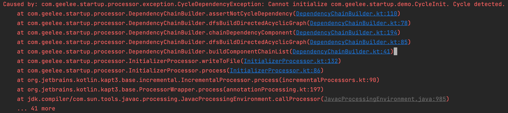

你是否有遇到过这样的烦恼：

- 项目中有很多需要在应用启动阶段进行初始化的操作
- 初始化逻辑存在先后依赖关系，A 初始化逻辑必须等待 B 初始化逻辑执行完才能执行
- 有些初始化逻辑仅在指定进程才需要执行
- 当项目膨胀起来，初始化逻辑开始混乱难以维护，启动性能问题也开始暴露

在项目初期，刚开始大家都各自写各自的逻辑，随着业务迭代，越来越多需要启动阶段进行初始化的逻辑引入，新加入的需要初始化的逻辑根本不知道该往哪里写了，而且稍不注意就会把整个启动阶段初始化的逻辑改坏，引发惊天大 bug。相信很多同学都会遇到这样的痛点，这个时候你一定需要这款产品：Startup —— 一站式解决以上所有问题的应用启动初始化器！

什么？你以为我要介绍的是 Android Jetpack 官方推出的 [App Startup](https://developer.android.com/topic/libraries/app-startup) 吗？当然不是，今天要介绍的是 [App Startup Pro max](https://github.com/GeeJoe/Startup.git) !

有点开玩笑了，写这个库之前，笔者确实先是考虑的直接使用官方的 App Startup，但是在使用过程遇到了一些 App Startup 并不能支持的特性，比如

- 只支持在一个进程初始化，因为内部是通过 `ContentProvider` 来提供初始化时机，需要我们在 `Manifest` 中注册它提供的 `androidx.startup.InitializationProvider`，并指定一个进程，通常是主进程；虽然在 1.1.0 版本更新之后，把  `androidx.startup.InitializationProvider` 改成了非 final，允许派生子类，然后注册多个 Provider 指定不同进程，但仍然不够灵活。
- 没有提供线程级别控制，无法指定某些初始化在指定线程进行
- 循环依赖的检测在运行时，效率不够高
- 自动注入需要依赖修改 Manifest，不够直观和方便

因此，笔者考虑在 App Startup 的基础上实现一个 Pro max 版本的初始化库，解决以上所有的问题！Github 链接：https://github.com/GeeJoe/Startup.git

> 实际上最后的实现版本，对官方 App Startup 基本没有太多参考了，除了名字以外😏

# 一秒上手使用

1. 应用启动时，初始化库

   ```kotlin
     class MyApplication : Application() {
   
         override fun attachBaseContext(base: Context) {
             super.attachBaseContext(base)
             Startup.init(base)
         }
     }
   ```

2. 定义组件初始化逻辑

   ```kotlin
   @Initializer
   class LogInitializer : Initializer {
       override fun init(context: Context, processName: String) {
           // ...
       }
   }
   ```

# 注解灵活配置

```kotlin
// 配置依赖项、运行进程、线程
@Initializer(
    dependencies = [BInitializer::class, CInitializer::class],
    threadMode = ComponentInfo.ThreadMode.WorkThread,
    supportProcess = ["sub", "main"]
)
class LogInitializer : Initializer {
    override fun init(context: Context, processName: String) {
        // ...
    }
}

```

- 一些优先级不那么高的耗时初始化逻辑，可以放在子线程中执行来提高启动速度
- 配置在子线程执行的初始化器会在启动时并行执行
- 配置在主线程的初始化器会在启动时串行执行
- 有依赖关系的初始化器会保证执行的先后顺序

# 编译时检测

如果有循环依赖、不合理线程、进程配置关系，会在编译时给出错误信息，快速定位问题

```kotlin
// 自己依赖自己，会在编译时报错 CycleDependencyException
@Config(dependencies = [CycleInit::class])
class CycleInit : Initializer {
    override fun init(context: Context, processName: String) {
        // no-op
    }
}
```



除了循环依赖检测，还支持以下编译时检测：

1. `IllegalAnnotationException` 注解使用错误时抛出异常。只能注解到实现了 `Initializer` 接口的类上
2. `IllegalProcessException` 当定义的进程信息不合法的时候抛出异常。比如 A 初始化器依赖于 B 初始化器；B 初始化器的 supportProcess 集合必须大于等于 A 初始化器
3. `IllegalThreadException` 当定义的线程信息不合法的时候抛出异常。比如 A 在主线程初始化，B 在子线程初始化， A 不能依赖 B

总而言之一句话：**只要编译能通过，就表示所有初始化配置没问题，让使用者专注于各组件自身的初始化逻辑，再也不用担心配置出错导致运行时异常！**

# 原理解析

这个库内部是怎么实现的呢，下面跟随笔者从 0 开始撸一遍！

## 第一步：定义接口

首先当然是定义初始化器的接口，我们主打使用方便，接口怎么简洁怎么来

```kotlin
// 不同的初始化器需要实现这个接口，在 init 方法中定义自己的初始化逻辑
interface Initializer {
    fun init(context: Context)
}

// 提供给接入方使用的入口类，需要在 Application 启动的时候调用一下 init
class Startup {
  	fun init(context: Context) { // 待实现 }
}
```

## 第二步：如何实现自动注册初始化器

我们最终希望接入者只需要首次接入的时候，在 `Application` 启动时调用一下 `Startup.init()`。后续使用者定义好初始化器之后就可以直接使用了。因此我们需要考虑如何让新增的初始化器可以自动注册到库中，以便 `Startup.init()` 被调用的时候能被找到并执行 `init`