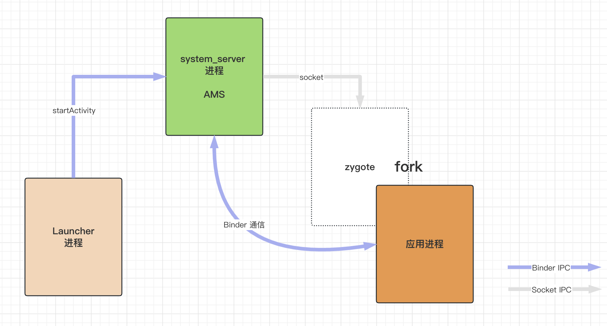

阅读本文，将了解：

1. Android 进程间通信 - Binder 机制
2. Activity 启动流程
3. Android 消息机制
4. View 绘制原理
5. 屏幕刷新机制 - Choreographer

# 从点击桌面图标到应用界面展示

从桌面点击图标到应用界面第一帧绘制出来，整个流程涉及的过程复杂，为了便于理解，这里将整个流程分为四个阶段：应用进程启动阶段、应用进程初始化阶段、Activity 启动阶段、View 绘制阶段；下面我们分别来介绍各个阶段系统所做的事情

## 阶段一：应用进程启动

启动阶段涉及四个进程之间的通信：Launcher 进程、system_server 进程、zygote 进程、应用进程

1. 首先桌面 Launcher 也是一个 App, 我们称之为 Launcher 进程，Launcher 进程在我们手机开机之后就启动了，并和 system_server 进程中的 AMS 建立了 Binder 通信，当我们点击桌面中的一个应用图标的时候，Launcher 进程会通过 Binder 向 AMS 发起 startActivity 请求
2. 当 AMS 收到请求时，处理 intent 信息，通过 ProcessRecord 判断应用进程是否存在，若不存在则通过 socket IPC 向 zygote 进程发送创建新进程的请求
3. zygote 进程 fork 出新的 App 进程，App 进程加载 `ActivityThread` 类，并调用 `ActivityThread.main()` 方法，这是应用进程的入口，至此应用进程已启动完成。



## 阶段二：应用进程初始化

初始化阶段主要做了三件事情：初始化并开启主线程 Looper 消息循环、初始化 Application 以及和 AMS 建立 Binder 通信

阶段一讲到，应用进程启动之后，调用了 `ActivityThread.main()` 方法，我们看下这里面具体做了什么事情

```java
// 已精简非核心代码  
public static void main(String[] args) {
      Looper.prepareMainLooper(); // 初始化主线程 Looper

      ActivityThread thread = new ActivityThread();
      thread.attach(false, startSeq);

      Looper.loop(); // 开启主线程消息循环
}

```

1. `Looper.prepareMainLooper()` 和 `Looper.loop()` 开启了主线程消息循环，之后就可以通过消息机制往主线程 post 任务了
2. `main` 是一个静态方法，可以看到这里实例化了一个 `ActivityThread` 并调用了 `attach` 方法

```java
  final ApplicationThread mAppThread = new ApplicationThread();

  // 已精简非核心代码
  private void attach(boolean system, long startSeq) {
      // 1. 这里传入的是 false, 所以一定会进入这个分支
      if (!system) {
          // 2. 这里做的事情就是将 ApplicationThread 传到 AMS 中，往后 AMS 和 应用就可以通过 Binder 直接通信了
          RuntimeInit.setApplicationObject(mAppThread.asBinder());
          final IActivityManager mgr = ActivityManager.getService();
          try {
              mgr.attachApplication(mAppThread, startSeq);
          } catch (RemoteException ex) {
              throw ex.rethrowFromSystemServer();
          }
         // ...
      } else {
          // ...
      }
  }

```

可以看到 `attach` 里面主要做了一件事情就是和 AMS 建立 binder 通信，我们看下 `ApplicationThread` 的实现

```java
private class ApplicationThread extends IApplicationThread.Stub {

      @Override
      public final void bindApplication(...) {
          //...
          sendMessage(H.BIND_APPLICATION, data);
      }

      //...
}
```

可以看到 `ApplicationThread` 实现了 `Stub` 接口，了解 AIDL 的同学都知道，这个就是用于跨进程通信的 AIDL 生成的接口文件，Stub 是由服务端实现的，这里的服务端就是应用进程，具体来说服务端的实现是 `ActivityThread`，而客户端就是运行在 system_server 的 AMS 了；

所以 `ApplicationThread` 是一个 Binder 对象，attach 方法就是把这个对象传给 AMS， 这样 AMS 就可以通过这里的接口来调用 `ActivityThread` 的代码了， `ApplicationThread` 就是 AMS 和 `ActivityThread` 沟通的桥梁。

一般 AMS 调用 `ApplicationThread` 的接口，`ApplicationThread` 会把任务和数据通过消息机制抛到主线程处理，其中 `H` 就是在 `ActivityThread` 中的一个主线程的 Handler，这里面处理了很多来自 AMS 请求的任务

3. 经过上面的步骤，应用进程和 system_server 进程已经建立了 Binder 通信，接着 system_server 通过 Binder 调用 `bindApplication`，最终落到 `ActivityThread` 的 `handleBindApplication()` 方法

```java
  private void handleBindApplication(AppBindData data) {
      // ...
      try {
          app = data.info.makeApplication(data.restrictedBackupMode, null); // 1. 实例化 Application, 内部调用了 Application.attachBaseContext()

          if (!data.restrictedBackupMode) {
              if (!ArrayUtils.isEmpty(data.providers)) {
                  installContentProviders(app, data.providers); // 2. 实例化 ContentProvider，调用 ContentProvider.onCreate()
              }
          }

          //...
          try {
              mInstrumentation.callApplicationOnCreate(app); // 3. 这里面调用 Application.onCreate()
          } catch (Exception e) {
              // ...
          }
      } finally {
          // ...
      }

      // ...
  }

```

分析了上面的代码，就解释了为什么是 Application.attachBaseContext -> ContentProvider.onCreate() -> Applicatoin.onCreate() 这个执行顺序了

## 阶段三：Activity 启动阶段

应用进程启动之后，紧接着 AMS 通过 Binder 调用，通过 `ApplicationThread` 向 `ActivityThread` 中主线程发送 EXECUTE_TRANSACTION 消息，来执行 Activity 的生命周期；最终会在主线程执行 `handleLaunchActivity`、`handleResumeActivity` 等，这里面就会调用 Activity 的 `onCreate`、`onResume` 等生命周期。

### handleLaunchActivity

```java
  public Activity handleLaunchActivity(ActivityClientRecord r,
          PendingTransactionActions pendingActions, Intent customIntent) {
      final Activity a = performLaunchActivity(r, customIntent);
      return a;
  }

  private Activity performLaunchActivity(ActivityClientRecord r, Intent customIntent) {
      //...
      Activity activity = null;
      try {
          // 实例化 Activity
          java.lang.ClassLoader cl = appContext.getClassLoader();
          activity = mInstrumentation.newActivity(
                  cl, component.getClassName(), r.intent);
          // ...
      } catch (Exception e) {
          // ...
      }

      try {
          // 调用 Activity.onCreate()
              if (r.isPersistable()) {
                  mInstrumentation.callActivityOnCreate(activity, r.state, r.persistentState);
              } else {
                  mInstrumentation.callActivityOnCreate(activity, r.state);
              }
          // ...
      } catch (SuperNotCalledException e) {
         // ...
      }

      return activity;
  }

```

可以看到这里就做了两件事情：实例化 Activity 然后调用 `Activity.onCreate()`

### handleResumeActivity

```java
  @Override
  public void handleResumeActivity(ActivityClientRecord r, boolean finalStateRequest,
          boolean isForward, String reason) {
          // 1. 这里面会执行 onResume()
          if (!performResumeActivity(r, finalStateRequest, reason)) {
              return;
          }
          // 2. 获取 decorView
          View decor = r.window.getDecorView();
          decor.setVisibility(View.INVISIBLE);

          ViewManager wm = a.getWindowManager();
          // 3. 将 decorView 添加到 WindowManager 中
          wm.addView(decor, l);
  }

```

`wm.addView` 最终会调用到 `android.view.WindowManagerGlobal#addView`

```java
  public void addView(View view, ViewGroup.LayoutParams params,
          Display display, Window parentWindow, int userId) {
          // 实例化 ViewRootImpl
          root = new ViewRootImpl(view.getContext(), display);

          // do this last because it fires off messages to start doing things
          try {
              // 核心代码，调用 setView 传入 view
              root.setView(view, wparams, panelParentView, userId);
          } catch (RuntimeException e) {
              // BadTokenException or InvalidDisplayException, clean up.
              if (index >= 0) {
                  removeViewLocked(index, true);
              }
              throw e;
          }
      }
  }

```

`ViewRootImpl.setView` 里面最核心的代码就是调用了 `requestLayout`

```java
  public void setView(View view, WindowManager.LayoutParams attrs, View panelParentView,
          int userId) {
      // ...
      requestLayout();
      //...
  }

```

`requestLayout` 里面就是 View 的绘制流程了

## 阶段四：View 绘制阶段

前面提到在 AMS 的调度下，Activity 会执行生命周期 `onCreate`、`onResume`，应用界面要显示出来，这两个生命周期是关键；我们一般会在 `onCreate` 里面调用 `setContentView` 来设置自定义布局，下面就看看，`setContentView` 里面都做了些什么事情

### setContentView()

以下代码基于 Android13（SDK 33）分析

```java
  // AppCompatActivity
  @Override
  public void setContentView(@LayoutRes int layoutResID) {
      initViewTreeOwners();
      getDelegate().setContentView(layoutResID);
  }
```

`getDelegate` 返回的是 `AppCompatDelegateImpl`

```java
  // AppCompatDelegateImpl
  @Override
  public void setContentView(int resId) {
      // 1. 实例化 DecorView
      ensureSubDecor(); 
      // 2. R.id.content 就是承载我们自定义 View 的容器
      ViewGroup contentParent = mSubDecor.findViewById(android.R.id.content); 
      contentParent.removeAllViews();
      // 3. 将我们自定义 View 添加到 R.id.content 中
      LayoutInflater.from(mContext).inflate(resId, contentParent); 
      mAppCompatWindowCallback.getWrapped().onContentChanged();
  }
```

逻辑比较清晰，先实例化一个 DecorView，然后将我们自定义 View 添加到 DecorView 中，那这个 DecorView 是什么呢

#### DecorView

DecorView 是一个继承自 FrameLayout 的 View，里面一般包含一个标题栏和一个内容区，其中内容区的 id 是 android.R.id.content，这里附一张[示意图](https://github.com/Moosphan/Android-Daily-Interview/issues/13)


我们这里可以简单理解为：DecorView 就是整个 Activity 的 Root View，用来容纳我们设置的自定义 View 布局；

所以执行完 `setContentView` 之后，一个以 DecorView 为 Root 的 View 树就创建好了，但是清注意，这个时候仅仅是构建好一个 View 树，View 还没有真正开始进入绘制流程，此时 View 不可见，也拿不到宽高。

### requstLayout()

回顾之前分析 `handleResumeActivity` 源码，我们知道，这里面先调用了 `onResume()`，然后最终调用到 `ViewRootImpl.setView`，在 `ViewRootImpl.setView` 里面调用了 `requestLayout` 开启 View 绘制流程。

首先看看这个 `ViewRootImpl` 是什么

#### ViewRootImpl

```java
public final class ViewRootImpl implements ViewParent,
      View.AttachInfo.Callbacks, ThreadedRenderer.DrawCallbacks,
      AttachedSurfaceControl { }
```

首先从定义上看，ViewRootImpl 不是 View，而是一个实现了 ViewParent 接口的对象。它的构造方法中有两个成员需要重点关注下

```java
public ViewRootImpl(@UiContext Context context, Display display, IWindowSession session,
          boolean useSfChoreographer) {
      // 保存当前线程，对于这里分析的启动 Activity 的场景，这里是主线程
      mThread = Thread.currentThread();
      // Choreographer 是屏幕刷新机制的关键，后续会单独讲
      mChoreographer = useSfChoreographer
              ? Choreographer.getSfInstance() : Choreographer.getInstance();
  }
```

这里对 ViewRootImpl 的介绍先不再深入，我们留个印象即可，我们重点看下 `requestLayout` 做了什么事情

```java
  // ViewRootImpl
  public void requestLayout() {
      if (!mHandlingLayoutInLayoutRequest) {
          checkThread();
          mLayoutRequested = true;
          scheduleTraversals();
      }
  }

  void checkThread() {
      if (mThread != Thread.currentThread()) {
          throw new CalledFromWrongThreadException(
                  "Only the original thread that created a view hierarchy can touch its views.");
      }
  }

```

这里主要做了两件事情：检查线程、调用 `scheduleTraversals()`

#### checkThread

`mThread` 就是实例化 `ViewRootImpl` 的时候的线程，我们前面提到 AMS 通过 Binder 调用最终向 ActivityThread 主线程发消息来执行 Activity 生命周期，所以 mThread 就是主线程；`requestLayout` 调用的地方也是主线程触发的，所以这里检测一定是通过的。不过如果我们在代码中手动调用 `View.requestLayout`，最终也会走到这里，此时的当前线程就是调用线程，所以这也解释了为什么我们不能在非主线程更新 UI。

> 一定不能在非主线程更新 UI 吗？这里留个疑问，后面会解答。

#### scheduleTraversals

```java
  void scheduleTraversals() {
      if (!mTraversalScheduled) {
          mTraversalScheduled = true;
          // 1. 发送一个同步屏障
          mTraversalBarrier = mHandler.getLooper().getQueue().postSyncBarrier();
          // 2. 向 Choreographer post 一个 callback
          mChoreographer.postCallback(
                  Choreographer.CALLBACK_TRAVERSAL, mTraversalRunnable, null);
          notifyRendererOfFramePending();
          pokeDrawLockIfNeeded();
      }
  }

  final class TraversalRunnable implements Runnable {
      @Override
      public void run() {
          // 3. 执行 doTraversal
          doTraversal();
      }
  }


  void doTraversal() {
      if (mTraversalScheduled) {
          mTraversalScheduled = false;
          // 4. 移除同步屏障
          mHandler.getLooper().getQueue().removeSyncBarrier(mTraversalBarrier);

          if (mProfile) {
              Debug.startMethodTracing("ViewAncestor");
          }

          // 5. onMeasure、onLayout、onDraw 
          performTraversals();

          if (mProfile) {
              Debug.stopMethodTracing();
              mProfile = false;
          }
      }
  }

```

1. 关于消息同步屏障，详细介绍可以移步到 [Android 消息机制](../Android\ 消息机制/Android\ 消息机制.md)，这里简单理解一下其目的就是为了保证渲染任务得到高优执行。
2. Choreographer 是屏幕刷新机制的关键实现，详细介绍可以移步到 [屏幕刷新机制](../屏幕刷新机制/屏幕刷新机制.md)，这里也简单了解一下：往 Choreographer 里面 postCallback 目的是为了在系统下一帧渲染时间到来的时候执行 Runnable 中的逻辑，对应上面也就是执行 `performTraversals()`

下面重点介绍下 `performTraversals()` 这个方法内部实现特别复杂，代码很长，这里就不贴源码了，最关键的三行代码就是 `performMeasure()`、`performLayout()`、`performDraw()`，而这三个方法内部对应的就是我们熟知的 `onMeasure()`、`onLayout()`、`onDraw()` 了

关于 `measure` `layout` `draw` 的流程，这里放一张图，一图胜千言


## 总结

1. Launcher 进程通过 Binder 向 system_server 进程的 AMS 发送启动 Activity 请求
2. AMS 判断如果应用进程不存在，通过 socket 向 zygote 进程发送 fork 应用进程命令
3. 应用进程启动之后，调用 `ActivityThread.main()` 方法启动消息轮循，建立 Binder 通信
4. AMS 通过 Binder 调度 Activity `onCreate`、`onResume` 等生命周期
5. `onCreate` 中通过 `setContentView` 传入的自定义布局构建以 DecorView 为 Root 的 View 树
6. `onResume` 后通过 `Choreographer` 屏幕刷新机制，开启 View 的绘制流程，执行 `onMeasure()`  `onLayout()` `onDraw()`

# 答疑解惑

## 什么是 fork 进程？

`fork()` 系统调用在父进程和子进程中的行为确实有些特殊。当一个进程调用 `fork()` 时，它会创建一个新的子进程，子进程是父进程的副本，包括代码、数据、堆栈等。在 `fork()` 之后，父进程和子进程将并发执行相同的代码。这意味着 `fork()` 系统调用在父进程和子进程中都会执行。

`fork()` 的返回值规则是为了让父进程和子进程能够区分自己的角色。在父进程中，`fork()` 返回新创建子进程的进程 ID（PID）；在子进程中，`fork()` 返回 0。由于父进程和子进程并发执行相同的代码，它们可以根据 `fork()` 的返回值来判断自己是父进程还是子进程，并执行不同的代码路径。

以下是一个简单的示例来说明这个概念：

```c
#include <stdio.h>
#include <unistd.h>

int main() {
  pid_t pid = fork();

  if (pid < 0) {
      // fork failed
      perror("fork");
      return 1;
  } else if (pid == 0) {
      // In child process
      printf("I am the child process, my PID is %d\\\\n", getpid());
  } else {
      // In parent process
      printf("I am the parent process, my PID is %d and my child's PID is %d\\\\n", getpid(), pid);
  }

  return 0;
}
```

在这个示例中，我们调用 `fork()` 创建一个子进程。由于父进程和子进程并发执行相同的代码，它们都会检查 `fork()` 的返回值。在子进程中，`fork()` 返回 0，因此它会执行 `if (pid == 0)` 分支；在父进程中，`fork()` 返回子进程的 PID，因此它会执行 `else` 分支。这样，父进程和子进程可以根据 `fork()` 的返回值来区分自己的角色，并执行相应的操作。 

## 为什么 Android 系统要通过 socket 的方式让 AMS 向 zygote 发送 fork 应用进程的请求？

简单高效：Socket 通信相较于其他 IPC 机制（如 Binder、共享内存等）来说，实现起来更加简单直接。AMS 只需向 Zygote 发送一个创建新进程的请求，而无需进行复杂的数据传输和共享。因此，使用 Socket 通信可以降低实现复杂度，同时保持较高的通信效率

## 为什么 Android 要用 zygote 进程来 fork 应用进程，不可以直接创建新进程吗？

在 Android 系统中，Zygote 进程充当了应用程序进程的孵化器（incubator）。Zygote 进程在系统启动时创建，它预加载了许多常用的类和资源，为应用程序进程提供了一个初始化好的运行环境。当需要创建新的应用程序进程时，系统会通过 Zygote 进程来 fork 出新的进程。这种设计的主要原因是为了提高应用程序启动速度和资源共享。

以下是使用 Zygote 进程的一些优势：

1. 提高应用程序启动速度：Zygote 进程在系统启动时预加载了许多常用的类和资源，这些类和资源在内存中只有一份，可以被所有应用程序进程共享。当通过 Zygote 进程 fork 出新的应用程序进程时，新进程可以直接使用这些已加载的类和资源，无需再次加载。这样可以大大减少应用程序启动时的类加载和资源初始化时间，提高启动速度。
2. 资源共享：由于 Zygote 进程预加载的类和资源在内存中只有一份，它们可以被所有应用程序进程共享。这样可以减少系统的内存占用，提高资源利用率。
3. 简化应用程序启动流程：通过 Zygote 进程来创建应用程序进程，可以简化启动流程，减少启动过程中的错误和异常。Zygote 进程为应用程序提供了一个统一的、经过良好测试的运行环境，有助于提高应用程序的稳定性和兼容性。

当然，理论上 Android 系统也可以直接创建新进程，但这样做会失去上述的优势，导致应用程序启动速度变慢、资源共享效率降低以及启动流程变得复杂。因此，Android 系统采用了 Zygote 进程来 fork 应用程序进程，以提高性能和稳定性。

## ApplicationThread 和 ActivityThread 各自创建时机和作用？

ApplicationThread 是 ActivityThread 的内部私有类，是一个 Binder 类，它继承自 IApplicationThread.Stub，实现了 IApplicationThread 接口。ApplicationThread 主要负责处理来自 AMS（Activity Manager Service）的请求。在应用程序进程启动时，ActivityThread 会创建一个 ApplicationThread 实例，并将其注册到 AMS。随后，AMS 可以通过 ApplicationThread 调用应用程序的各种方法，如启动 Activity、发送广播、处理服务请求等

ActivityThread 是在 zygote 进程 fork 出应用进程之后，调用 ActivityThread.main() 方法内部创建的，ActivityThread 内部开启了应用程序的主线程，负责处理与应用程序生命周期、UI 事件和系统服务相关的任务；而 ApplicationThread 是一个 Binder 类，负责处理来自 AMS 的请求。这两个类共同协作，实现了应用程序与系统服务之间的通信和协同工作

## getWidth() 与 getMeasuredWidth() 区别？


### 应用场景

- getMeasuredWidth() / getMeasuredHeight()是在Measure过程中赋值的，所以需在Measure过程后获取的值才有意义
- 同理，getWidth() / getHeight()在Layout过程中赋值，所以在Layout过程后获取的值才有意义

所以，二者的应用场景是：

- getMeasuredWidth() / getMeasuredHeight()：在onLayout()中获取View的宽/高
- getWidth() / getHeight()：在除onLayout()外的地方获取View的宽/高

### 不相等情况

- 问：上面提到，一般情况下，二者获取的宽 / 高是相等的。那么，“非一般” 情况是什么？（即二者不相等）
- 答：人为设置：通过重写View的 layout（）强行设置

```java
@Override
public void layout( int l , int t, int r , int b) {
	// 改变传入的顶点位置参数
	super.layout(l，t，r+100，b+100)；
}
```

虽然这样的人为设置无实际意义，但证明了：**View的最终宽 / 高 与 测量宽 / 高是可以不一样**

## requestLayout()、invalidate()、postInvalidate() 区别？

### invaliddate() 和 postInvalidate()

这个两个方法的区别比较简单：postInvalidate() 就是在子线程调用时，把操作 post 到主线程调用，最终还是走的 invalidate()

```java
public void postInvalidate() {
    postInvalidateDelayed(0);
}
public void postInvalidateDelayed(long delayMilliseconds) {
    // We try only with the AttachInfo because there's no point in invalidating
    // if we are not attached to our window
    final AttachInfo attachInfo = mAttachInfo;
    if (attachInfo != null) {
        attachInfo.mViewRootImpl.dispatchInvalidateDelayed(this, delayMilliseconds);
    }
}
public void dispatchInvalidateDelayed(View view, long delayMilliseconds) {
    Message msg = mHandler.obtainMessage(MSG_INVALIDATE, view);
    mHandler.sendMessageDelayed(msg, delayMilliseconds);
}
private void handleMessageImpl(Message msg) {
        switch (msg.what) {
            case MSG_INVALIDATE:
                ((View) msg.obj).invalidate();
                break;
      // ...
}
```

### reqeustLayout() 和 invalidate()

两个方法的执行结果：

```java
//调用requestLayout()方法，打印如下
MyView onMeasure: 
MyView onMeasure: 
MyView onLayout: 
MyView onDraw: 
//调用invalidate()方法，打印如下
MyView onDraw:
```

1. requestLayout 和 invalidate 最终都会调用到 ViewRootImpl 的 scheduleTraversals() 方法
2. scheduleTraversals 最终会走到 performTraversals()，方法内部会根据传参和状态的不同判断是否执行 onMeasure、onLayout()、onDraw()

### 总结

`requestLayout()`和`invalidate()`都是Android中用于更新视图的方法，它们的区别如下：

1. `requestLayout()`：当视图的布局参数（如宽度、高度、位置等）发生变化时，需要调用`requestLayout()`方法来重新测量（measure）、布局（layout）和绘制（draw）视图。`requestLayout()`方法会触发视图树的一次完整的测量、布局和绘制流程，包括父视图和子视图。由于`requestLayout()`涉及到整个视图树的更新，因此性能开销较大。通常情况下，当视图的尺寸或位置发生变化时，需要调用`requestLayout()`方法。
2. `invalidate()`：当视图的内容（如颜色、文本等）发生变化时，需要调用`invalidate()`方法来重新绘制（draw）视图。`invalidate()`方法只会触发视图的绘制流程，而不会触发测量和布局。相比`requestLayout()`，`invalidate()`方法的性能开销较小。通常情况下，当视图的外观发生变化时，需要调用`invalidate()`方法。
3. `requestLayout()`用于更新视图的布局参数，会触发整个视图树的测量、布局和绘制流程，性能开销较大。
4. `invalidate()`用于更新视图的内容，只会触发视图的绘制流程，性能开销较小。

在实际开发过程中，需要根据视图的变化情况选择合适的方法来更新视图。如果只是视图内容的变化，应优先使用`invalidate()`方法；如果是视图布局参数的变化，需要使用`requestLayout()`方法。

## View 的更新必须在主线程吗？

任何线程都可以更新自己创建的 UI，只需要满足以下两种情况

1. 在 ViewRootImpl 创建之前，可以在子线程更新 UI，比如在 Activity onCreate 的时候
2. 在 ViewRootImpl 创建之后，只需要保证创建 ViewRootImpl 的线程和更新 UI 的线程是同一个就可以；比如我们在子线程调用 `ViewManager#addView`

我们同上说子线程不可以更新 UI，这个异常是在 ViewRootImpl 的 checkThread() 方法中抛出的：

```java
void checkThread() {
      if (mThread != Thread.currentThread()) {
          throw new CalledFromWrongThreadException(
                  "Only the original thread that created a view hierarchy can touch its views.");
      }
  }
```