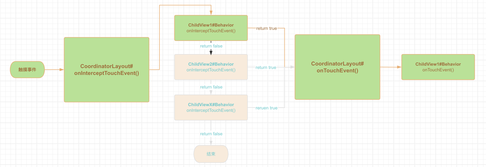
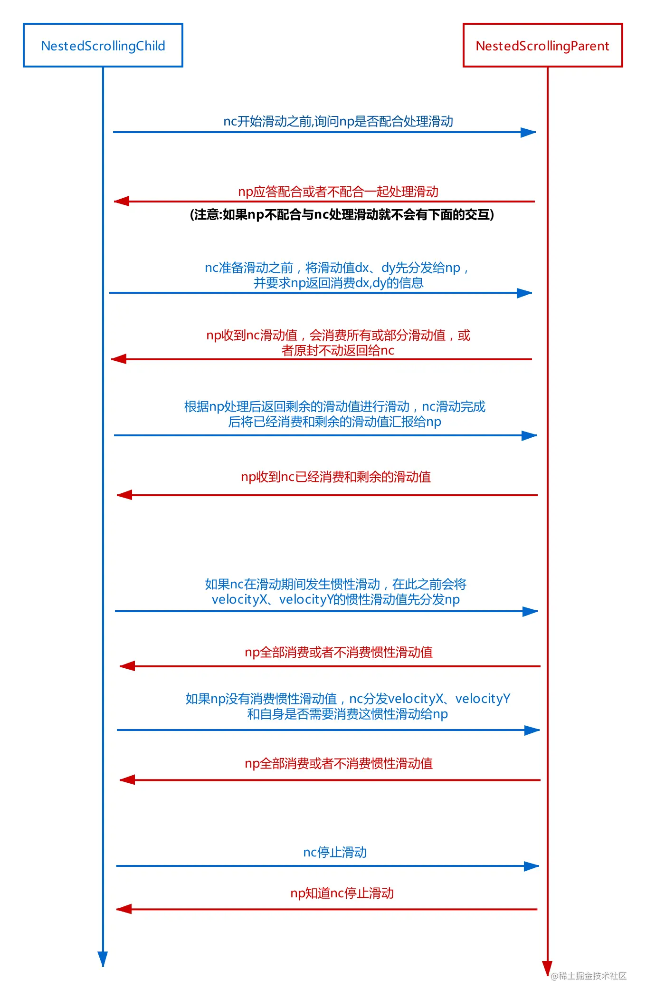

Google 官方源码也有 Bug ！因为踩了 AppBarLayout 的坑！！这一次要彻底搞懂 CoordinatorLayout + Behavior！！！

# 爱之初体验 - 熟悉的陌生人

最近在实现滑动吸顶效果的时候使用到了 `CoordinatorLayout` + `AppBarLayout`，这两个组件都是“老熟人”了，之所以这么说是因为这都是 2015 年的东西了，但实话说在项目中用的并不算多，或者说仅仅只是会用，但绝对称不上“精通”，所以准确的说这俩应该叫“熟悉的陌生人”。正因为如此，我在项目中咔咔一顿写之后，看似实现了产品希望的效果，但是却遇到了两个神奇的 Bug！


为方便讲解，以下用 Demo 演示。布局很简单，就是经典的 `CoordinatorLayout` + `AppBarLayout` + `ViewPager` 的组合，其中 `ViewPager`  里面包含两个 `Fragment`，每个 Fragment 内都有一个 `RecyclerView`

```xml
<?xml version="1.0" encoding="utf-8"?>
<androidx.coordinatorlayout.widget.CoordinatorLayout xmlns:android="http://schemas.android.com/apk/res/android"
    xmlns:app="http://schemas.android.com/apk/res-auto"
    android:layout_width="match_parent"
    android:layout_height="match_parent">

    <com.google.android.material.appbar.AppBarLayout
        android:layout_width="match_parent"
        android:layout_height="wrap_content">

        <TextView
            android:layout_width="match_parent"
            android:layout_height="wrap_content"
            android:background="@color/teal_200"
            android:text="注意看我会抖动\n注意看我会抖动\n注意看我会抖动\n注意看我会抖动\n注意看我会抖动\n注意看我会抖动\n注意看我会抖动\n注意看我会抖动\n注意看我会抖动\n注意看我会抖动\n注意看我会抖动\n注意看我会抖动\n注意看我会抖动\n注意看我会抖动\n注意看我会抖动\n注意看我会抖动\n注意看我会抖动\n注意看我会抖动\n注意看我会抖动\n注意看我会抖动\n"
            android:textSize="20sp"
            app:layout_scrollFlags="scroll" />
    </com.google.android.material.appbar.AppBarLayout>

    <androidx.viewpager2.widget.ViewPager2
        android:id="@+id/view_pager"
        android:layout_width="match_parent"
        android:layout_height="match_parent"
        app:layout_behavior="com.google.android.material.appbar.AppBarLayout$ScrollingViewBehavior" />

</androidx.coordinatorlayout.widget.CoordinatorLayout>
```

```kotlin
class AppBarLayoutBugActivity : AppCompatActivity() {

    private lateinit var viewPager: ViewPager2

    override fun onCreate(savedInstanceState: Bundle?) {
        super.onCreate(savedInstanceState)
        setContentView(R.layout.activity_appbar_layout_bug)
        viewPager = findViewById(R.id.view_pager)
        viewPager.adapter = MyAdapter(this)
    }

    inner class MyAdapter(fragmentActivity: FragmentActivity) :
        FragmentStateAdapter(fragmentActivity) {
        override fun getItemCount(): Int {
            return 2
        }

        override fun createFragment(position: Int): Fragment {
            val fragment = ListFragment()
            fragment.arguments = Bundle().apply {
                putString("fragment_name", "第 $position 个Fragment")
            }
            return fragment
        }
    }

}
```

`ListFragment` 代码很简单，也不是本文重点，这里就不贴代码了。

下面就来看看，这就这点代码能引出什么惊天大 bug 了！

## AppBarLayout 滑动抖动

遇到的第一个问题就是：当快速向上滑动 `AppBarLayout` 然后又向下快速滑动 `RecyclerView` 的时候，整个页面都在疯狂抖动！


## AppBarLayout 滑动无反应

第二个问题就是：我在 ViewPager 第一页滑动的好好的，当我滑动到第二页的时候，`AppBarLayout` 怎么滑都滑不动了


# 爱之再了解 - 拔开外衣窥探原理

这两个问题直接把我给整不会了，一度怀疑是自己太久没用了，是哪里使用姿势有问题，一通分析下来无果之后，最后决定还是先把 `CoordinatorLayout` + `Behavior` 这一套机制给整明白，正所谓知己知彼方能百战百胜！


## CoordinatorLayout 事件分发机制

我们布局最外层是一个 `CoordinatorLayout` 根据 Android 中事件分发的顺序，所有手指触摸事件最开始是先到这里的。而从源码上看，`CoordinatorLayout` 覆写了 `onInterceptTouchEvent` 和 `onTouchEvent`

```java
public class CoordinatorLayout {
    @Override
    public boolean onInterceptTouchEvent(MotionEvent ev) {
        final int action = ev.getActionMasked();

        // Make sure we reset in case we had missed a previous important event.
        if (action == MotionEvent.ACTION_DOWN) {
            resetTouchBehaviors(true);
        }
        
        // 如果有人拦截事件，事件就交给 onTouchEvent 处理
        final boolean intercepted = performIntercept(ev, TYPE_ON_INTERCEPT);

        if (action == MotionEvent.ACTION_UP || action == MotionEvent.ACTION_CANCEL) {
            resetTouchBehaviors(true);
        }

        return intercepted;
    }
}

```

`onInterceptTouchEvent()` 中通过调用 `performIntercept()` 判断是否有人要拦截事件，如果有的话，事件会交给 `onTouchEvent()` 处理。先看看 `performIntercept()` 是怎么处理的

```java 
public class CoordinatorLayout {

    private boolean performIntercept(MotionEvent ev, final int type) {
        boolean intercepted = false;
        boolean newBlock = false;

        MotionEvent cancelEvent = null;

        final int action = ev.getActionMasked();

        // 1. 这里是按照一定的顺序，一般是最上层的 View 在前面，获取所有的 child View
        final List<View> topmostChildList = mTempList1;
        getTopSortedChildren(topmostChildList);

        // 2. 按照从上往下顺序遍历所有子孩子
        // Let topmost child views inspect first
        final int childCount = topmostChildList.size();
        for (int i = 0; i < childCount; i++) {
            final View child = topmostChildList.get(i);
            final androidx.coordinatorlayout.widget.CoordinatorLayout.LayoutParams lp = (androidx.coordinatorlayout.widget.CoordinatorLayout.LayoutParams) child.getLayoutParams();
            final androidx.coordinatorlayout.widget.CoordinatorLayout.Behavior b = lp.getBehavior();

            // 3. 一旦发现有一个子 View 拦截事件了，就向其他子 View 发送一个 ACTION_CANCEL 事件
            if ((intercepted || newBlock) && action != MotionEvent.ACTION_DOWN) {
                // Cancel all behaviors beneath the one that intercepted.
                // If the event is "down" then we don't have anything to cancel yet.
                if (b != null) {
                    if (cancelEvent == null) {
                        final long now = SystemClock.uptimeMillis();
                        cancelEvent = MotionEvent.obtain(now, now,
                                MotionEvent.ACTION_CANCEL, 0.0f, 0.0f, 0);
                    }
                    switch (type) {
                        case TYPE_ON_INTERCEPT:
                            b.onInterceptTouchEvent(this, child, cancelEvent);
                            break;
                        case TYPE_ON_TOUCH:
                            b.onTouchEvent(this, child, cancelEvent);
                            break;
                    }
                }
                continue;
            }

            // 4. 把事件分发给子 View 的 Behavior
            if (!intercepted && b != null) {
                switch (type) {
                    case TYPE_ON_INTERCEPT:
                        intercepted = b.onInterceptTouchEvent(this, child, ev);
                        break;
                    case TYPE_ON_TOUCH:
                        intercepted = b.onTouchEvent(this, child, ev);
                        break;
                }
              	// 5. 找到一个拦截事件的 View，保存在 mBehaviorTouchView 中
                if (intercepted) {
                    mBehaviorTouchView = child;
                }
            }

            // Don't keep going if we're not allowing interaction below this.
            // Setting newBlock will make sure we cancel the rest of the behaviors.
            final boolean wasBlocking = lp.didBlockInteraction();
            final boolean isBlocking = lp.isBlockingInteractionBelow(this, child);
            newBlock = isBlocking && !wasBlocking;
            if (isBlocking && !newBlock) {
                // Stop here since we don't have anything more to cancel - we already did
                // when the behavior first started blocking things below this point.
                break;
            }
        }

        topmostChildList.clear();

        return intercepted;
    }
}

```

关键的代码都在注释中解释了，总结一下就是 `performIntercept()` 负责把事件分发给所有 `CoordinatorLayout` 的子 View 所绑定的 `Behavior`（按照层级上从上往下，最顶层优先收到事件）。在每个子 View 的 `Behavior` 中的 `onInterceptTouchEvent` 中决定是否要拦截事件，并且保证只要有一个 View 拦截事件之后，其他 View 不能再处理后续事件，拦截的事件的子 View 被保存在 `mBehaviorTouchView` 中

当 `onInterceptTouchEvent` 返回 true 时，表示有子 View 拦截事件，此时事件会传递到 `onTouchEvent`

```java
public class CoordinatorLayout {

    @Override
    @SuppressWarnings("unchecked")
    public boolean onTouchEvent(MotionEvent ev) {
        boolean handled = false;
        boolean cancelSuper = false;
        MotionEvent cancelEvent = null;

        final int action = ev.getActionMasked();

        // 1. mBehaviorTouchView 不为空说明有 View 拦截事件，否则再调用一下 performIntercept 看有没有子 View 拦截事件
        if (mBehaviorTouchView != null || (cancelSuper = performIntercept(ev, TYPE_ON_TOUCH))) {
            // Safe since performIntercept guarantees that
            // mBehaviorTouchView != null if it returns true
            final CoordinatorLayout.LayoutParams lp = (CoordinatorLayout.LayoutParams) mBehaviorTouchView.getLayoutParams();
            final CoordinatorLayout.Behavior b = lp.getBehavior();
            // 2. 能走到这里的说明肯定是有 View 拦截事件了，将事件传递给这个 View 对应的 Behavior
            if (b != null) {
                handled = b.onTouchEvent(this, mBehaviorTouchView, ev);
            }
        }

        // Keep the super implementation correct
        if (mBehaviorTouchView == null) {
            handled |= super.onTouchEvent(ev);
        } else if (cancelSuper) {
            if (cancelEvent == null) {
                final long now = SystemClock.uptimeMillis();
                cancelEvent = MotionEvent.obtain(now, now,
                        MotionEvent.ACTION_CANCEL, 0.0f, 0.0f, 0);
            }
            super.onTouchEvent(cancelEvent);
        }

        if (cancelEvent != null) {
            cancelEvent.recycle();
        }

        if (action == MotionEvent.ACTION_UP || action == MotionEvent.ACTION_CANCEL) {
            resetTouchBehaviors(false);
        }

        return handled;
    }
}
```

能看到 `onTouchEvent` 中也是将事件传递给要拦截事件的 View 的 Behavior 中。

至此，我们知道 **`CoordinatorLayout` 本身并不处理事件，而是负责将事件传递给所有子 View 的 Behavior，事件真正处理的逻辑都在 Behavior 中！**



> 所有子 View 的 Behavior 都不拦截事件，`CoordinatorLayout.onInterceptTouchEvent` 就返回 false，此时事件传递到子 View，走正常的 View 事件传递机制

## Behavior

前面我们分析到：`CoordinatorLayout` 负责将事件传递到子 View 所绑定的 `Behavior` 上，`Behavior` 是什么？以及子 View 的 `Behavior` 是什么时候被设置到 View 里面的呢？

### Behavior 是什么

`Behavior` 是一个接口，里面定义了非常多的方法，其中就有我们上面提到的 `onInterceptTouchEvent()` 和 `onTouchEvent()`，除此之外还有很多重要的方法，这里我列举一些比较核心的方法：

```java
public static abstract class Behavior<V extends View> {

    /**
     * 建立和其他兄弟 View 的依赖关系, 当返回 true 时, 表示 [child] 依赖 [dependency]
     * 当 dependency 发生变化的时候（大小位置等）会回调 [onDependentViewChanged] [onDependentViewRemoved]
     *
     * @param parent CoordinatorLayout
     * @param child Behavior 所绑定的 View，就是自己
     * @param dependency 除了自己以外的其他兄弟 View
     * @return 返回 true 表示 child 依赖 dependency
     */
    public boolean layoutDependsOn(@NonNull CoordinatorLayout parent, @NonNull V child,
                                   @NonNull View dependency) {
        return false;
    }

    /**
     * 当所依赖的 View [dependency] 发生大小位置等变化时会回调该函数，可以在这里对 child 做相应的处理来响应变化
     *
     * @param parent CoordinatorLayout
     * @param child Behavior 所绑定的 View，就是自己
     * @param dependency layoutDependsOn 中返回了 true 对应的那个兄弟 View
     * @return 如果这里改变了 child 的位置大小，则返回 true
     */
    public boolean onDependentViewChanged(@NonNull CoordinatorLayout parent, @NonNull V child,
                                          @NonNull View dependency) {
        return false;
    }

    /**
     * 当所依赖的 View [dependency] 被 remove 时会回调该函数
     *
     * @param parent CoordinatorLayout
     * @param child Behavior 所绑定的 View，就是自己
     * @param dependency layoutDependsOn 中返回了 true 对应的那个兄弟 View
     */
    public void onDependentViewRemoved(@NonNull CoordinatorLayout parent, @NonNull V child,
                                       @NonNull View dependency) {
    }

    /**
     * 当 CoordinatorLayout 开始测量 child 宽高的时候调用
     */
    public boolean onMeasureChild(@NonNull CoordinatorLayout parent, @NonNull V child,
                                  int parentWidthMeasureSpec, int widthUsed,
                                  int parentHeightMeasureSpec, int heightUsed) {
        return false;
    }

    /**
     * 当 CoordinatorLayout 开始布局 child 的时候调用
     */
    public boolean onLayoutChild(@NonNull CoordinatorLayout parent, @NonNull V child,
                                 int layoutDirection) {
        return false;
    }

    ...
}
```

注释中已经大致解释了各个方法的用途和含义，其中还有很多 `xxxNestedxxx` 的方法，是嵌套滑动相关的，这个会在后续介绍。

### Behavior 初始化时机

有朋友可能会抢答了 —— xml 定义子 View 的时候通过 `app:layout_behavior` 指定就好了！

是的没错，但这只回答了一半。做过自定义 View 的朋友们都知道，在 xml 中定义的属性，我们一般会在对应的 View 的构造方法里面通过 `TypedArray` 解析出来，`layout_behavior` 也是这样吗？`CoordinatorLayout` 的子孩子可以是任意类型的 View，难道要在所有的 View 的构造方法里面去解析 `layout_behavior` 吗？如果是的话那只能把这个逻辑放在最基础的 View 构造方法里面了。但是翻遍了 View 的源码也没有找到 `layout_behavior` 的身影。而且想想也不合理，`Behavior` 是 `CoordinatorLayout` 特有的东西，如果把 `Behavior` 相关的逻辑下沉到 View，那就十分耦合了。 

我们回到 `CoordinatorLayout` 身上，他是通过拿到子 View 的 `LayoutParams` 然后通过 `LayoutParams.getBehavior()` 拿到 Behavior 的。那我们看看 `LayoutParams` 是怎么定义的：

```java
class CoordinatorLayout {
      public static class LayoutParams extends MarginLayoutParams {
        Behavior mBehavior;

        boolean mBehaviorResolved = false;

        LayoutParams(@NonNull Context context, @Nullable AttributeSet attrs) {
            super(context, attrs);
            final TypedArray a = context.obtainStyledAttributes(attrs,
                    R.styleable.CoordinatorLayout_Layout);
            mBehaviorResolved = a.hasValue(
                    R.styleable.CoordinatorLayout_Layout_layout_behavior);
            if (mBehaviorResolved) {
                mBehavior = parseBehavior(context, attrs, a.getString(
                        R.styleable.CoordinatorLayout_Layout_layout_behavior));
            }
            a.recycle();

            if (mBehavior != null) {
                // If we have a Behavior, dispatch that it has been attached
                mBehavior.onAttachedToLayoutParams(this);
            }
        }

        @Nullable
        public Behavior getBehavior() {
            return mBehavior;
        }
    }
}
```

可以看到 `layout_behavior` 正是在 `CoordinatorLayout.LayoutParams` 里面进行解析的，其中 `parseBehavior` 即是通过反射创建对应的 `Behavior` 对象。

但还有个问题：在一开始的例子中，我们写 `AppBarLayout` 的时候并没有指定 `layout_behavior` ，它的 `Behavior` 又是什么时候设置的呢？ 

```java
public class AppBarLayout extends LinearLayout implements CoordinatorLayout.AttachedBehavior {
      @Override
  		@NonNull
  		public CoordinatorLayout.Behavior<AppBarLayout> getBehavior() {
    		behavior = new AppBarLayout.Behavior();
    		return behavior;
  		}
}

public interface AttachedBehavior {
    @NonNull Behavior getBehavior();
}

```

通过源码发现 `AppBarLayout` 实现了 `AttachedBehavior` 接口，这个接口有个方法 `getBehavior` 返回了 `AppBarLayout` 的` Behavior`；继续分析 `getBehavior` 是在哪里被调用的：

```java
LayoutParams getResolvedLayoutParams(View child) {
    // 1. 这里就是前面分析的 LayoutParams
    final LayoutParams result = (LayoutParams) child.getLayoutParams();
    // 2. 如果 xml 中没有定义 layout_behavior, 这里就是 false
    if (!result.mBehaviorResolved) {
        // 3. 如果 View 实现了 AttachedBehavior 接口，就调用 getBehavior 获取
        if (child instanceof AttachedBehavior) {
            Behavior attachedBehavior = ((AttachedBehavior) child).getBehavior();
            if (attachedBehavior == null) {
                Log.e(TAG, "Attached behavior class is null");
            }
            result.setBehavior(attachedBehavior);
            result.mBehaviorResolved = true;
        } else {
            // 4. 还可以通过注解 DefaultBehavior 绑定 Behavior 不过已经被废弃了，建议使用 AttachedBehavior 接口
            // The deprecated path that looks up the attached behavior based on annotation
            Class<?> childClass = child.getClass();
            DefaultBehavior defaultBehavior = null;
            while (childClass != null
                    && (defaultBehavior = childClass.getAnnotation(DefaultBehavior.class))
                    == null) {
                childClass = childClass.getSuperclass();
            }
            if (defaultBehavior != null) {
                try {
                    result.setBehavior(
                            defaultBehavior.value().getDeclaredConstructor().newInstance());
                } catch (Exception e) {
                    Log.e(TAG, "Default behavior class " + defaultBehavior.value().getName()
                            + " could not be instantiated. Did you forget"
                            + " a default constructor?", e);
                }
            }
            result.mBehaviorResolved = true;
        }
    }
    return result;
}
```

`getResolvedLayoutParams` 又是在哪里被调用呢

```java
class CoordinatorLayout {
		protected void onMeasure(int widthMeasureSpec, int heightMeasureSpec) {
      	prepareChildren();
    }
  	
  	private void prepareChildren() {
        mDependencySortedChildren.clear();
        mChildDag.clear();
				
     		// 1. 遍历所有子 View
        for (int i = 0, count = getChildCount(); i < count; i++) {
            final View view = getChildAt(i);
						
          	// 2. 调用 getResolvedLayoutParams 初始化 LayoutParams
            final LayoutParams lp = getResolvedLayoutParams(view);
            lp.findAnchorView(this, view);

            mChildDag.addNode(view);
						
          	// 3. 再遍历一遍子 View，构建各个子 View 之间的依赖关系，最后形成一个有向无环图
            // Now iterate again over the other children, adding any dependencies to the graph
            for (int j = 0; j < count; j++) {
                if (j == i) {
                    continue;
                }
                final View other = getChildAt(j);
              	// 4. 这里会调用 Behavior.layoutDependOn(), 根据其返回值来建立依赖关系，形成有向无环图
                if (lp.dependsOn(this, view, other)) {
                    if (!mChildDag.contains(other)) {
                        // Make sure that the other node is added
                        mChildDag.addNode(other);
                    }
                    // Now add the dependency to the graph
                    mChildDag.addEdge(other, view);
                }
            }
        }

        // Finally add the sorted graph list to our list
        mDependencySortedChildren.addAll(mChildDag.getSortedList());
        // We also need to reverse the result since we want the start of the list to contain
        // Views which have no dependencies, then dependent views after that
        Collections.reverse(mDependencySortedChildren);
    }
}
```

至此我们总结下 Behavior 初始化逻辑：

1. 可以通过 xml 设置 `layout_behavior` 来指定 `Behavior`；`CoordinatorLayout.LayoutParams` 构造方法中解析 `layout_behavior` ，通过反射实例化 `behavior` 对象
2. 如果子 View 实现了 `AttachedBehavior` 接口，通过 `getBehavior` 指定 `Behavior`
3. `CoordinatorLayout` `onMeasure()` 的时候会调用 `prepareChildren()` 内部调用 `getResolvedLayoutParams()` 判断如果子 View 实现了 `AttachedBehavior` 就通过 `getBehavior` 获取 `behavior` 对象保存在 ``CoordinatorLayout.LayoutParams` 中
4. `prepareChildren` 中还遍历所有子 View 调用了子 View 的 `Behavior.layoutDependOn()` 来建立所有子 View 之间的依赖关系，最终形成一个有向无环图，为后续回调 `onDependentViewChanged()` 和 `onDependentViewRemoved()` 用。 
5. `CoordiantorLayout` 通过获取子 View 的 ``CoordinatorLayout.LayoutParams` 来获取先前初始化好的 `behavior`

## 嵌套滑动

前面提到 `Behavior` 中有很多 `xxxNestedxxx` 的方法都是嵌套滑动相关的，下面就看下这些方法都是什么时候被调用的

```java
public static abstract class Behavior<V extends View> {

    ...

    public boolean onStartNestedScroll(@NonNull CoordinatorLayout coordinatorLayout,
                                       @NonNull V child, @NonNull View directTargetChild, @NonNull View target,
                                       @ViewCompat.ScrollAxis int axes, @ViewCompat.NestedScrollType int type) {
    }

    public void onNestedScrollAccepted(@NonNull CoordinatorLayout coordinatorLayout,
                                       @NonNull V child, @NonNull View directTargetChild, @NonNull View target,
                                       @ViewCompat.ScrollAxis int axes, @ViewCompat.NestedScrollType int type) {
    }

    public void onStopNestedScroll(@NonNull CoordinatorLayout coordinatorLayout,
                                   @NonNull V child, @NonNull View target, @ViewCompat.NestedScrollType int type) {
    }

    public void onNestedScroll(@NonNull CoordinatorLayout coordinatorLayout, @NonNull V child,
                               @NonNull View target, int dxConsumed, int dyConsumed, int dxUnconsumed,
                               int dyUnconsumed, @ViewCompat.NestedScrollType int type, @NonNull int[] consumed) {
    }

    public void onNestedPreScroll(@NonNull CoordinatorLayout coordinatorLayout,
                                  @NonNull V child, @NonNull View target, int dx, int dy, @NonNull int[] consumed,
                                  @ViewCompat.NestedScrollType int type) {
    }

    public boolean onNestedFling(@NonNull CoordinatorLayout coordinatorLayout,
                                 @NonNull V child, @NonNull View target, float velocityX, float velocityY,
                                 boolean consumed) {
    }

    public boolean onNestedPreFling(@NonNull CoordinatorLayout coordinatorLayout,
                                    @NonNull V child, @NonNull View target, float velocityX, float velocityY) {
    }
}
```

在这之前，先了解两个东西：`NestedScrollingParent` 和 `NestedScrollingChild`

> 在源码中，会发现有 `NestedScrollingParent` `NestedScrollingParent2` `NestedScrollingParent3`；`NestedScrollingChild` 也有 2 和 3，这是因为 Google 在后面的迭代中发现之前定义的接口不足又补充了一些方法，由于都是继承关系，我们直接看版本 3 的就可以了。在后面文章中我们 `NestedScrollingParent` 和 `NestedScrollingChild` 默认代表版本 3

- **`NestedScrollingParent`**: 在嵌套滑动中，表示父容器，`CoordiantorLayout` 就实现了该接口
- **`NestedScrollingChild`**: 在嵌套滑动中，表示内部的可滑动组件，一般被 `NestedScrollingParent` 包裹着；比如 `RecyclerView` 就实现了该接口

### 嵌套滑动中的事件传递机制

我们从 `RecyclerView` 的滑动开始分析，嵌套滑动中，事件是如何一步步分发到 `Behavior` 中的

在 `RecyclerView` 的 `onTouchEvent()` 中，有一个和嵌套滑动相关的调用：`dispatchNestedPreScroll()` 和 `dispatchNestedScroll()`

```java
  @Override
  public boolean onTouchEvent(MotionEvent e) {
      switch (action) {
          case MotionEvent.ACTION_MOVE: {
              if (mScrollState == SCROLL_STATE_DRAGGING) {
   								// 1. 最终走到 NestedScrollingParent.onNestedPreScroll()
                  if (dispatchNestedPreScroll(
                          canScrollHorizontally ? dx : 0,
                          canScrollVertically ? dy : 0,
                          mReusableIntPair, mScrollOffset, TYPE_TOUCH
                  )) {
                    	// 2. 计算被父 View 滑动消费掉的滑动距离，剩下再交给自己处理
                      dx -= mReusableIntPair[0];
                      dy -= mReusableIntPair[1];
                      // Updated the nested offsets
                      mNestedOffsets[0] += mScrollOffset[0];
                      mNestedOffsets[1] += mScrollOffset[1];
                      getParent().requestDisallowInterceptTouchEvent(true);
                  }

                  mLastTouchX = x - mScrollOffset[0];
                  mLastTouchY = y - mScrollOffset[1];
									// 3. 内部调用了 dispatchNestedScroll， 最终走到 NestedScrollingParent.onNestedScroll()
                  if (scrollByInternal(
                          canScrollHorizontally ? dx : 0,
                          canScrollVertically ? dy : 0,
                          e)) {
                      getParent().requestDisallowInterceptTouchEvent(true);
                  }
                
              }
          } 
      return true;
  }

```

`RecyclerView` 中分发嵌套滑动事件，最终会交给 `NestedScrollingChildHelper` 和 `ViewParentCompat` 处理，其中 `ViewParentCompat` 定义了 `onNestedPreScroll()` `onNestedScroll()` 等方法，内部判断当前 View 的 parent 是否实现了 `NestedScrollingParent` 接口，是则将事件传递给 `NestedScrollingParent`

关于 NestedScrolling 的详细内容网上已经有很多大神讲解得非常详细，详见 [《浅析NestedScrolling嵌套滑动机制之基础篇》](https://juejin.cn/post/6844904184911773709)

这里直接借用大神文章中的一张图来总结嵌套滑动事件分发的机制



总的来说，当嵌套滑动的时候 `NestedScrollingChild` 会先将事件交 `NestedScrollingParent` 处理，然后自己再处理剩余的滑动距离。前面我们讲到 `RecyclerView` 实现了 `NestedScrollingChild` 接口，`CoordinatorLayout` 实现了 `NestedScrollingParent` 接口，因此，嵌套滑动时，事件又先回到了 `CoordinatorLayout` 上。

因为嵌套滑动相关的回调都大同小异，这里以 `onNestedScroll()` 为例看下 `CoordinatorLayout` 是怎么处理的。

```java
  public void onNestedScroll(@NonNull View target, int dxConsumed, int dyConsumed,
          int dxUnconsumed, int dyUnconsumed, @ViewCompat.NestedScrollType int type,
          @NonNull int[] consumed) {
      final int childCount = getChildCount();
      boolean accepted = false;
      int xConsumed = 0;
      int yConsumed = 0;
			
    	// 1. 遍历所有子 view
      for (int i = 0; i < childCount; i++) {
          final View view = getChildAt(i);
          if (view.getVisibility() == GONE) {
              // If the child is GONE, skip...
              continue;
          }

          final LayoutParams lp = (LayoutParams) view.getLayoutParams();
          if (!lp.isNestedScrollAccepted(type)) {
              continue;
          }

          final Behavior viewBehavior = lp.getBehavior();
          if (viewBehavior != null) {

              mBehaviorConsumed[0] = 0;
              mBehaviorConsumed[1] = 0;
							// 2. 事件传递给 Behavior
              viewBehavior.onNestedScroll(this, view, target, dxConsumed, dyConsumed,
                      dxUnconsumed, dyUnconsumed, type, mBehaviorConsumed);
							// 3. 计算被消费的滑动距离
              xConsumed = dxUnconsumed > 0 ? Math.max(xConsumed, mBehaviorConsumed[0])
                      : Math.min(xConsumed, mBehaviorConsumed[0]);
              yConsumed = dyUnconsumed > 0 ? Math.max(yConsumed, mBehaviorConsumed[1])
                      : Math.min(yConsumed, mBehaviorConsumed[1]);

              accepted = true;
          }
      }

      consumed[0] += xConsumed;
      consumed[1] += yConsumed;

      if (accepted) {
          onChildViewsChanged(EVENT_NESTED_SCROLL);
      }
  }

```

可以看到，**嵌套滑动事件最终又交给了子 View 的 Behavior！**

最后我们再看下 `Behavior` 中嵌套滑动中各个回调方法具体的含义是什么

| 方法名                      | 含义                                                         |
| --------------------------- | ------------------------------------------------------------ |
| boolean onStartNestedScroll | 开始嵌套滑动前调用，比如手机按下时、快速滑动开始时；返回 true 表示 ViewParent 接受此次嵌套滑动 |
| void onNestedScrollAccepted | onStartNestedScroll 返回 true 的时候会调用                   |
| void onStopNestedScroll     | 嵌套滑动结束时调用，比如手指抬起时                           |
| void onNestedPreScroll      | 马上嵌套滑动前调用，比 onStartNestedScroll 晚，比 onNestedScroll 前 |
| void onNestedScroll         | 嵌套滑动过程调用                                             |
| void onNestedPreFling       | 马上嵌套 fling 前调用                                        |
| void onNestedFling          | 嵌套 fling 过程调用                                          |

至此，`CoordinatorLayout` + `Behavior` 机制基本分析完毕。我们简单小结一下：

## 小结

1. `CoordinatorLayout` 事件分发给所有子 View 的 `Behavior`，由子 View 的 `Behavior` 决定是否要拦截事件，以及拦截之后如何处理事件；
2. 当发生嵌套滑动的时候，事件先交给 `CoordinatorLayout` 处理，`CoordinatorLayout` 又将事件传递给所有子 View 的 `Behavior` 处理；
3. `Behavior` 是所有事件的拦截者，在这里可以拦截到各种滑动事件以此处理自己的逻辑，同时还能和其他兄弟 View 建立依赖关系，在他们发生位置大小变化的时候也能收到回调，方便地处理自己的逻辑；


以上就是 `CoordinatorLayout` 协调布局所有子 View 间 “协同” 的秘密！

看完是不是感觉功力瞬间大增，是时候开始解决开头遇到的两个问题了！


# 爱之终圆满 - 妈妈再也不用担心我不会 CoordinatorLayout + Behavior 了

## AppBarLayout 滑动抖动问题

分析抖动问题的表现，是由快速滑动引起的，因此首先怀疑是否嵌套滑动 fling 导致的。当我们手指快速滑动 `RecyclerView` 的时候，会触发 `RecyclerView` 的 `fling()` 方法；同时当我们快速滑动 `AppBarLayout` 的时候，通过阅读源码，发现也会调用 `fling()`

`AppBarLayout` 的 `Behavior` 是 `AppBarLayout.Behavior`，继承自 `HeaderBehavior`

```java
// HeaderBehavior
public boolean onTouchEvent(
    @NonNull CoordinatorLayout parent, @NonNull V child, @NonNull MotionEvent ev) {
  switch (ev.getActionMasked()) {
    ...
    case MotionEvent.ACTION_UP:
      if (velocityTracker != null) {
        consumeUp = true;
        velocityTracker.addMovement(ev);
        velocityTracker.computeCurrentVelocity(1000);
        float yvel = velocityTracker.getYVelocity(activePointerId);
        // 触发 fling
        fling(parent, child, -getScrollRangeForDragFling(child), 0, yvel);
      }
  }
  
  final boolean fling(
      CoordinatorLayout coordinatorLayout,
      @NonNull V layout,
      int minOffset,
      int maxOffset,
      float velocityY) {
    if (flingRunnable != null) {
      layout.removeCallbacks(flingRunnable);
      flingRunnable = null;
    }

    if (scroller == null) {
      scroller = new OverScroller(layout.getContext());
    }

    scroller.fling(
        0,
        getTopAndBottomOffset(), // curr
        0,
        Math.round(velocityY), // velocity.
        0,
        0, // x
        minOffset,
        maxOffset); // y

    ...
  }

```

那么抖动问题就很好猜了：快速上滑 `AppBarLayout` 触发了一个向上的 `fling()`，在 `fling()` 还没有结束的时候，快速向下滑动 `RecyclerView` 会触发一个向下的 `fling()`，此时两个相反方向的 `fling()` 就会造成开头动图中抖动的问题了。

解决思路就是：当 `RecyclerView` 触发嵌套 `fling()` 的时候，取消掉正在进行的 `AppBarLayout` 的 `fling()`

这里要自定义一个 `AppBarLayout` 的 `Behavior`，覆写它的 `onNestedPreFling` 方法，在里面通过反射调用取消 `AppBarLayout` 的 `fling()`

> 由于 `AppBarLayout` 的 `Behavior` 是 `protected` 的，只能在子类使用，因此这里只能自定义一个 `AppBarLayout`

```kotlin
class FixedFlingAppBarLayout @JvmOverloads constructor(
    context: Context, attrs: AttributeSet? = null
) : AppBarLayout(context, attrs) {


    private class FixedFlingAppBarLayout : BaseBehavior<AppBarLayout>() {

        override fun onNestedPreFling(
            coordinatorLayout: CoordinatorLayout,
            child: AppBarLayout,
            target: View,
            velocityX: Float,
            velocityY: Float
        ): Boolean {
            tryCancelAppBarLayoutFling(child)
            return super.onNestedPreFling(coordinatorLayout, child, target, velocityX, velocityY)
        }

        private fun tryCancelAppBarLayoutFling(appBarLayout: AppBarLayout) {
            getFlingRunnable()?.let {
                appBarLayout.removeCallbacks(it)
            }
        }

        private fun getFlingRunnable(): Runnable? {
            return try {
                val superClass = this::class.java.superclass.superclass
                superClass.getDeclaredField("flingRunnable").let {
                    it.isAccessible = true
                    it.get(this) as? Runnable
                }
            } catch (e: Throwable) {
                null
            }
        }
    }

    override fun getBehavior(): CoordinatorLayout.Behavior<AppBarLayout> {
        return FixedFlingAppBarLayout()
    }
}
```

## AppBarLayout 滑动无反应问题

由于这个问题是必现的，我们可以通过断点，看下滑动不了的时候，事件分发到哪里出问题了。最终发现事件分发到 `AppBarLayout` 的 `Behavior` 父类：`HeaderBehavior` 的 `onInterceptTouchEvent()` 的时候出事了：

```java
@Override
public boolean onInterceptTouchEvent(
    @NonNull CoordinatorLayout parent, @NonNull V child, @NonNull MotionEvent ev) {
  	// 1. 这里 canDragView 返回了 false 表示 AppBarLayout 不能被 drag, 因此无法滑动
    isBeingDragged = canDragView(child) && parent.isPointInChildBounds(child, x, y);
    ...
  return false;
}

  @Override
  boolean canDragView(T view) {
    // 2 .默认情况下是 null
    if (onDragCallback != null) {
      // If there is a drag callback set, it's in control
      return onDragCallback.canDrag(view);
    }

    // 3. 通过断点发现这里不为 null
    if (lastNestedScrollingChildRef != null) {
      // 4. 但是 scrollingView.isShown() 返回了 false!
      final View scrollingView = lastNestedScrollingChildRef.get();
      return scrollingView != null
          && scrollingView.isShown()
          && !scrollingView.canScrollVertically(-1);
    } else {
      // Otherwise we assume that the scrolling view hasn't been scrolled and can drag.
      return true;
    }
  }
```

根据断点信息得出，这里 `lastNestedScrollingChildRef` 不为空且不可见，导致 `AppBarLayout` 无法滑动。进一步分析 `lastNestedScrollingChildRef` 赋值的地方是

```java
class AppBarLayout.BaseBehavior {
  	public boolean onStartNestedScroll(...) {
      // A new nested scroll has started so clear out the previous ref
      lastNestedScrollingChildRef = null;
    }
  		
  	public void onStopNestedScroll(...) {
      // Keep a reference to the previous nested scrolling child
      lastNestedScrollingChildRef = new WeakReference<>(target);
    }
}
```

`onStartNestedScroll` 置为空，`onStopNestedScroll` 把之前嵌套滑动的可滚动组件缓存起来。从开头录屏的操作路径上看，一开始滑动了第一屏的 `RecyclerView`, 因此此时这里的 `target` 其实就是 `RecyclerView`，问题出现在 ViewPager 切到第二页的时候，第一页的 `ViewHolder` 离屏了，View 会被 remove 掉，而 `View.isShown()` 的判断是这样的

```java
  public boolean isShown() {
      View current = this;
      //noinspection ConstantConditions
      do {
          if ((current.mViewFlags & VISIBILITY_MASK) != VISIBLE) {
              return false;
          }
          ViewParent parent = current.mParent;
          if (parent == null) {
              return false; // We are not attached to the view root
          }
          if (!(parent instanceof View)) {
              return true;
          }
          current = (View) parent;
      } while (current != null);

      return false;
  }

```

这里判断只要有任一一个 Parent 不可见或者为空，说明 View 不可见。因此当第一屏离屏之后，View 被 remove 了 parent 就为空了，因此 `View.isShown()` 返回 false，从而导致 AppBarLayout 不可滑动。那什么时候会恢复呢？我们看到 `onStartNestedScroll` 的时候 `lastNestedScrollingChildRef` 会被置为空，因此当我们再次滑动第二页的 `RecyclerView` 之后，`AppBarLayout` 就能正常被滑动了。

看到这里是不是觉得 `AppBarLayout` 这个代码写的有问题！？解决思路是什么呢？从源码中我们看到 `canDragView` 中优先判断 `onDragCallback` 是否为空，不为空的时候用 `onDragCallback` 返回值来判断是否可滑动。

因此解决思路就是设置一个自定义的 `onDragCallback` 或者直接自定义 `Behavior` 覆写 `canDragView()`。因为前面的一个问题采用了自定义 `Behavior`，因此这里也继续用自定义 `Behavior` 的方式。

> 由于 `AppBarLayout` 的 `Behavior` 是 `protected` 的，只能在子类使用，因此这里和前面一样只能自定义一个 `AppBarLayout`，同时因为 canDragView 被覆写成 default 可见性，只能在包内覆写，因此这里还要求自定义 `AppBarLayout 放在 com.google.android.material.appbar` 包下

解决两个问题的完整代码如下

```java
class FixedFlingAndDragAppBarLayout @JvmOverloads constructor(
    context: Context, attrs: AttributeSet? = null
) : AppBarLayout(context, attrs) {


    private class AlwaysCanDragFlingAppbarLayoutBehavior : BaseBehavior<AppBarLayout>() {
        override fun canDragView(view: AppBarLayout?): Boolean {
            return true
        }

        override fun onNestedPreFling(
            coordinatorLayout: CoordinatorLayout,
            child: AppBarLayout,
            target: View,
            velocityX: Float,
            velocityY: Float
        ): Boolean {
            tryCancelAppBarLayoutFling(child)
            return super.onNestedPreFling(coordinatorLayout, child, target, velocityX, velocityY)
        }

        private fun tryCancelAppBarLayoutFling(appBarLayout: AppBarLayout) {
            getFlingRunnable()?.let {
                appBarLayout.removeCallbacks(it)
            }
        }

        private fun getFlingRunnable(): Runnable? {
            return try {
                val superClass = this::class.java.superclass.superclass
                superClass.getDeclaredField("flingRunnable").let {
                    it.isAccessible = true
                    it.get(this) as? Runnable
                }
            } catch (e: Throwable) {
                null
            }
        }
    }

    override fun getBehavior(): CoordinatorLayout.Behavior<AppBarLayout> {
        return AlwaysCanDragFlingAppbarLayoutBehavior()
    }
}
```

看下用 `FixedFlingAndDragAppBarLayout` 代替 `AppBarLayout` 修复后最终的效果


> 由于 Gif 帧率问题，看起来像是掉帧，但不是抖动。可以对比开头的 Gif

# The End

从此，`CoordinatorLayout` 和 `AppBarLayout` 幸福地生活在一起...

