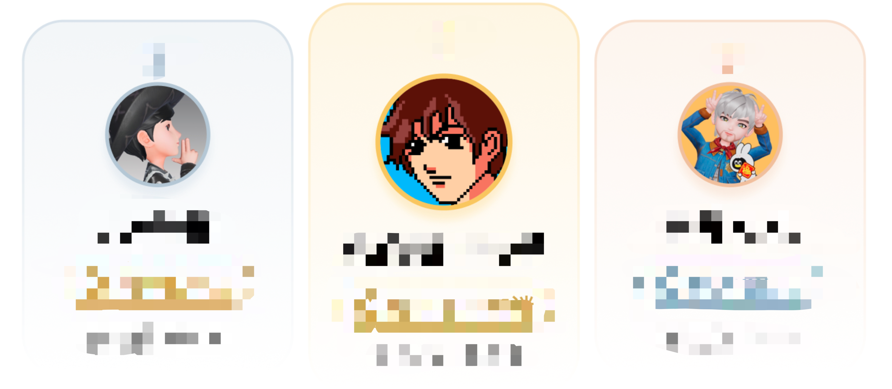
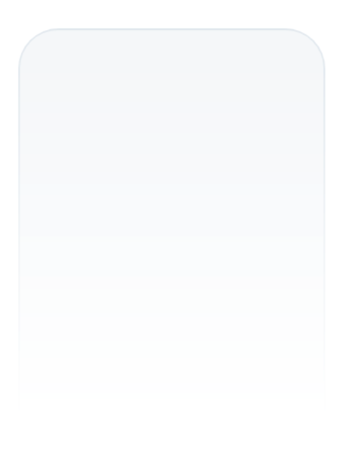
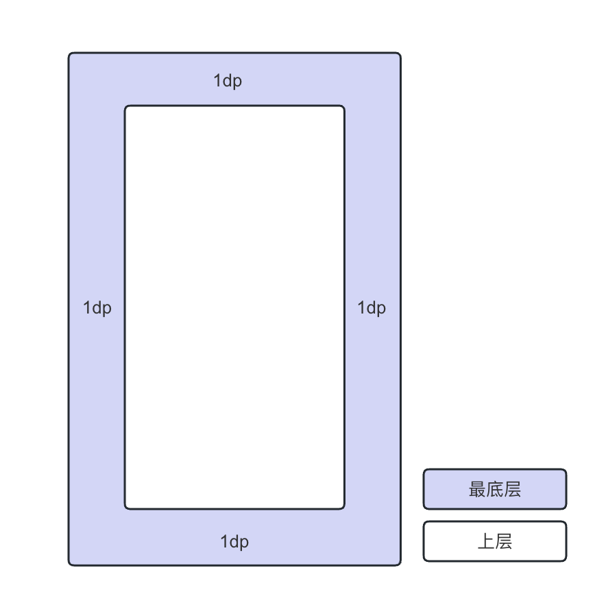
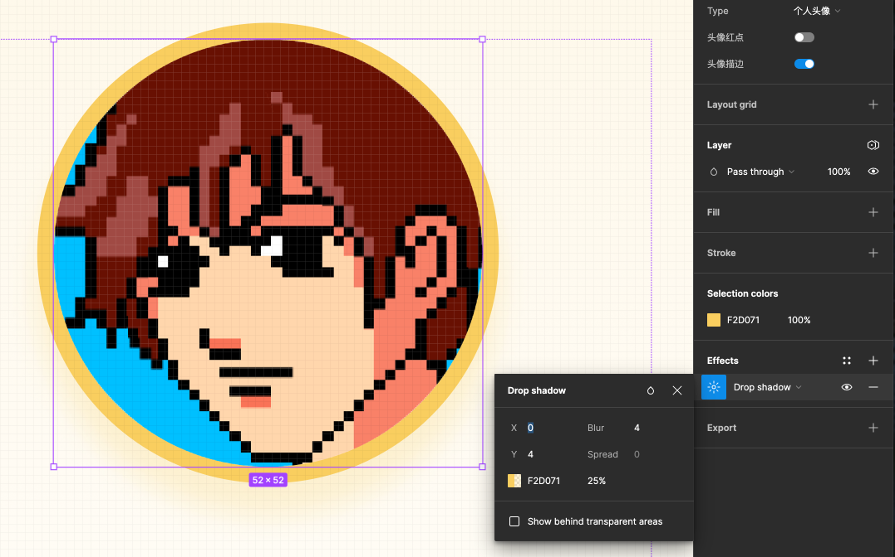
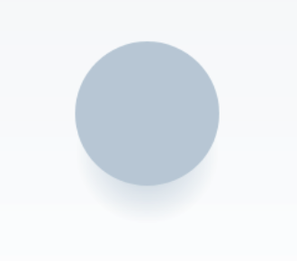
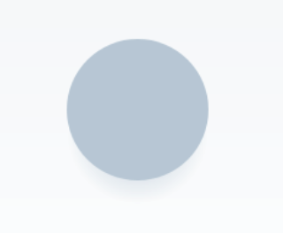
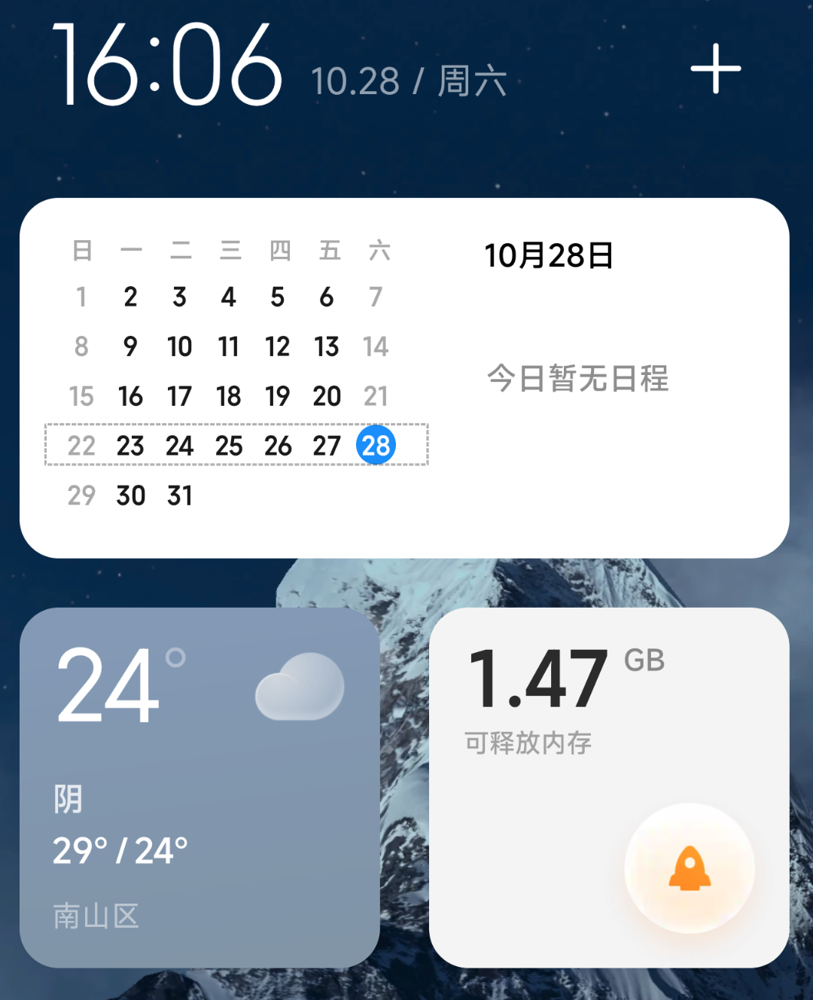
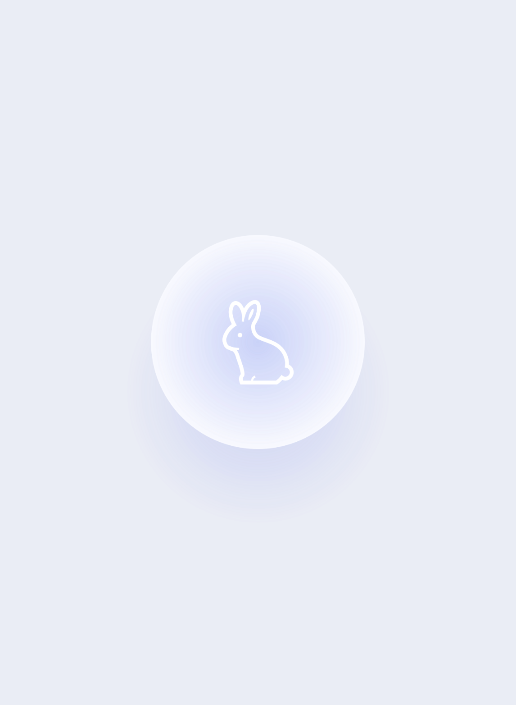

最近做需求的时候，设计师出了一张这样的设计稿



其中每一个卡片的背景都是从上到下渐变，仔细看其中的边框也是渐变的，这个要怎么实现呢？第一个能想到的最简单的办法就是让设计师导出包含边框的完整的背景切图。但是作为一个优（ban）秀（zhuan）的开发工程师，当然要想办法自己实现啦，用切图你就输啦！（开玩笑）；更重要的是，对比直接使用一张图，使用自定义 Drawable 来实现可以减少包大小（还能炫技）

## 渐变背景的实现

渐变背景很简单，相信是个 Android 开发都会，这里不多啰嗦，直接贴代码

```xml
<shape>
		<corners
    		android:topLeftRadius="16dp"
        android:topRightRadius="16dp" />
    <gradient
        android:angle="270"
        android:endColor="#00BFCDDA"
        android:startColor="#26BFCDDA" />
</shape>
```

但是，渐变的边框怎么实现呢？我们都知道在 `<shape>` 中可以使用 `<stroke>` 标签实现边框，但是不支持渐变呀。`<gradient>` 标签只能应用在 `<shape>` 中对整个背景进行渐变，怎么能利用这个能力来实现一个渐变的边框呢

## `<layer-list>` 闪亮登场

`layer-list` 类似 PS 里面的图层的概念，我们可以使用多个图层叠加来实现一些特殊的效果。比如我们可以在底下放置一个深色的图层，上层再放置一个白色图层，白色图层比下层宽高小 2dp，两个图层居中展示，这样就实现一个宽度为 1dp 的边框了。在这个基础上，我们把两个图层都设置成渐变，这不就是我们要的渐变边框了吗

```xml
<?xml version="1.0" encoding="utf-8"?>
<layer-list xmlns:android="http://schemas.android.com/apk/res/android">

    <item>
        <shape>
            <corners
                android:topLeftRadius="16dp"
                android:topRightRadius="16dp" />
            <gradient
                android:angle="270"
                android:endColor="#00BFCDDA"
                android:startColor="#66BFCDDA" />
        </shape>
    </item>

    <item
        android:end="1dp"
        android:left="1dp"
        android:right="1dp"
        android:top="1dp">
        <shape>
            <corners
                android:topLeftRadius="15dp"
                android:topRightRadius="15dp" />
            <gradient
                android:angle="270"
                android:endColor="#00BFCDDA"
                android:startColor="#26BFCDDA" />
        </shape>
    </item>

</layer-list>
```

效果如图所示


是不是感觉不太对，边框颜色怎么这么浅呢？仔细看我们这里所有的颜色都是带透明度的，上层图层有透明度所以直接透过下层了，我们可以在中间再加一层纯白的非透明图层

```xml
<?xml version="1.0" encoding="utf-8"?>
<layer-list xmlns:android="http://schemas.android.com/apk/res/android">

    <item>
        <shape>
            <corners
                android:topLeftRadius="16dp"
                android:topRightRadius="16dp" />
            <gradient
                android:angle="270"
                android:endColor="#00BFCDDA"
                android:startColor="#66BFCDDA" />
        </shape>
    </item>

    <item
        android:end="1dp"
        android:left="1dp"
        android:right="1dp"
        android:top="1dp">
        <shape>
            <corners
                android:topLeftRadius="15dp"
                android:topRightRadius="15dp" />
            <solid android:color="@color/white"/>
        </shape>
    </item>

    <item
        android:end="1dp"
        android:left="1dp"
        android:right="1dp"
        android:top="1dp">
        <shape>
            <corners
                android:topLeftRadius="15dp"
                android:topRightRadius="15dp" />
            <gradient
                android:angle="270"
                android:endColor="#00BFCDDA"
                android:startColor="#26BFCDDA" />
        </shape>
    </item>

</layer-list>
```

这样效果就出来了 



## `<layer-list>` 的用法

一个 `<layer-list> </layer-list>` 定义一系列图层，每个图层用一个 `<item> </item>` 表示。最上面的 `<item>` 位于图层最底，每一个 `<item>` 可以使用 `top bottom left right` 来设置相对于最底层图层的偏移位置，比如例子中的上下左右各设置 1dp 表示相对于最底层图层向内移动 1dp；用一个示意图表示更清晰：



至此，渐变的边框实现了，仔细看设计稿，还有一个隐藏难题：仔细看，头像部分还有一个阴影



这咋办，按照以往的做法，这里肯定是直接使用切图了，但是，作为一个优秀的...

好了话不多少，看看怎么实现吧：从设计稿上看，这里阴影的偏移是 4，还有个模糊半径 4，难道还要动用高斯模糊吗...有没有简单的办法呢

## 用 `<gradient>` 实现阴影效果

直接用一个圆形的渐变看看效果如何

```xml
<?xml version="1.0" encoding="utf-8"?>
<shape xmlns:android="http://schemas.android.com/apk/res/android">
    <size
        android:width="56dp"
        android:height="56dp" />
    <corners android:radius="28dp" />
    <gradient
        android:endColor="@color/transparent"
        android:gradientRadius="28dp"
        android:startColor="#F2D071"
        android:type="radial" />
</shape>
```



感觉还行，但是阴影颜色好像太深了，和设计稿有点出入，再调整一下

```xml
<?xml version="1.0" encoding="utf-8"?>
<shape xmlns:android="http://schemas.android.com/apk/res/android">
    <size
        android:width="44dp"
        android:height="44dp" />
    <corners android:radius="22dp" />
    <gradient
        android:centerY="0.4" <!--渐变中心调整一下，让下半部分颜色更浅一些-->
        android:endColor="@color/transparent"
        android:gradientRadius="22dp"
        android:startColor="#BFCDDA"
        android:type="radial" />
</shape>
```



现在看起来就比较完美了，搞定，关电脑，收手机，下班！

## One more thing

等等！拿手机的时候我突然瞄到了这个



这个球！


能不能用上面的方法，实现一个类似的看起来是 3D 效果的小球球呢？开整！

```xml
<?xml version="1.0" encoding="utf-8"?>
<androidx.constraintlayout.widget.ConstraintLayout xmlns:android="http://schemas.android.com/apk/res/android"
    xmlns:app="http://schemas.android.com/apk/res-auto"
    android:layout_width="match_parent"
    android:layout_height="match_parent"
    android:background="#edeff7">

    <View
        android:id="@+id/ball_shadow"
        android:layout_width="188dp"
        android:layout_height="188dp"
        android:layout_marginTop="70dp"
        android:background="@drawable/ball_shadow_bg"
        app:layout_constraintBottom_toBottomOf="@+id/ball"
        app:layout_constraintEnd_toEndOf="@+id/ball"
        app:layout_constraintStart_toStartOf="@+id/ball"
        app:layout_constraintTop_toTopOf="@+id/ball" />

    <View
        android:id="@+id/ball"
        android:layout_width="152dp"
        android:layout_height="152dp"
        android:background="@drawable/ball_bg"
        app:layout_constraintBottom_toBottomOf="parent"
        app:layout_constraintEnd_toEndOf="parent"
        app:layout_constraintStart_toStartOf="parent"
        app:layout_constraintTop_toTopOf="parent" />

    <ImageView
        android:id="@+id/img"
        android:layout_width="60dp"
        android:layout_height="60dp"
        android:src="@drawable/rabbit"
        app:layout_constraintBottom_toBottomOf="@id/ball"
        app:layout_constraintEnd_toEndOf="@id/ball"
        app:layout_constraintStart_toStartOf="@id/ball"
        app:layout_constraintTop_toTopOf="@id/ball" />

</androidx.constraintlayout.widget.ConstraintLayout>
```

ball_shadow_bg.xml

```xml
<?xml version="1.0" encoding="utf-8"?>
<shape xmlns:android="http://schemas.android.com/apk/res/android">

    <size
        android:width="188dp"
        android:height="188dp" />
    <gradient
        android:gradientRadius="94dp"
        android:startColor="#305363ef"
        android:type="radial" />
    <corners android:radius="94dp" />
</shape>
```

ball_bg.xml

```xml
<?xml version="1.0" encoding="utf-8"?>
<layer-list xmlns:android="http://schemas.android.com/apk/res/android">
    <item>
        <shape>
            <size
                android:width="152dp"
                android:height="152dp" />
            <solid android:color="@color/white" />
            <corners android:radius="76dp" />
        </shape>
    </item>

    <item>
        <shape>
            <size
                android:width="152dp"
                android:height="152dp" />
            <gradient
                android:gradientRadius="100dp"
                android:startColor="#265363ef"
                android:type="radial" />
            <corners android:radius="76dp" />
        </shape>
    </item>

    <item>
        <shape>
            <size
                android:width="152dp"
                android:height="152dp" />
            <gradient
                android:gradientRadius="74dp"
                android:startColor="#204263ef"
                android:type="radial" />
            <corners android:radius="76dp" />
        </shape>
    </item>
</layer-list>
```



配色问题，感觉有点像个蓝月亮，所以加上了一只小白兔[捂脸]

问题不大，收工，下班！

> 今日水文已达成 ✅