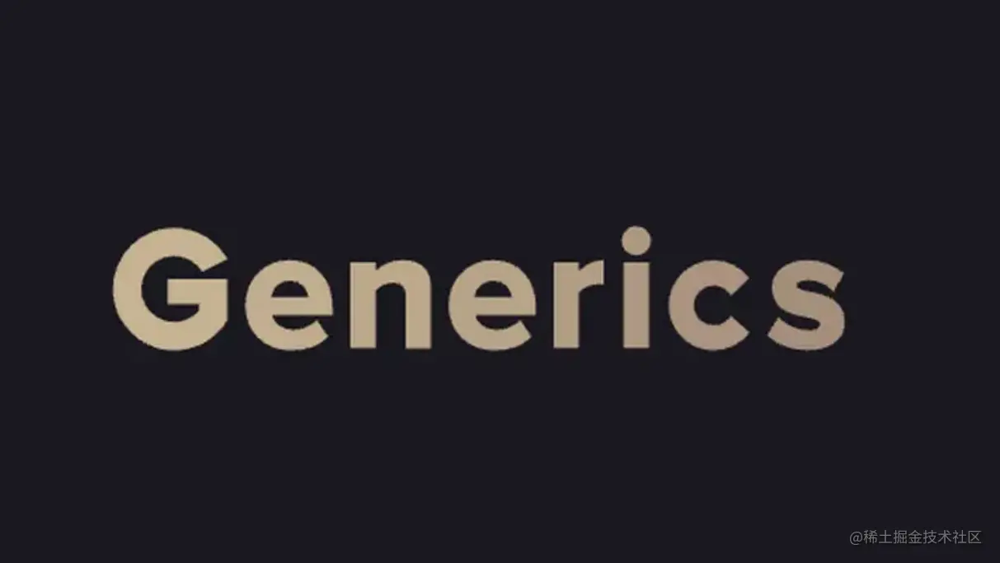
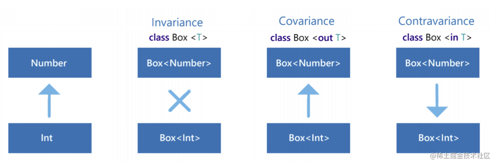
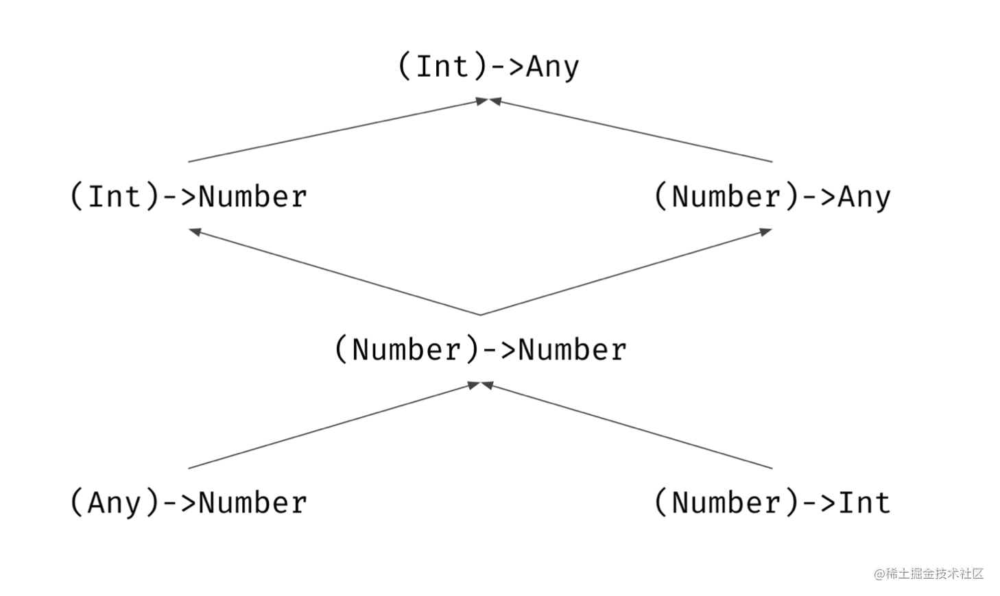
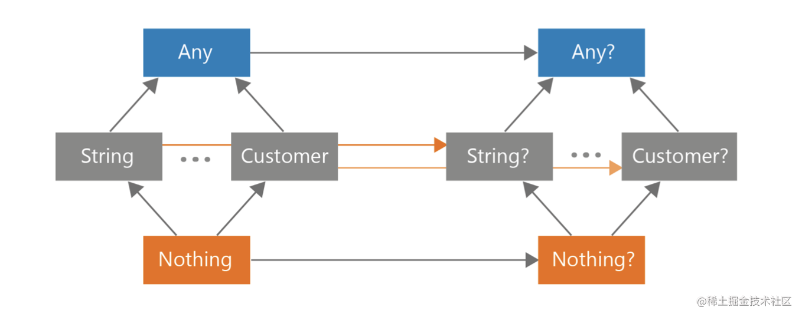
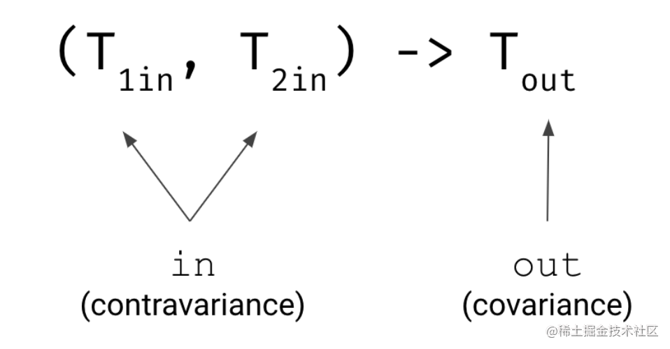

> 摘要：文章翻译自《Effective Kotlin: Best practices》 中的 Chapter 3 - Item24 - Consider variance for generic type

以下文章翻译自[《Effective Kotlin: Best practices》](https://www.amazon.com/Effective-Kotlin-practices-Marcin-Moskala/dp/8395452837) 中的 *Chapter3 - Item24 - 
Consider variance for generic types*

更多关于泛型的内容可参见我的另一篇文章：[《一文了解 Java/Kotlin 中的泛型》](https://juejin.cn/post/7077811938247311390)

## 条目 24：关注泛型的型变

名词解释表

| 英文               | 中文       | 解释                                                         |
| ------------------ | ---------- | ------------------------------------------------------------ |
| type parameter     | 类型参数   | 泛型中尖括号中的参数，例如 `List<T>` 中的 `T`，`Comparable<Int>` 中的 `Int` 等 |
| variance modifiers | 型变修饰符 | `in` 和 `out`                                                |
| -                  | 子类泛型   | 标准翻译应为：类型参数为子类的泛型，为了描述方便，此处简称为「子类泛型」 |
| -                  | 父类泛型   | 标准翻译应为：类型参数为父类的泛型，为了描述方便，此处简称为「父类泛型」 |
| function type      | 函数类型   | 形如：`（T）-> U`                                            |

> 译者注：本篇专有名字比较多，为了方便理解和记忆，在此列出名词对照表

假设我们有以下泛型类：

```kotlin
class Cup<T>
```

上述泛型类的类型参数 `T` 没有指定任何型变修饰符（`in` 或者 `out`）, 因此默认是不型变的。不型变意味着子类泛型和父类泛型之间没有任何继承关系，比如：`Cup<Int>` 和 `Cup<Number>`、`Cup<Any>` 和 `Cup<Noting>` 之间没有任何继承关系。

```kotlin
fun main() {
  val anys: Cup<Any> = Cup<Int>() // 编译错误，类型不匹配
  val nothings: Cup<Nothing> = Cup<Int>() // 编译错误
}
```

如果我们想要让他们有继承关系，我们就需要使用型变修饰符：`out` 和 `in`，其中 `out` 使得泛型协变，而 `in` 使得泛型逆变：

```kotlin
class Cup<out T>
open class Dog
class Puppy: Dog()

fun main(args: Array<String>) {
  val b: Cup<Dog> = Cup<Puppy>() // 协变之后，子类泛型是父类泛型的子类，子类可以赋值给父类
}
```

```kotlin
class Cup<in T>
open class Dog
class Puppy: Dog()

fun main(args: Array<String>) {
  val b: Cup<Puppy> = Cup<Dog>() // 逆变之后，父类泛型是子类泛型的子类，子类可以赋值给父类
}
```

下图演示了这种型变的关系：


### 函数类型

Kotlin 中，函数类型也是型变的，举个例子：

```kotlin
fun printProcessedNumber(transition: (Int) -> Any) {
  print(transition(42))
}
```

这个方法的参数是函数类型的，他可以接受以下所有类型的参数：`(Int) -> Number`,`(Number) -> Any`, `(Number) -> Number`,`(Any) -> Number`,`(Number) -> Int` 等等。

这些类型的继承关系是这样的：


从这个继承关系我们可以发现，从上往下看：参数类型向继承体系中较高的类型（父类方向）移动，而返回类型则向较低的类型（子类方向）移动


<center>Kotlin 类型继承体系</center>

这并不是巧合，正是因为在 Kotlin 中，所有函数类型的参数类型是逆变的，而函数类型的返回类型是协变的：




这并不是 Kotlin 中唯一一个支持型变的类型，还有一个更加常见的支持协变的类型就是 `List`（声明时使用了 out 修饰符），而 `MutableList` 则是不型变的。

### 型变修饰符的安全性

在 Java 中，数组是协变的，很多消息来源表示，这是为了方便在使用数组作为参数的时候，可以实现一些形如 `sort` 的方法，可以支持对不同类型的数组做相同的排序逻辑。然而，数组协变会带来一个很大的问题：

```java
Integer[] numbers = {1, 4, 2, 1};
Object[] objects = numbers; // 编译没有问题
objects[2] = 'B'; // 编译没有问题，但是运行时抛出 ArrayStoreException
```

在 Kotlin 中，数组是不型变的，所以以上问题就不存在了。

当我们把一个子类赋值给父类的时候，这里有一个隐式的向上转型的过程：

```kotlin
open class Dog
class Puppy: Dog()
class Hound: Dog()

fun takeDog(dog: Dot) {}

takeDog(Dog())
takeDog(Puppy())
takeDog(Hound())
```

以上代码还不涉及协变，如果我们把协变的类型参数放在输入位置，由于协变以及向上转型，我们可以往入参处传入任意类型，很显然这个是很危险的：

```kotlin
class Box<out T> {
  private var value: T? = null
  
  // 1. 这个是会编译报错的，我们假设允许这么写，看看会发生什么
  fun set(value: T) {
    this.value = value
  }
  
  fun get(): T = value ?: error("value not set")
}

val puppyBox = Box<Puppy>() // 我是一个用来放 puppy 的盒子
val dogBox: Box<Dog> = puppyBox // puppyBox 向上转型为 dogBox，但我仍然是用来放 puppy 的盒子
dogBox.set(Hound()) // 如果 1 处可以这么写的话，因为 Hound 是 Dog 的子类，这里也可以正常传入了，但是，我本来明明是放小狗狗（puppy）的，你现在给我塞了一只猎犬（hound）

// 接下来举个更离谱的例子
val dogHouse = Box<Dog>() // 我是一个狗窝
val box: Box<Any> = dogHouse // 向上转型为 Box<Any>，但我仍然是个狗窝
box.set("some string") // String 是 Any 子类，可以传入，但我是狗窝啊，你给我丢一个字符串进来！
box.set(42) // Int 也是 Any 子类，可以传入，离谱，我是狗窝，你给我塞一个 Int
```

因此，为了避免这种情况发生，Kotlin 在编译时禁止了这种行为：**Kotlin 禁止在公有的输入位置使用协变的类型参数**：

```kotlin
class Box<out T> {
  var value: T? = null // 编译错误
  
  fun set(value: T) { // 编译错误
    this.value = value 
  }
}
```

如果把访问修饰符修改为 `private` 的话就可以了：

```kotlin
class Box<out T> {
  private var value: T? = null 
  
  private fun set(value: T) { 
    this.value = value 
  }
}
```

协变的类型参数通常只能用于作为消费者对外暴露读取方法，一个很好的例子就是 Kotlin 中的 `List<T>`，在 Kotlin 中， `List` 只提供了可读方法，因此 `List` 在声明处定义成了协变（使用 `out`）

对应的，逆变的类型参数如果放在公有的输出位置，也会存在问题：

```kotlin
open calss Car
interface Boat
class Amphibious: Car(), Boat 

class Box<in T>(
  // 1. 这会编译错误，我们假设这个是允许的，看看会发生什么问题
  val value: T 
)

val garage: Box<Car> = Box(Car()) // 我是一个车库
val amphibiousSpot: Box<Amphibious> = garage // 因为支持逆变，这里可以赋值给子类泛型
val boat: Boat = garage.value // 如果 1 是支持的话，这里赋值也是支持的，但是，我明明是个车库，我没法提供船！

// 一个更离谱的例子
val noSpot: Box<Nothing> = Box<Car>(Card()) // 我是个车库，但我先转型成一个啥也不是的东西
val noting: Noting = noSpot.value // 我没法提供一个 nothing！
```

因此，为了避免这种情况发生，Kotlin 在编译时禁止了这种行为：**Kotlin 禁止在公有的输出位置使用逆变的类型参数**：

```kotlin
class Box<in T> {
  var value: T? = null // 编译错误
  
  fun get(): T = value ?: error("value not set") // 编译错误
}
```

同样的，改为 `private` 就可以了，代码不再赘述

> 译者注：这和 Java 中的 PECS 是一致的：
>
> [Effective Java, 3rd Edition](https://link.juejin.cn?target=http%3A%2F%2Fwww.oracle.com%2Ftechnetwork%2Fjava%2Feffectivejava-136174.html) 的作者 Joshua Bloch 称那些你只能从中 **读取** 的对象为 **生产者** ，并称那些你只能 **写入** 的对象为 **消费者**。因此他提出了以下助记符：
>
> ***PECS** 代表生产者-Extends、消费者-Super（Producer-Extends, Consumer-Super）*

### 型变修饰符的位置

型变修饰符可以作用在两种位置上：声明处型变和使用处型变。声明处型变可以作用在所有使用该泛型的地方，而使用处型变则可以更加灵活地控制我们需要哪种型变。

比如对于某些只有可读方法的泛型，我们可以使用声明处型变，例如前面举例的 `List<T>`, 但是像 `MutableList` 即可以写也可以读，那么就更加适合用使用处型变来按照我们自己的需求去定义何种型变了。

> 译者注： 在 Java 中只有使用处型变

### 总结

Kotlin 有强大的泛型类型，并且支持使用声明处型变以及使用处型变

- 默认的类型参数是不型变的
- `out` 修饰符可以使类型参数协变
- `in` 修饰符可以使类型参数逆变

在 Kotlin 中

- `List` 和 `Set` 是协变的，`MutableList`,`MutableSet`,`MutableMap` 是不型变的
- 函数类型的参数类型是逆变的，函数类型的返回类型是协变的
- 协变的类型参数（`out` 修饰符）只能出现在公有的 return 位置（输出位置）上
- 逆变的类型参数（`in` 修饰符）只能出现在公有的入参位置（输入位置）上