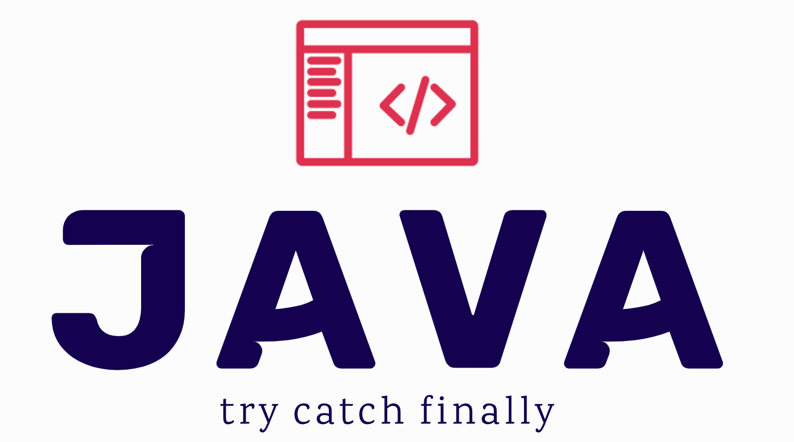

# try catch finally 执行的顺序

## 先给结论

1. finally 语句在 try return 语句执行之后 try return 返回之前执行
2. finally 块中的 return 语句会覆盖 try 块中的 return 返回
3. 如果 finally 语句中没有 return 语句覆盖返回值，那么原来的返回值可能因为 finally 里的修改而改变也可能不变

### 1. finally 语句在 try return 语句执行之后 try return 返回之前执行

```java
public class TryCatchFinallyJava {
    public void main() {
        System.out.println(test());
    }

    private int test() {
        int a = 10;
        try {
            System.out.println("I am try");
            return a += 10;
        } catch (Throwable e) {
            System.out.println("I am catch");
        } finally {
            System.out.println("I am finally");
            System.out.println("a = " + a);
        }
        return 200;
    }
}

// 输出
I am try
I am finally
a = 20
20
```

### 2. finally 块中的 return 语句会覆盖 try 块中的 return 返回

```java
public class TryCatchFinallyJava {
    public void main() {
        System.out.println(test());
    }

    private int test() {
        int a = 10;
        try {
            System.out.println("I am try");
            return a += 10;
        } catch (Throwable e) {
            System.out.println("I am catch");
        } finally {
            System.out.println("I am finally");
            System.out.println("a = " + a);
            return a += 10;
        }
    }
}

// 输出
I am try
I am finally
a = 20
30
```

### 3. 如果 finally 语句中没有 return 语句覆盖返回值，那么原来的返回值可能因为 finally 里的修改而改变也可能不变

分两种情况

1. finally 中修改的是基本数据类型，那么不会影响 try 中返回值
2. finally 中修改的是引用类型，分两种情况
   1. 修改引用类型的对象的值，会导致 try 中值改变
   2. 把一个新的类的实例赋值给改引用类型变量，不会导致 try 中值改变

```java
public class TryCatchFinallyJava {
    public void main() {
        System.out.println(test());
    }

    private int test() {
        int a = 10;
        try {
            System.out.println("I am try");
            return a += 10;
        } catch (Throwable e) {
            System.out.println("I am catch");
        } finally {
            System.out.println("I am finally");
            a = 100;
        }
        return 200;
    }
}

// 输出
I am try
I am finally
20

public class TryCatchFinallyJava {
    public void main() {
        System.out.println(test().name);
    }

    public static class Person {
        public String name;
    }

    private Person test() {
        Person person = new Person();
        try {
            person.name = "try";
            return person;
        } catch (Throwable e) {
            person.name = "catch";
        } finally {
            person.name = "finally"; // 对对象的修改直接映射到外部的 Personal
            person = null; // 指向一个新的地址，并不应影响外面 personal 的地址
        }
        return person;
    }
}

// 输出
finally
```


## 分析背后的原理

### 1. 为什么 finally 一定会执行？

Java 采用方式是复制 finally 代码块的内容，分别放在 try catch 代码块所有正常 return 和 异常 throw 之前，我们看一下以下代码生产的字节码

```java
public class TryCatchFinallyJava {
    private void main() {
        try {
            System.out.println("I am try");
        } catch(Throwable e) {
            System.out.println("I am catch");
        } finally {
            System.out.println("I am finally");
        }
    }
}
```

```java
  // access flags 0x2
  private main()V
    TRYCATCHBLOCK L0 L1 L2 java/lang/Throwable
    TRYCATCHBLOCK L0 L1 L3 null
    TRYCATCHBLOCK L2 L4 L3 null
   L0
    LINENUMBER 9 L0
    GETSTATIC java/lang/System.out : Ljava/io/PrintStream;
    LDC "I am try"
    INVOKEVIRTUAL java/io/PrintStream.println (Ljava/lang/String;)V
   L1
    LINENUMBER 13 L1
    GETSTATIC java/lang/System.out : Ljava/io/PrintStream;
    LDC "I am finally"  // 1. 注意看这里被复制了
    INVOKEVIRTUAL java/io/PrintStream.println (Ljava/lang/String;)V
   L5
    LINENUMBER 14 L5
    GOTO L6
   L2
    LINENUMBER 10 L2
   FRAME SAME1 java/lang/Throwable
    ASTORE 1
   L7
    LINENUMBER 11 L7
    GETSTATIC java/lang/System.out : Ljava/io/PrintStream;
    LDC "I am catch"
    INVOKEVIRTUAL java/io/PrintStream.println (Ljava/lang/String;)V
   L4
    LINENUMBER 13 L4
    GETSTATIC java/lang/System.out : Ljava/io/PrintStream;
    LDC "I am finally"  // 2. 注意看这里被复制了
    INVOKEVIRTUAL java/io/PrintStream.println (Ljava/lang/String;)V
   L8
    LINENUMBER 14 L8
    GOTO L6
   L3
    LINENUMBER 13 L3
   FRAME SAME1 java/lang/Throwable
    ASTORE 2
    GETSTATIC java/lang/System.out : Ljava/io/PrintStream;
    LDC "I am finally"
    INVOKEVIRTUAL java/io/PrintStream.println (Ljava/lang/String;)V
   L9
    LINENUMBER 14 L9
    ALOAD 2
    ATHROW
   L6
    LINENUMBER 15 L6
   FRAME SAME
    RETURN
   L10
    LOCALVARIABLE e Ljava/lang/Throwable; L7 L4 1
    LOCALVARIABLE this Lcom/example/demo/TryCatchFinallyJava; L0 L10 0
    MAXSTACK = 2
    MAXLOCALS = 3
```

可以看到 finally 中的代码被复制到了 try 和 catch 后面，这就保证了不管是否发生异常，finally 中的代码都会被执行；

### 2. 为什么 finally 语句在 try return 语句执行之后 try return 返回之前执行？ 

我们同样的手段分别看下，当 try catch 中有 return 语句时，生成的字节码

```java
public class TryCatchFinallyJava {
    public void main() {
        System.out.println(test());
    }

    private int test() {
        int a = 10;
        try {
            System.out.println("I am try");
            return a += 10;
        } catch (Throwable e) {
            System.out.println("I am catch");
        } finally {
            System.out.println("I am finally");
            System.out.println("a = " + a);
        }
        return 200;
    }
}
```

```java
  private test()I
    TRYCATCHBLOCK L0 L1 L2 java/lang/Throwable
    TRYCATCHBLOCK L0 L1 L3 null
    TRYCATCHBLOCK L2 L4 L3 null
   L5
    LINENUMBER 12 L5
    BIPUSH 10
    ISTORE 1
   L0
    LINENUMBER 14 L0
    GETSTATIC java/lang/System.out : Ljava/io/PrintStream;
    LDC "I am try"
    INVOKEVIRTUAL java/io/PrintStream.println (Ljava/lang/String;)V
   L6
    LINENUMBER 15 L6
    IINC 1 10 // 1. 注意看这里：上面执行完 try 之后，这里就执行了 add 操作，紧接着下面就是 finally 了
    ILOAD 1
    ISTORE 2
   L1
    LINENUMBER 19 L1
    GETSTATIC java/lang/System.out : Ljava/io/PrintStream;
    LDC "I am finally" // 2. finally 执行了，前面没有 return
    INVOKEVIRTUAL java/io/PrintStream.println (Ljava/lang/String;)V
   L7
    LINENUMBER 20 L7
    GETSTATIC java/lang/System.out : Ljava/io/PrintStream;
    ILOAD 1
    INVOKEDYNAMIC makeConcatWithConstants(I)Ljava/lang/String; [
      // handle kind 0x6 : INVOKESTATIC
      java/lang/invoke/StringConcatFactory.makeConcatWithConstants(Ljava/lang/invoke/MethodHandles$Lookup;Ljava/lang/String;Ljava/lang/invoke/MethodType;Ljava/lang/String;[Ljava/lang/Object;)Ljava/lang/invoke/CallSite;
      // arguments:
      "a = \u0001"
    ]
    INVOKEVIRTUAL java/io/PrintStream.println (Ljava/lang/String;)V
   L8
    LINENUMBER 15 L8
    ILOAD 2
    IRETURN // 3. 上面执行完 finally 最后一行代码 System.out.println("a = " + a); 之后，这里就 return 了
   L2
    LINENUMBER 16 L2
   FRAME FULL [com/example/demo/TryCatchFinallyJava I] [java/lang/Throwable]
    ASTORE 2
   L9
    LINENUMBER 17 L9
    GETSTATIC java/lang/System.out : Ljava/io/PrintStream;
    LDC "I am catch"
    INVOKEVIRTUAL java/io/PrintStream.println (Ljava/lang/String;)V
   L4
    LINENUMBER 19 L4
    GETSTATIC java/lang/System.out : Ljava/io/PrintStream;
    LDC "I am finally"
    INVOKEVIRTUAL java/io/PrintStream.println (Ljava/lang/String;)V
   L10
    LINENUMBER 20 L10
    GETSTATIC java/lang/System.out : Ljava/io/PrintStream;
    ILOAD 1
    INVOKEDYNAMIC makeConcatWithConstants(I)Ljava/lang/String; [
      // handle kind 0x6 : INVOKESTATIC
      java/lang/invoke/StringConcatFactory.makeConcatWithConstants(Ljava/lang/invoke/MethodHandles$Lookup;Ljava/lang/String;Ljava/lang/invoke/MethodType;Ljava/lang/String;[Ljava/lang/Object;)Ljava/lang/invoke/CallSite;
      // arguments:
      "a = \u0001"
    ]
    INVOKEVIRTUAL java/io/PrintStream.println (Ljava/lang/String;)V
   L11
    LINENUMBER 21 L11
    GOTO L12
   L3
    LINENUMBER 19 L3
   FRAME SAME1 java/lang/Throwable
    ASTORE 3
    GETSTATIC java/lang/System.out : Ljava/io/PrintStream;
    LDC "I am finally"
    INVOKEVIRTUAL java/io/PrintStream.println (Ljava/lang/String;)V
   L13
    LINENUMBER 20 L13
    GETSTATIC java/lang/System.out : Ljava/io/PrintStream;
    ILOAD 1
    INVOKEDYNAMIC makeConcatWithConstants(I)Ljava/lang/String; [
      // handle kind 0x6 : INVOKESTATIC
      java/lang/invoke/StringConcatFactory.makeConcatWithConstants(Ljava/lang/invoke/MethodHandles$Lookup;Ljava/lang/String;Ljava/lang/invoke/MethodType;Ljava/lang/String;[Ljava/lang/Object;)Ljava/lang/invoke/CallSite;
      // arguments:
      "a = \u0001"
    ]
    INVOKEVIRTUAL java/io/PrintStream.println (Ljava/lang/String;)V
   L14
    LINENUMBER 21 L14
    ALOAD 3
    ATHROW
   L12
    LINENUMBER 22 L12
   FRAME SAME
    SIPUSH 200
    IRETURN
   L15
    LOCALVARIABLE e Ljava/lang/Throwable; L9 L4 2
    LOCALVARIABLE this Lcom/example/demo/TryCatchFinallyJava; L5 L15 0
    LOCALVARIABLE a I L0 L15 1
    MAXSTACK = 2
    MAXLOCALS = 4

```

生成的字节码从上往下执行，关键位置都注释解释了，这里不再赘述；

### 3. 为什么 finally 块中的 return 语句会覆盖 try 块中的 return 返回？

```java
public class TryCatchFinallyJava {
    public void main() {
        System.out.println(test());
    }

    private int test() {
        int a = 10;
        try {
            System.out.println("I am try");
            return a += 10;
        } catch (Throwable e) {
            System.out.println("I am catch");
        } finally {
            System.out.println("I am finally");
            System.out.println("a = " + a);
            return a += 10;
        }
    }
}
```

```java
  private test()I
    TRYCATCHBLOCK L0 L1 L2 java/lang/Throwable
    TRYCATCHBLOCK L0 L1 L3 null
    TRYCATCHBLOCK L2 L4 L3 null
   L5
    LINENUMBER 12 L5
    BIPUSH 10
    ISTORE 1
   L0
    LINENUMBER 14 L0
    GETSTATIC java/lang/System.out : Ljava/io/PrintStream;
    LDC "I am try"  // 1. 执行 try
    INVOKEVIRTUAL java/io/PrintStream.println (Ljava/lang/String;)V
   L6
    LINENUMBER 15 L6
    IINC 1 10  // 2. 执行 a += 10;
    ILOAD 1
    ISTORE 2
   L1
    LINENUMBER 19 L1
    GETSTATIC java/lang/System.out : Ljava/io/PrintStream;
    LDC "I am finally" // 3. 执行 finally
    INVOKEVIRTUAL java/io/PrintStream.println (Ljava/lang/String;)V
   L7
    LINENUMBER 20 L7
    GETSTATIC java/lang/System.out : Ljava/io/PrintStream;
    ILOAD 1
    INVOKEDYNAMIC makeConcatWithConstants(I)Ljava/lang/String; [
      // handle kind 0x6 : INVOKESTATIC
      java/lang/invoke/StringConcatFactory.makeConcatWithConstants(Ljava/lang/invoke/MethodHandles$Lookup;Ljava/lang/String;Ljava/lang/invoke/MethodType;Ljava/lang/String;[Ljava/lang/Object;)Ljava/lang/invoke/CallSite;
      // arguments:
      "a = \u0001"
    ]
    INVOKEVIRTUAL java/io/PrintStream.println (Ljava/lang/String;)V // 4. 执行 System.out.println("a = " + a);
   L8
    LINENUMBER 21 L8
    IINC 1 10 // 5. 执行 a+=10
    ILOAD 1
    IRETURN // 6. 注意看这里关键：return 了
   L2
    LINENUMBER 16 L2
   FRAME FULL [com/example/demo/TryCatchFinallyJava I] [java/lang/Throwable]
    ASTORE 2
   L9
    LINENUMBER 17 L9
    GETSTATIC java/lang/System.out : Ljava/io/PrintStream;
    LDC "I am catch"
    INVOKEVIRTUAL java/io/PrintStream.println (Ljava/lang/String;)V
   L4
    LINENUMBER 19 L4
    GETSTATIC java/lang/System.out : Ljava/io/PrintStream;
    LDC "I am finally"
    INVOKEVIRTUAL java/io/PrintStream.println (Ljava/lang/String;)V
   L10
    LINENUMBER 20 L10
    GETSTATIC java/lang/System.out : Ljava/io/PrintStream;
    ILOAD 1
    INVOKEDYNAMIC makeConcatWithConstants(I)Ljava/lang/String; [
      // handle kind 0x6 : INVOKESTATIC
      java/lang/invoke/StringConcatFactory.makeConcatWithConstants(Ljava/lang/invoke/MethodHandles$Lookup;Ljava/lang/String;Ljava/lang/invoke/MethodType;Ljava/lang/String;[Ljava/lang/Object;)Ljava/lang/invoke/CallSite;
      // arguments:
      "a = \u0001"
    ]
    INVOKEVIRTUAL java/io/PrintStream.println (Ljava/lang/String;)V
   L11
    LINENUMBER 21 L11
    IINC 1 10
    ILOAD 1
    IRETURN
   L3
    LINENUMBER 19 L3
   FRAME SAME1 java/lang/Throwable
    ASTORE 3
    GETSTATIC java/lang/System.out : Ljava/io/PrintStream;
    LDC "I am finally"
    INVOKEVIRTUAL java/io/PrintStream.println (Ljava/lang/String;)V
   L12
    LINENUMBER 20 L12
    GETSTATIC java/lang/System.out : Ljava/io/PrintStream;
    ILOAD 1
    INVOKEDYNAMIC makeConcatWithConstants(I)Ljava/lang/String; [
      // handle kind 0x6 : INVOKESTATIC
      java/lang/invoke/StringConcatFactory.makeConcatWithConstants(Ljava/lang/invoke/MethodHandles$Lookup;Ljava/lang/String;Ljava/lang/invoke/MethodType;Ljava/lang/String;[Ljava/lang/Object;)Ljava/lang/invoke/CallSite;
      // arguments:
      "a = \u0001"
    ]
    INVOKEVIRTUAL java/io/PrintStream.println (Ljava/lang/String;)V
   L13
    LINENUMBER 21 L13
    IINC 1 10
    ILOAD 1
    IRETURN
   L14
    LOCALVARIABLE e Ljava/lang/Throwable; L9 L4 2
    LOCALVARIABLE this Lcom/example/demo/TryCatchFinallyJava; L5 L14 0
    LOCALVARIABLE a I L0 L14 1
    MAXSTACK = 2
    MAXLOCALS = 4

```

从第 6 个注释处可以看到，执行完 finally 中的 a += 10; 之后，代码就直接 return 了

### 4. 为什么如果 finally 语句中没有 return 语句覆盖返回值，那么原来的返回值可能因为 finally 里的修改而改变也可能不变？

这个问题相信看了前面两个字节码的解释之后，应该就能理解了，首先确定了执行顺序，然后再区分一下是值传递还是地址传递就能理解了

其实可以把 try catch finally 理解为三个不同的方法，共同操作的变量相当于把这个变量以参数的形式传递到这三个方法中；

1. 对于基本数据类型，传递到一个方法的形参，是把当前值的拷贝传递进来，在方法内部修改形参的值，是不会影响方法外部的值的
2. 对于引用类型，传递到一个方法的形参，是把当前引用的地址值传递进来，在方法内部修改引用地址对应的对象的成员变量，会导致原来的对象变化
3. 对于引用类型，传递到一个方法的形参，是把当前引用的地址值传递进来，在方法内部示例化一个新的对象，然后把新对象的地址复制给参数，然后对新对象的修改是不会影响到老对象的

# 在处理锁的同步和释放中，为什么要用 try finally？

在处理锁的同步和释放代码中，使用 `try-finally` 语句的主要目的是确保在临界区代码执行完毕或发生异常时，锁能够被正确释放。这有助于防止死锁和资源泄漏，提高代码的健壮性和可靠性。

当我们在代码中使用锁（如 `synchronized`、`ReentrantLock` 等）来保护临界区资源时，需要确保在临界区代码执行完毕后，锁能够被正确释放。如果在临界区代码中发生异常，而锁没有被正确释放，可能会导致其他线程无法获取锁，从而导致死锁或资源泄漏。

使用 `try-finally` 语句可以确保在临界区代码执行完毕或发生异常时，锁能够被正确释放。`try` 语句块中包含临界区代码，而 `finally` 语句块中包含释放锁的代码。无论 `try` 语句块中的代码是否正常执行或发生异常，`finally` 语句块中的代码都会被执行，从而确保锁被正确释放。

以下是一个使用 `try-finally` 语句处理锁同步和释放的示例：

```java
ReentrantLock lock = new ReentrantLock();

lock.lock(); // 获取锁
try {
    // 临界区代码
} catch (Exception e) {
    // 处理异常
} finally {
    lock.unlock(); // 释放锁
}
```

总之，在处理锁的同步和释放代码中，使用 `try-finally` 语句可以确保在临界区代码执行完毕或发生异常时，锁能够被正确释放。这有助于防止死锁和资源泄漏，提高代码的健壮性和可靠性。