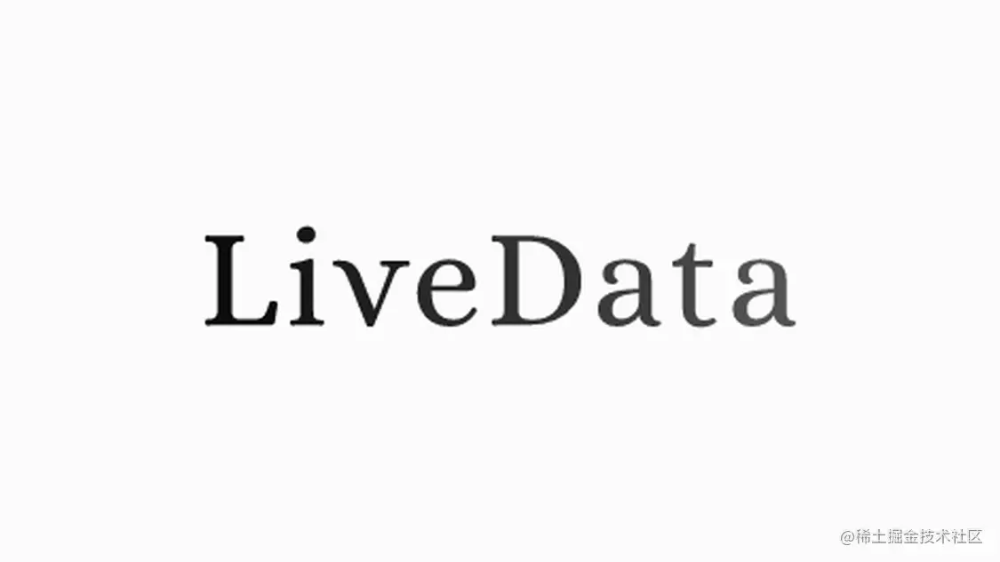
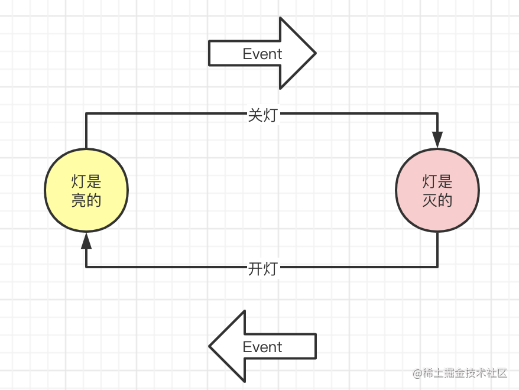

> 摘要：你真的会用 LiveData 吗？你了解其中有哪些坑吗？本文将介绍 LiveData 的正确使用姿势以及常见的错误使用方式

借助 LiveData 的能力，在 View（Activity 或者 Fragment）和 ViewModel 之间，使用 LiveData 通信，当 LiveData 发生变化的时候，订阅了该 LiveData 的 View 能够收到通知以便做出相应的更新 UI 逻辑。

这种特性对于那种需要持续监听数据变化，然后实时做出 UI 响应的场景十分有用且便利。


然而，这里有个细节需要注意：View 在 observes LiveData 的那一刻，便能收到一次通知，拿到当前 LiveData 的值。换句话说，我们可以在监听 LiveData 的时候，拿到监听之前设置给 LiveData 的值 —— 我们称之为**粘性消息**。

但是有时候，我们并不希望在监听的时候拿到「上一次的值」。比如我们实现收款到账提醒的功能，我们希望每次有新收到账的时候，发送一个到账通知的提醒，假设我们监听之前，已经有到账记录了，这时候如果我才开始监听，然后提醒我有新的到账（实际上是上一次的到账），这就有问题了。

LiveData 的这种特性，这并不是一个 Bug，LiveData 设计之初并不是给我们用来当成 EventBus 使用的，而是用于监听「状态」的，此处引用[官博](https://medium.com/androiddevelopers/livedata-with-snackbar-navigation-and-other-events-the-singleliveevent-case-ac2622673150)的原文

> Instead of trying to solve this with libraries or extensions to the Architecture Components, it should be faced as a design problem.

## 如何理解状态（state）和事件（event）？

简单理解：「状态」可以持续一段时间，而「事件」指某一刻发生的事情

拿一个简单的例子举例：开灯和关灯



- 关灯和开灯可以理解为是两次事件的发生，而灯是亮的和灯是灭的则是两种状态；
- 灯亮之后可以获取灯的状态（状态一直在持续），但无法知道是什么时候开灯的（事件是之前发生的，转瞬即逝）
- 事件的触发可以让状态发生转换

而 LiveData 的特性「监听时能够接收到监听之前已经改变的状态」正是为了「状态」而设计的。因此，并不是所有场景下都适合使用 LiveData，**当我们所要监听的数据是符合「状态」特性，而是不是「事件」特性的时候，才是最适合使用 LiveData 的场景**。

## LiveData 常见的几种错误使用姿势

前文之所以花费这么大篇幅介绍 LiveData 的「粘性消息」特性，一是为了让大家对 LiveData 有更深一步的认识，了解其设计之初的目的才知道什么时候该用，什么时候不该用，二是因为如果我们不了解这个特性，很容易引发问题。下面分别介绍几种常见错误使用方式：

### case 1：数据是「事件」类型的

以「收款到账提醒举例」

```kotlin
class MvvmViewModel : ViewModel() {

    private val _billLiveData = MutableLiveData<String>()

    val billLiveData: LiveData<String>
        get() = _billLiveData

    fun pay(msg: String) {
        _billLiveData.value = msg
    }
}
```

```kotlin
class MvvmActivity : AppCompatActivity() {
    private val viewModel by viewModels<MvvmViewModel>()

    override fun onCreate(savedInstanceState: Bundle?) {
        super.onCreate(savedInstanceState)
        setContentView(R.layout.activity_mvvm)
        viewModel.pay("小明付款了 100 元")
        btn.setOnClickListener {
            viewModel.pay("小张付款了 800 元")
        }
        viewModel.billLiveData.observe(this, Observer {
            Log.d("sample", it)
        })
    }

}
```

运行之后会不做任何操作会输入如下日志：

```kotlin
sample: 小明付款了 100 元
```

这里其实不符合预期的，小明是在之前付款了 100 元，而我是在之后才开始监听，此刻并不需要通知我之前发生的事情

这种情况下其实是不建议使用 LiveData 的，虽然使用各种 workaround 的方式（此处可参考我的另一篇文章：[LiveData 非粘性消息的探索和尝试](https://juejin.cn/post/6955727941850365965) ）可能可以满足需求，但是 LiveData 有自己特定的使用场景，如果非要突破限制去使用的话，会让 LiveData 变得更让人难以理解

此处引用另一篇[博客](https://proandroiddev.com/singleliveevent-to-help-you-work-with-livedata-and-events-5ac519989c70)的原文

> **The Anti-Pattern**
> Using LiveData objects for events can be taken as a bad design decision, even more when that event needs to be consumed just once. We can have a workaround using some boolean flags to help the view decide whether the Dialog/SnackBar must be triggered/shown or not. But this can lead to a solution difficult to read/maintain and ugly as well.

### case 2：有多个监听者并在其中一个 observer 中修改 LiveData

不要在 observer 中修改 LiveData 的值的数据，会影响其他 observer。例如下面的代码：

```kotlin
class MvvmViewModel : ViewModel() {

    private val _liveData = MutableLiveData<User>()

    val liveData: LiveData<User>
        get() = _liveData

    fun setNewValue(user: User) {
        _liveData.value = user
    }
}

data class User(var name: String)
```

```kotlin
class MvvmActivity : AppCompatActivity() {
    private val viewModel by viewModels<MvvmViewModel>()

    private val observer1 = object : Observer<User> {
        override fun onChanged(t: User?) {
            Log.d("sample", "observer1 onChanged: $t")
            t?.name = "Michael" // 在这里修改了 LiveData 中 user 的 name
        }
    }

    private val observer2 = object : Observer<User> {
        override fun onChanged(t: User?) {
            Log.d("sample", "observer2 onChanged: $t")
        }
    }

    override fun onCreate(savedInstanceState: Bundle?) {
        super.onCreate(savedInstanceState)
        setContentView(R.layout.activity_mvvm)
        btn.setOnClickListener {
            viewModel.setNewValue(User("Joe"))
        }
        viewModel.liveData.observe(this, observer1)
        viewModel.liveData.observe(this, observer2)
    }

}
```

1. 我们在 observer1 中修改了 User 中 name 的值
2. 这个时候如果我们点击了按钮，发送一个 User("Joe")，observer1 和 observer2 分别会输出如下日志

```kotlin
observer1 onChanged: User(name=Joe)
observer2 onChanged: User(name=Michael)
```

所以，除非我们有这种需求，否则不要在 observer 中改变 LiveData 所引用的值。

一种更好的设计应该把 LiveData<T> 中 T 定义成不可变的（ Immutable），比如例子中的 User 可以定义成如下

```kotlin
data class User(val name: String) // name 是不可变的
```

这样可以有效防止在 observer 中修改 LiveData 数据的问题

### case 3：重复添加 observer

```kotlin
class MvvmActivity : AppCompatActivity() {
    private val viewModel by viewModels<MvvmViewModel>()
    private var count = 0

    override fun onCreate(savedInstanceState: Bundle?) {
        super.onCreate(savedInstanceState)
        setContentView(R.layout.activity_mvvm)
        btn.setOnClickListener(
            View.OnClickListener {
                viewModel.pay("100 元")
            })
        btn_wait.setOnClickListener {
            viewModel.billLiveData.observe(this, Observer {
                Log.d("sample", "收到了 ${count++}")
            })
        }
    }
}
```

以上代码在每次监听的时候都 new 一个新的 observer 实例，如果这个时候点击 btn，此处会接收到多次监听（因为注册了多个 observer）

```kotlin
sample: 收到了 0
sample: 收到了 1
sample: 收到了 2
sample: 收到了 3
```

所以除非特殊场景需要，否则**谨慎使用**每次都创建新的实例

### case 4：错误使用 LifecycleOwner

一种很常见的场景：在 RecycleView 的 ViewHolder 中监听 ViewModel 的 LiveData，然后此时传递的 lifecycleOwner 是对应的 Fragment。由于 ViewHolder 的生命周期是比 Fragment 短的，所以当 ViewHolder 销毁时，由于 Fragment 的 Lifecycle 还没有结束，此时 ViewHolder 会发生内存泄露（监听的 LiveData 没有解绑）

这种场景下有两种解决办法：

1. 使用 LiveData 的 observeForever 然后在 ViewHolder 销毁前手动调用 removeObserver
2. 使用 LifecycleRegistry 给 ViewHolder 分发生命周期，详见我的另一篇文章： [自定义生命周期以及实现生命周期感知能力](https://juejin.cn/post/6955728991135203335) 

---

相关文章

[LiveData 非粘性消息的探索和尝试](https://juejin.cn/post/6955727941850365965)

[使用 Architecture Component 实现 MVVM 的正确姿势](https://juejin.cn/post/6955724479506939935)

[自定义生命周期以及实现生命周期感知能力](https://juejin.cn/post/6955728991135203335)