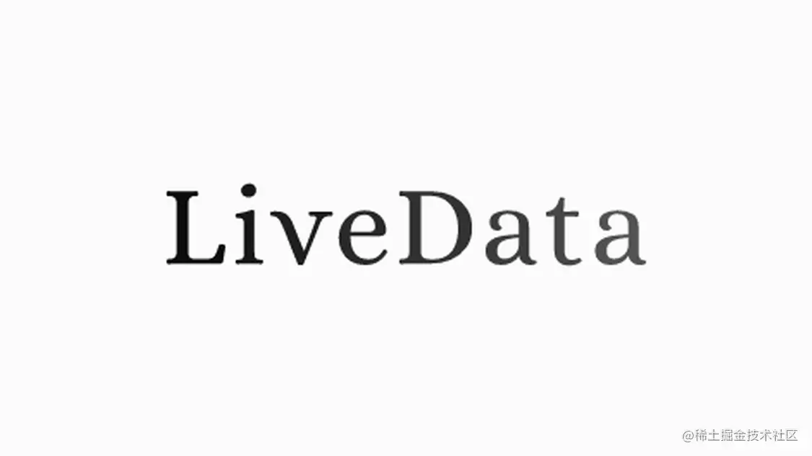

> 摘要：我们可以使用 LiveData 来发送事件吗？如何使用 LiveData 实现非粘性消息的发送呢？这里分享一些尝试和探索...

LiveData 默认是支持粘性消息的（关于什么是粘性消息，请移步我的另一篇文章：[LiveData 的正确使用姿势以及反模式](https://juejin.cn/post/6955726530911666190) ），如何通过 LiveData 来实现非粘性消息呢，本文将在[官博](https://medium.com/androiddevelopers/livedata-with-snackbar-navigation-and-other-events-the-singleliveevent-case-ac2622673150)的基础上，分析几种尝试的方案，以及他们各自的优缺点

### 姿势一：重置 LiveData 的值

在 observer 里加上一个判断，当 LiveData 的值符合某个条件的时候，才做出响应的更新 UI 逻辑，然后提供一个重置 LiveData 值的方法，重置之后，observer 中条件判断为 fasle，因此可以达到不更新 UI 的目的

示例代码

```kotlin
moneyReceivedViewModel.billLiveData.observe(this, Observer {
	if (it != null) {
		Toast.makeText(this, "到账$it元", Toast.LENGTH_SHORT).show()
	}
})
```

```kotlin
class MoneyReceivedViewModel : ViewModel {
	private val _billLiveData = MutableLiveData<String>()
	val billLiveData: LiveData<String> = _billLiveData
	
	// 在 observe 之前和 show Toast 之后重置一下 LiveData
	fun reset() {
		_billLiveData.value = null
	}
}
```

**缺陷：**

1. 需要在 observer 中增加一些逻辑判断代码，这不符合简洁的 MVVM 模式（不应该在 View 层做过多的逻辑处理）
2. 需要手动重置，不够优雅，一旦忘记重置就容易引发问题

### 姿势二：使用 SingleLiveEvent

[SingleLiveEvent](https://github.com/android/architecture-samples/blob/dev-todo-mvvm-live/todoapp/app/src/main/java/com/example/android/architecture/blueprints/todoapp/SingleLiveEvent.java) 是官方 sample 中封装的 LiveData，可以实现一个事件只被消费一，实现原理也很简单

```kotlin
class SingleLiveEvent<T> : MutableLiveData<T>() {
    private val mPending: AtomicBoolean = AtomicBoolean(false)

    @MainThread
    override fun observe(owner: LifecycleOwner, observer: Observer<in T>) {
        if (hasActiveObservers()) {
            Log.w(
                TAG,
                "Multiple observers registered but only one will be notified of changes."
            )
        }

        // Observe the internal MutableLiveData
        super.observe(owner, object : Observer<T?> {
            override fun onChanged(t: T?) {
                if (mPending.compareAndSet(true, false)) {
                    observer.onChanged(t)
                }
            }
        })
    }

    @MainThread
    override fun setValue(t: T?) {
        mPending.set(true)
        super.setValue(t)
    }

    /**
     * Used for cases where T is Void, to make calls cleaner.
     */
    @MainThread
    fun call() {
        setValue(null)
    }

    companion object {
        private const val TAG = "SingleLiveEvent"
    }
}
```

示例代码

```kotlin
class MoneyReceivedViewModel : ViewModel() {
    val billLiveEvent = SingleLiveEvent<String>()

    fun payForLiveEvent(money: String) {
        billLiveEvent.value = money
    }
}
```

```kotlin
viewModel.payForLiveEvent("100")

viewModel.billLiveEvent.observe(this, Observer {
    Log.d("sample", "到账 ${it} 元")
})

btn.setOnClickListener {
    viewModel.payForLiveEvent("200")
}

btn_wait.setOnClickListener {
    viewModel.billLiveEvent.observe(this, Observer {
        Log.d("sample", "到账 ${it} 元")
    })
}

// 以上代码在 Activity 的 onCreate() 中
// 当 Activity 启动的时候就会输出日志 -> 到账 100 元（没有实现不接收 observe() 之前的事件）
// 点击 btn 之后输出 -> 到账 200 元
// 点击 btn_wait 无输出（实现了事件只被消费一次）
```

**缺陷：**

1. 由于 setValue() 之后 onChange() 只会回调一次，因此，如果有多个 observer 的话，也只有一个才能收到回调，而且无法保证哪一个 observer 被回调（每个 observer 生命周期不一样，observe() 时机也不一样）
2. 在 observe 之前发送的事件还是会被接收到，没有解决问题

### 姿势三：LiveData 包裹一个 Event

```kotlin
open class Event<out T>(private val content: T) {

    var hasBeenConsumed = false
        private set // Allow external read but not write

    /**
     * Returns the content and prevents its use again.
     */
    fun consumed(): T? {
        return if (hasBeenConsumed) {
            null
        } else {
            hasBeenConsumed = true
            content
        }
    }

    /**
     * Returns the content, even if it's already been handled.
     */
    fun peek(): T = content
}
```

```kotlin
class MoneyReceivedViewModel : ViewModel() {
    private val _billEvent = MutableLiveData<Event<String>>()

    val billEvent: LiveData<Event<String>>
        get() = _billEvent

    fun payForEvent(msg: String) {
        _billEvent.value = Event(msg)
    }
}
```

```kotlin
viewModel.payForEvent("100")

viewModel.billEvent.observe(this, Observer {
		it.consumed()?.let {
			Log.d("sample", "到账 ${it} 元")
		}
})

btn.setOnClickListener {
    viewModel.payForEvent("200")
}

btn_wait.setOnClickListener {
	  viewModel.billEvent.observe(this, Observer {
			it.consumed()?.let {
				Log.d("sample", "到账 ${it} 元")
			}
		})
}

// 以上代码在 Activity 的 onCreate() 中
// 当 Activity 启动的时候就会输出日志 -> 到账 100 元（没有实现不接收 observe() 之前的事件）
// 点击 btn 之后输出 -> 到账 200 元
// 点击 btn_wait 无输出（实现了事件只被消费一次）
```

这种方式的好处是：

- onChanged() 每次都会回调，但是是否要处理数据取决于 observer：consumed() 不返回已经被消费的消息，peek() 可返回已经被消费的数据

**缺陷：**

1. 和姿势二一样，observe() 之前的数据还是会被监听到，没有解决问题
2. 虽然可以添加多个 observers 且使用 peek() 来获取数据，但是还是无法实现多个 observer 都只接收一次事件

### 姿势四：支持多 observer 且仅接受 observe() 之后的消息

可参考 [基于LiveData实现事件总线思路和方案](https://juejin.cn/post/6844903949267386376#comment)

# LiveData 并不是非用不可

我们使用了各种 workaround 的方式让 LiveData 支持粘性消息，以上几种方案也只有最后一种能够解决问题。但是笔者并不推荐使用这样的方式来绕过 LiveData 的限制，去打破 LiveData 原本的设计，这会让 LiveData 变得更让人难以理解

我们并不是非要用 LiveData 不可，LiveData 有适合自己的使用场景（具体可移步：[LiveData 的正确使用姿势以及反模式](https://juejin.cn/post/6955726530911666190) ），事件总线的场景已经有非常多的优秀开源库可以使用：EventBus、RxBus 等都可以供我们参考。

另一篇[官博](https://medium.com/androiddevelopers/livedata-beyond-the-viewmodel-reactive-patterns-using-transformations-and-mediatorlivedata-fda520ba00b7)也提到了，如果我们项目中已经有一些比较成熟的方案，我们大可不必非要使用 LiveData

> **LiveData and RxJava**  
> Finally, let’s address the elephant in the room. LiveData was designed to allow the View observe the ViewModel. Definitely use it for this! Even if you already use Rx, you can communicate both with LiveDataReactiveStreams*.
> If you want to use LiveData beyond the presentation layer, you might find that MediatorLiveData does not have a toolkit to combine and operate on streams of data like RxJava offers. However, Rx comes with a steep learning curve. A combination of LiveData transformations (and Kotlin magic) might be enough for your case but if you (and your team) already invested in learning RxJava, you probably don’t need LiveData.
> *If you use auto-dispose, using LiveData for this would be redundant.

这里有些人可能会提到现有的 EventBus 或者 RxBus 等都没有生命周期感知能力，不能在生命周期销毁的时候自动解绑监听，而 LiveData 有这个能力，所以想使用 LiveData 来实现事件总线。这里其实我们可以换一种思路：给 callback 或者 EventBus 等增加 Lifecycle 感知能力，这样便能实现自动解绑了，这种方式相比使用 hack 的手段修改 LiveData 会更加友好一些，具体可以参考我的另一篇文章：[自定义生命周期以及实现生命周期感知能力](https://juejin.cn/post/6955728991135203335) 

---

相关文章

[使用 Architecture Component 实现 MVVM 的正确姿势](https://juejin.cn/post/6955724479506939935)

[LiveData 的正确使用姿势以及反模式](https://juejin.cn/post/6955726530911666190)

[自定义生命周期以及实现生命周期感知能力](https://juejin.cn/post/6955728991135203335)