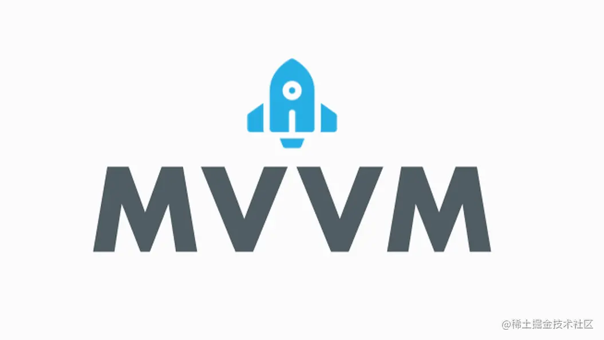
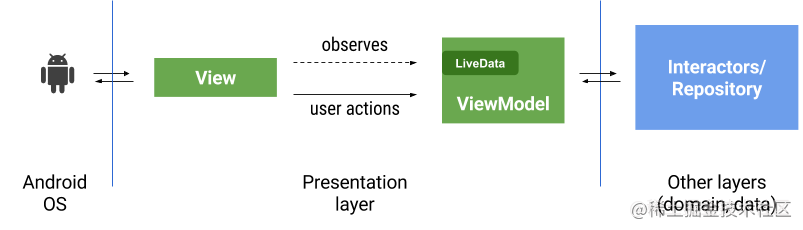
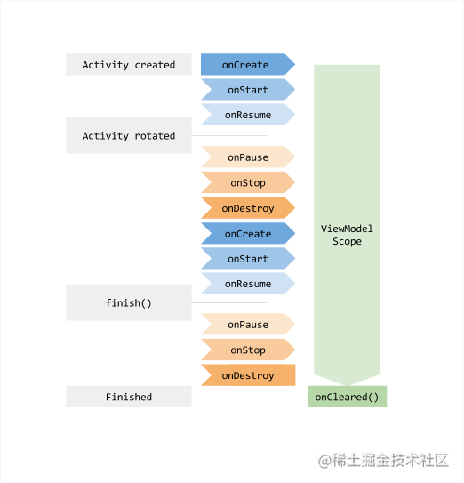
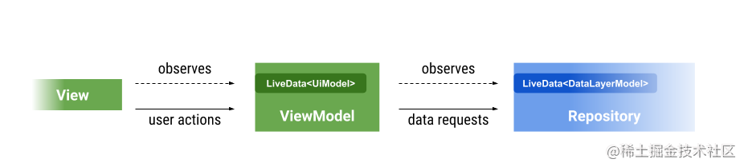
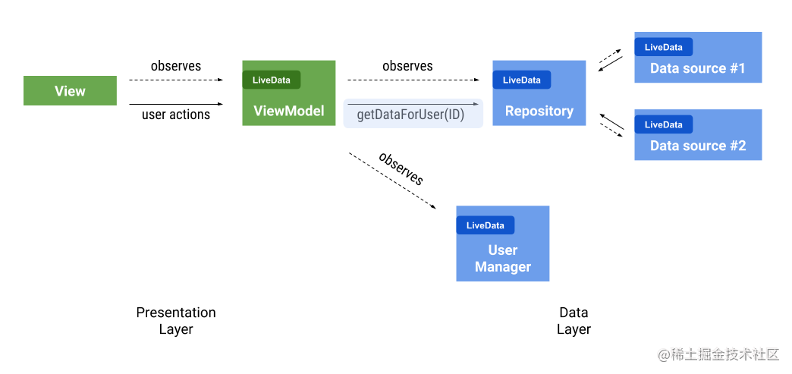
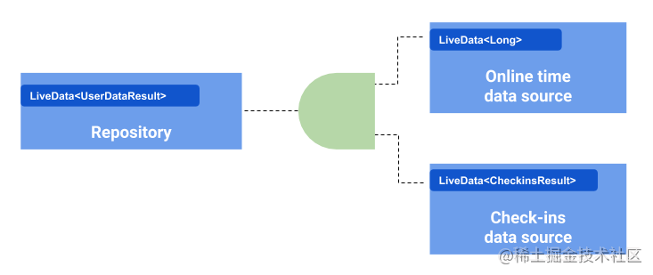
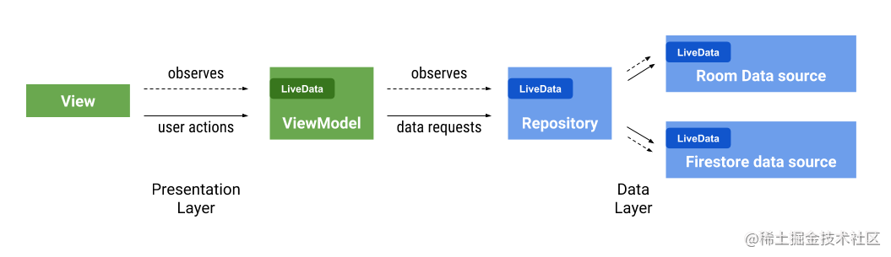

> 摘要：使用 Architecture Component 实现 MVVM 的正确姿势是怎样的？ViewModel 和 LiveData 在使用的时候有什么需要特别注意的？

## 一、MVVM 之初体验

网上关于 MVVM 的介绍非常多，这里不再赘述，直接看一个例子，用直观的代码来感受一下用 MVVM 开发，是一种什么样的感受

```kotlin
class MvvmViewModel : ViewModel() {

    private val _billLiveData = MutableLiveData<Int>(0)

    val billLiveData: LiveData<Int>
        get() = _billLiveData

    fun pay() {
        _billLiveData.value = _billLiveData.value?.inc()
    }
}
```

```kotlin
class MvvmActivity : AppCompatActivity() {
    private val viewModel by viewModels<MvvmViewModel>()

    override fun onCreate(savedInstanceState: Bundle?) {
        super.onCreate(savedInstanceState)
        setContentView(R.layout.activity_mvvm)
        btn.setOnClickListener {
            viewModel.pay()
        }
        viewModel.billLiveData.observe(this, Observer {
            Log.d("sample", "收到了 $it")
        })
    }
}
```

一个很简单的例子：每次计数加一就输出一条日志。

思考一下如果用常规的做法如何实现：加 Callback？还是使用 EventBus？这里使用 LiveData 和 ViewModel 实现了一个简单的 MVVM：数据的变化能够自动通知 View 然后做出相应的 UI 改变，并且能在 Activity 生命周期结束前停止监听

## 二、认识 Architecture Components

MVVM 一定要用 LiveData、ViewModel 吗？答案肯定是否定的，但是 Android 给我提供了一套组件，可以让我们更方便地用 MVVM 模式来开发，减少我们重复造轮子的工作量

### ViewModel

[ViewModel](https://developer.android.com/topic/libraries/architecture/viewmodel) 是官方提供的，用于管理 UI 相关数据的，并且具有生命周期感知能力的一个组件。它可以实现当 Activity 状态发生变化诸如屏幕旋转的时候，数据能保存下来而不会丢失。在 MVVM 中，ViewModel 充当 View 和 Model 之前数据中转和逻辑处理的角色



**ViewModel 的生命周期**

ViewModel 的生命周期和创建 ViewModel 实例时，传递进去的 LifecycleOwner 的生命周期有关

```kotlin
// this 就是 LifecycleOwner，可以是 Activity 或者 Fragment
val viewModel = ViewModelProvider(this).get(MvvmViewModel::class.java) 
// 或者如果引入了 activity-ktx 或者 fragment-ktx 也可以这样用：
class MvvmActivity : AppCompatActivity() {
    private val viewModel by viewModels<MvvmViewModel>()
}
```

ViewModel 和其绑定的 LifecycleOwner 生命周期的关系如下图



可以看到，在屏幕发生旋转的场景下，ViewModel 的生命周期是比 Activity 长的，因此我们**不应该在 ViewModel 中持有 View 或者任何和 Activity context 引用关系的类**，否则会引发内存泄露的风险

**ViewModel 实例化传参**

有时候我们希望给创建的 ViewModel 传递参数，这里分场景看一下：

1. 需要一个 context

   上文说了，我们不应该在 ViewModel 中持有 context，但是如果我需要一个 context，可以考虑使用 AndroidViewModel，AndroidViewModel 的构造函数支持传入一个 Application context，所以不用担心泄露问题

   ```kotlin
   class MvvmViewModel(context: Application) : AndroidViewModel(context) {
   	...  
   }
   ```

2. 需要传递其他参数

   假设我们希望给 ViewModel 传递一个别的参数，可以使用 ViewModelProvider.Factory

   ```kotlin
   class MyViewModelFactory(private val param: String) : ViewModelProvider.Factory {
           override fun <T : ViewModel> create(modelClass: Class<T>): T {
               return MvvmViewModel(param) as T
           }
       }
   ```

   ```kotlin
   val viewModel = ViewModelProvider(this, MyViewModelFactory("hello")).get(MvvmViewModel::class.java)
   // 或者如果引入了 activity-ktx 或者 fragment-ktx 也可以这样用：
   private val viewModel by viewModels<MvvmViewModel> { MyViewModelFactory("hello") }
   ```
**在 Fragment 或者 Activity 中使用 ViewModel 注意事项**

通过 ViewModelProvider 获取 ViewModel 时，必须在 Activity onCreate 之后或者 Fragment onAttach 之后再使用，否则会报 IllegalStateException

```java
/**
     * Returns the {@link ViewModelStore} associated with this activity
     * <p>
     * Overriding this method is no longer supported and this method will be made
     * <code>final</code> in a future version of ComponentActivity.
     *
     * @return a {@code ViewModelStore}
     * @throws IllegalStateException if called before the Activity is attached to the Application
     * instance i.e., before onCreate()
     */
    @NonNull
    @Override
    public ViewModelStore getViewModelStore() {
        if (getApplication() == null) {
            throw new IllegalStateException("Your activity is not yet attached to the "
                    + "Application instance. You can't request ViewModel before onCreate call.");
        }
        if (mViewModelStore == null) {
            NonConfigurationInstances nc =
                    (NonConfigurationInstances) getLastNonConfigurationInstance();
            if (nc != null) {
                // Restore the ViewModelStore from NonConfigurationInstances
                mViewModelStore = nc.viewModelStore;
            }
            if (mViewModelStore == null) {
                mViewModelStore = new ViewModelStore();
            }
        }
        return mViewModelStore;
    }
```

```java
/**
     * Returns the {@link ViewModelStore} associated with this Fragment
     * <p>
     * Overriding this method is no longer supported and this method will be made
     * <code>final</code> in a future version of Fragment.
     *
     * @return a {@code ViewModelStore}
     * @throws IllegalStateException if called before the Fragment is attached i.e., before
     * onAttach().
     */
    @NonNull
    @Override
    public ViewModelStore getViewModelStore() {
        if (mFragmentManager == null) {
            throw new IllegalStateException("Can't access ViewModels from detached fragment");
        }
        return mFragmentManager.getViewModelStore(this);
    }
```

可以使用 fragment-ktx 或者 activity-ktx 提供的扩展函数对 ViewModel 作懒加载：

```kotlin
@MainThread
public inline fun <reified VM : ViewModel> ComponentActivity.viewModels(
        noinline factoryProducer: (() -> ViewModelProvider.Factory)? = null
): Lazy<VM> {
    val factoryPromise = factoryProducer ?: {
        defaultViewModelProviderFactory
    }

    return ViewModelLazy(VM::class, { viewModelStore }, factoryPromise)
}

@MainThread
public inline fun <reified VM : ViewModel> Fragment.viewModels(
        noinline factoryProducer: (() -> ViewModelProvider.Factory)? = null
): Lazy<VM> {
    val factoryPromise = factoryProducer ?: {
        defaultViewModelProviderFactory
    }

    return ViewModelLazy(VM::class, { viewModelStore }, factoryPromise)
}
```

使用的时候：

```kotlin
// 懒加载，只有在使用的时候才初始化，但是还是要保证在 Activity.onCreate() 或者
// Fragment.onAttach() 之后再使用
private val viewModel: MyViewModel by viewModels<MyViewModel>()
```


### LiveData

[LiveData](https://developer.android.com/topic/libraries/architecture/livedata#transform_livedata) 也是官方提供的，用于提供可被监听的数据，且具有生命周期感知能力的组件。这种感知能力使得 LiveData 可以在监听者处于 active 状态的时候才去更新 UI，并且在生命周期销毁的时候自定解绑监听关系。

**粘性消息特性以及适用场景**

LiveData 默认是支持粘性消息的，也就是在 observe() 的时候可以拿到 observe() 之前赋给 LiveData 的值。因此在使用 LiveData 的时候也要特别注意这一点，否则可能引发一些意想不到的问题，具体可移步我的另一篇文章：[LiveData 的正确使用姿势以及反模式](https://juejin.cn/post/6955726530911666190) 

**非粘性消息的实现**

网络上和官方博客上都有提到，如果要使用 LiveData 来实现非粘性消息（observe() 的时候不接收之前赋给 LiveData 的值），有各种 workaround 的方式，具体可以移步至我的另一篇文章：[LiveData 非粘性消息的探索和尝试](https://juejin.cn/post/6955727941850365965) 

**LiveData 变换和组合**

有时候我们希望对 LiveData 做一些变换或者其他处理再提供给 View 层使用，可以使用 Transforms

**一对一的静态转换 —— map**



上图中的例子，我们把从 Repo 传递过来的 DataLayerModel 在 ViewModel 处转换成了 UiModel 再提供给 View，这是一种很常见的模式，有时候 Repo 层的数据很复杂，而 View 只关心和 UI 相关的数据即可，例如下面的代码

```kotlin
object Repo {
    private val _userData = MutableLiveData<User>()
    val userData: LiveData<User> = _userData

    fun fetchData() {
        // 模拟延迟两秒返回数据
        Thread.sleep(2000)
        _userData.value = User(1234, "joe")
    }
}

data class User(val id: Int, val name: String)
```

```kotlin
class MvvmViewModel : ViewModel() {
    // UI  层不关心 user 的 id, 只需要展示用户名即可, 这里做一次 map 转换
    val uiModel: LiveData<String> =
        Transformations.map(Repo.userData, Function { user -> user.name })

    fun fetchData() {
        Repo.fetchData()
    }
}
```

```kotlin
class MvvmActivity : AppCompatActivity() {
    private val viewModel by viewModels<MvvmViewModel>()

    override fun onCreate(savedInstanceState: Bundle?) {
        super.onCreate(savedInstanceState)
        setContentView(R.layout.activity_mvvm)
        viewModel.uiModel.observe(this, Observer {
            Log.d("sample", it)
        })
        btn.setOnClickListener {
            viewModel.fetchData()
        }
    }
}
```

**一对一的动态转换 —— switchMap**



这是另外一种场景，有时候我们希望当某个数据发生变化之后，用这个数据去获取另外一个数据，然后 View 层监听最后这个数据的变化，举个例子：我们希望获取到用户 id 之后再去获取这个用户名下的图书信息

```kotlin
object UserRepo {
    private val _userData = MutableLiveData<User>()
    val userData: LiveData<User> = _userData

    fun fetchData() {
        // 模拟延迟两秒返回数据
        Thread.sleep(2000)
        _userData.value = User(1234, "joe")
    }
}

data class User(val id: Int, val name: String)
```

```kotlin
object BookRepo {

    fun getBooksOfUser(id: Int): LiveData<Book> {
        // 模拟延迟两秒返回数据
        Thread.sleep(2000)
        return MutableLiveData<Book>(Book("钢铁是怎样炼成的"))
    }
}

data class Book(val name: String)
```

```kotlin
class MvvmViewModel : ViewModel() {
    // 这里监听了 user 的变化，当 user 更新之后去 BookRepo 中获取图书信息，并返回一个 LiveData
    val uiModel: LiveData<Book> =
        Transformations.switchMap(UserRepo.userData, Function { user -> BookRepo.getBooksOfUser(user.id) })

    fun fetchData() {
        UserRepo.fetchData()
    }
}
```

```kotlin
class MvvmActivity : AppCompatActivity() {
    private val viewModel by viewModels<MvvmViewModel>()

    override fun onCreate(savedInstanceState: Bundle?) {
        super.onCreate(savedInstanceState)
        setContentView(R.layout.activity_mvvm)
        // UI 监听图书信息的变化
        viewModel.uiModel.observe(this, Observer {
            Log.d("sample", it.name)
        })
        btn.setOnClickListener {
            viewModel.fetchData()
        }
    }
}
```

switchMap 的另一个好处是：observer 的生命周期是可以传递到新的 LiveData 中的，也就是当 observer 生命周期销毁的时候，两个 LiveData 的监听关系都会断开，这在 ViewModel 和 Repo 之间也是用 LiveData 通信的场景下，可以有效防止 ViewModel 泄露的问题

**一对多的转换 —— MediatorLiveData**

Transforms 的 map() 和 switchMap() 实际上内部都是用了一个叫 MediatorLiveData 的封装类，使用这个类可以将多个 LiveData 组合起来，实现监听多个 LiveData 变化的功能



例如上图我们的 Repo 一般都有远程数据和本地缓存，这是一种很常见的场景，这个时候我们可以使用 MediatorLiveData 来监听本地和远程的数据变化

```kotlin
class MvvmViewModel : ViewModel() {

    private val local = LocalRepo.userData
    private val remote = RemoteRepo.userData

    // 共同监听本地和远程数据的变化
    private val _result = MediatorLiveData<String>().apply {
        addSource(local, Observer {
            // 本地缓存数据不为空就使用本地缓存
            if (it != null) {
                this.value = it
            }
        })
        addSource(remote, Observer {
            // 网络数据获取到了就使用网络数据
            this.value = it
        })
    }
    
    val result: LiveData<String> = _result
}
```

```kotlin
class MvvmActivity : AppCompatActivity() {
    private val viewModel by viewModels<MvvmViewModel>()

    override fun onCreate(savedInstanceState: Bundle?) {
        super.onCreate(savedInstanceState)
        setContentView(R.layout.activity_mvvm)
        // UI 数据变化
        viewModel.result.observe(this, Observer {
            Log.d("sample", it)
        })
    }
}
```

## 三、用 Architecture Components 来实现 MVVM 的正确姿势

参考官博：[ViewModel 和 LiveData 的模式和反模式](https://medium.com/androiddevelopers/viewmodels-and-livedata-patterns-antipatterns-21efaef74a54)


### 各层之间的职责边界

1. ViewModel 中的 LiveData 是提供给 View 监听的，View 应该只需要关系 UI 相关的数据，从 Repo 获取的数据（可能需要）经过一些处理再提供给 View，这个处理的过程应该放在 ViewModel 中（可以使用 Transforms）
2. View 层不应该有过多的逻辑代码，逻辑代码应该在 ViewModel 中处理好再通知 View 直接更新 UI，View 只需要关系如何更新 UI 以及把用户的交互事件发送给 ViewModel 即可，这种模式叫做 [Passive View](https://martinfowler.com/eaaDev/PassiveScreen.html)
3. 理想情况下 ViewModel 中不应该有 Android framework 相关的代码，这用对于可测性而言会更加友好（不需要 mock Android 相关的代码）

### 注意内存泄露问题

1. ViewModel 中不能持有 View，一方面防止内存泄漏，另一方变这种设计有益于写单测；如果需要在 ViewModel 中使用 Context，可以使用 AndroidViewModel
2. 传递给 LiveData 的 LifecycleOwner 要符合 observer 的生命周期，如果 LifecycleOwner 的生命周期比 Observer 长，容易引发内存泄露，详见： [LiveData 的正确使用姿势以及反模式](https://juejin.cn/post/6955726530911666190) 
3. ViewModel 和 Repo 之前之间的通信，要注意在适当的时候反注册。如果使用 LiveData，因为 ViewModel 本身是不具备生命周期的，可以考虑使用 Transforms + LiveData；如果使用其他注册监听器的方式，可以在 ViewModel 的 onCleared() 方法中取消监听/释放资源

### 各层之间的通信方式

1. ViewModel 和 View 之间使用 LiveData 通信，这里要注意一个细节，在 ViewModel 中，如下代码是有问题的：

   ```kotlin
   class MvvmViewModel : ViewModel() {
   
       val liveData = MutableLiveData<String>()
       
       fun fetchData() {
           liveData.value = "hello"
       }
   }
   ```

   ViewModel 直接对外暴露了 MutableLiveData 版本，这样 View 层可以拿到 LiveData 并且修改 LiveData 的值。正确的做法应该是 LiveData 只能在 ViewModel 被写，在 View 中对于 LiveData 只有读的权限

   ```kotlin
   class MvvmViewModel : ViewModel() {
   
       // mutable 版本只在内部使用
       private val _liveData = MutableLiveData<String>()
       // 对外暴露只读版本的 LiveData
       val liveData: LiveData<String> = _liveData
   
       fun fetchData() {
           _liveData.value = "hello"
       }
   }
   ```

 

2. ViewModel 和 Repo 之间的通信，可以使用常规的 Callback 也可以使用 LiveData 

使用 Transforms 让 ViewModel 和 Model 之间也用上 LiveData



使用 LiveData 的方式要注意 ViewModel 内存泄露问题，可以使用 observeForever 和 removeObserver 来手动管理监听和取消监听，可以使用 Transforms 来避免内存泄露问题

```kotlin
class MvvmViewModel : ViewModel() {
    
    // 当 View 对 uiModel 取消监听之后，这里 ViewModel 和 UserRepo/BookRepo 之间监听也会断开
    val uiModel: LiveData<Book> =
        Transformations.switchMap(
            UserRepo.userData,
            Function { user -> BookRepo.getBooksOfUser(user.id) })

    fun fetchData() {
        UserRepo.fetchData()
    }
}
```

---

相关文章：

[LiveData 的正确使用姿势以及反模式](https://juejin.cn/post/6955726530911666190)

[LiveData 非粘性消息的探索和尝试](https://juejin.cn/post/6955727941850365965)

[自定义生命周期以及实现生命周期感知能力](https://juejin.cn/post/6955728991135203335)