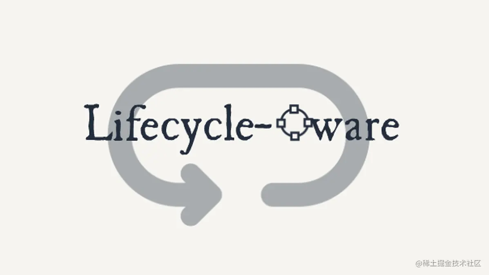
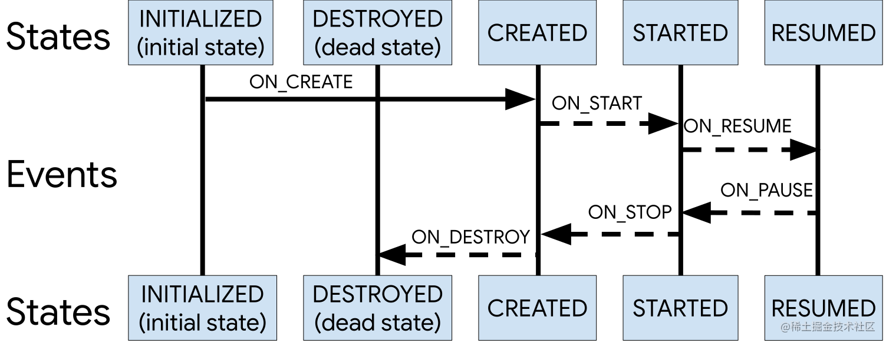

> 摘要：如何让原本不具备生命周期的 View 拥有和Activity/Fragment 一样的 Lifecycle？如何让代码具备生命周期感知能力？

在 Android 的世界里，很多组件都是具备生命周期的，比如 Activity、Fragment 等，在 Architecture Component 出来之前，我们都是通过 Activity/Fragment 的生命周期回调函数来在相应的生命周期里做相应的操作，比如注册监听、释放资源等等。

然而这种方式并不是那么优雅，原本 Activity/Fragment 应该只需要关心如何刷新 UI 以及把用户的交互行为事件发送给 ViewModel/Presenter 的，而不需要关系诸如生命周期结束如何释放资源等问题。

而 Android Jetpack 提供了一系列的 lifecycle-aware component (具备生命周期感知能力的组件) 正好解决了这个问题，可以把这些和生命周期相关的逻辑迁移到需要这些生命周期的组件本身，让彼此的职责更加清晰了。

举个例子：一个具备生命周期感知能力的 Listener 使用起来是这样的（以下是伪代码）

```kotlin
class MyActivity : Activity() {
	override fun onCreate(...) {
	// 将 Activity 生命周期传递给 Listener，当 Activity destroy 的时候
	// 这个 Listener 会自动和 Activity 取消绑定 
        listener = MyLocationListener(this) { location ->
            // update UI
        }
	// 不需要手动 removeListener
        addListener(listener)
    }
}
```
此处插入一个广告：一个只有 100 代码实现的具备生命周期感知能力的 EventBus —— [LifecycleEventBus](https://juejin.cn/post/6966584751977136141)


# 如何让代码实现具备生命周期感知能力

要实现上述那个具备生命周期感知能力的 Listener，首先我们得了解一下 Lifecycle 这个类

## **Lifecycle**

Lifecycle 是一个包含生命周期状态信息的类，允许其他的对象来监听它的生命周期状态；Lifecycle 主要有两个概念：事件（Event）和状态（State）

### Event

事件可以理解为一系列生命周期的回调函数，例如 Activity 中的 onCreate()\onResume()\onPause() 等等

### **State**

指当前组件的生命周期状态，比如 created\started\destroyed 等



## LifecycleObserver

LifecycleObserver 顾名思义是 Lifecycle 的监听者，也就是生命周期感知能力的获得者，我们可以在 Observer 中使用相应的注解方法来监听 Lifecycle 的状态变化，例如实现一个具备生命周期感知能力的 Listener

```kotlin
class LifecycleAwareListener(private val lifecycle: Lifecycle) : LifecycleObserver {
    
    init {
        lifecycle.addObserver(this)
    }

    fun onCallback() {

    }

    @OnLifecycleEvent(Lifecycle.Event.ON_DESTROY)
    fun onDestroy() {
        // release resource
    }
}
```

# 如何给 View 自定义生命周期

Activity 和 Fragment 默认已经实现了 Lifecycle，但是有些 View 并没有，举一个例子：如果我们想要在 RecyclerView 中的 ViewHolder 中使用生命周期感知能力的组件，譬如 LiveData 等，我们这里暂且定义 ViewHolder 的生命周期和其所绑定的 View 的生命周期保持一致 —— view attach 到 view detach。

在开始之前我们先来了解一下核心类 LifecycleOwner 和 LifecycleRegistry

## LifecycleOwner

这是一个特别简单的接口

```kotlin
public interface LifecycleOwner {
    /**
     * Returns the Lifecycle of the provider.
     *
     * @return The lifecycle of the provider.
     */
    @NonNull
    Lifecycle getLifecycle();
}
```

只有一个方法，返回一个 Lifecycle，这个接口定义一个类是具备生命周期的，返回的 Lifecycle 可供其他具有生命周期感知能力的组件（LifecycleObserver 的实现者）监听

## LifecycleRegistry

[LifecycleRegistry](https://developer.android.com/reference/androidx/lifecycle/LifecycleRegistry) 这是一个生命周期注册器，继承自 Lifecycle，LifecycleOwner 通过这个类来分发生命周期事件，并在 getLifecycle() 中返回，例如下面的代码：

```kotlin
class LifecycleViewHolder(itemView: View) : RecyclerView.ViewHolder(itemView), LifecycleOwner {

    private val lifecycleRegistry: LifecycleRegistry by lazy { LifecycleRegistry(this) }

    fun onCreate() {
        lifecycleRegistry.currentState = Lifecycle.State.CREATED
    }

    fun onDestroy() {
        lifecycleRegistry.currentState = Lifecycle.State.DESTROYED
    }

    override fun getLifecycle(): Lifecycle {
        return lifecycleRegistry
    }

}
```

这样一个具备了生命周期的 ViewHolder 就诞生了，但是 onCreate())\onDestroy() 这几个方法哪里调用呢？前面说到我们暂且可以定义 ViewHolder 的生命周期和其所绑定的 View 的生命周期保持一致

```kotlin
class LifecycleViewHolder(itemView: View) : RecyclerView.ViewHolder(itemView), LifecycleOwner {

    init {
        itemView.addOnAttachStateChangeListener(object : View.OnAttachStateChangeListener {
            // View onDetached 的时候回调 onDestroy()
            override fun onViewDetachedFromWindow(v: View?) {
                itemView.removeOnAttachStateChangeListener(this)
                onDestroy()
            }

            // View onAttached 的时候回调 onCreate()
            override fun onViewAttachedToWindow(v: View?) {
                onCreate()
            }
        })
    }

    private val lifecycleRegistry: LifecycleRegistry by lazy { LifecycleRegistry(this) }

    fun onCreate() {
        lifecycleRegistry.currentState = Lifecycle.State.CREATED
    }

    fun onDestroy() {
        lifecycleRegistry.currentState = Lifecycle.State.DESTROYED
    }

    override fun getLifecycle(): Lifecycle {
        return lifecycleRegistry
    }

}
```

然后在 ViewHolder 中就可以像 Activity 和 Fragment 一样使用 LiveData 等具备生命周期感知能力的组件了

```kotlin
class MyViewHolder(view: View, private val viewModel: MvvmViewModel) : LifecycleViewHolder(view) {

    override fun onCreate() {
        super.onCreate()
        viewModel.uiModel.observe(this, Observer {
            println(it.name)
        })
    }

}
```

---

**参考文章：**

[Handling Lifecycles with Lifecycle-Aware Components](https://developer.android.com/topic/libraries/architecture/lifecycle#lco)

**其他相关文章：**

[LiveData 的正确使用姿势以及反模式](https://juejin.cn/post/6955726530911666190) 

[使用 Architecture Component 实现 MVVM 的正确姿势](https://juejin.cn/post/6955724479506939935) 

[LiveData 非粘性消息的探索和尝试](https://juejin.cn/post/6955727941850365965)

[手把手教你如何用 100 行代码实现一个有生命周期感知能力的 EventBus](https://juejin.cn/post/6966584751977136141)