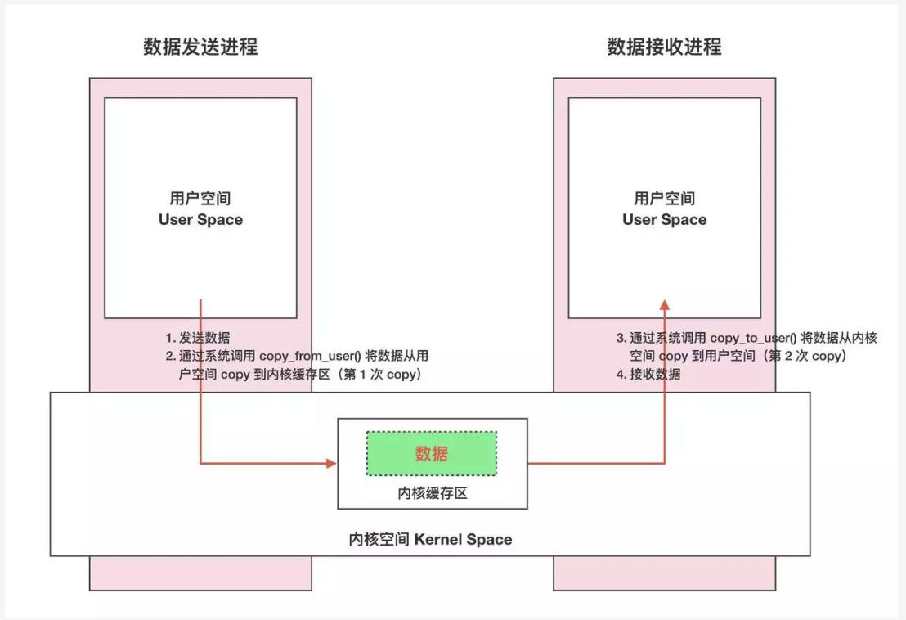
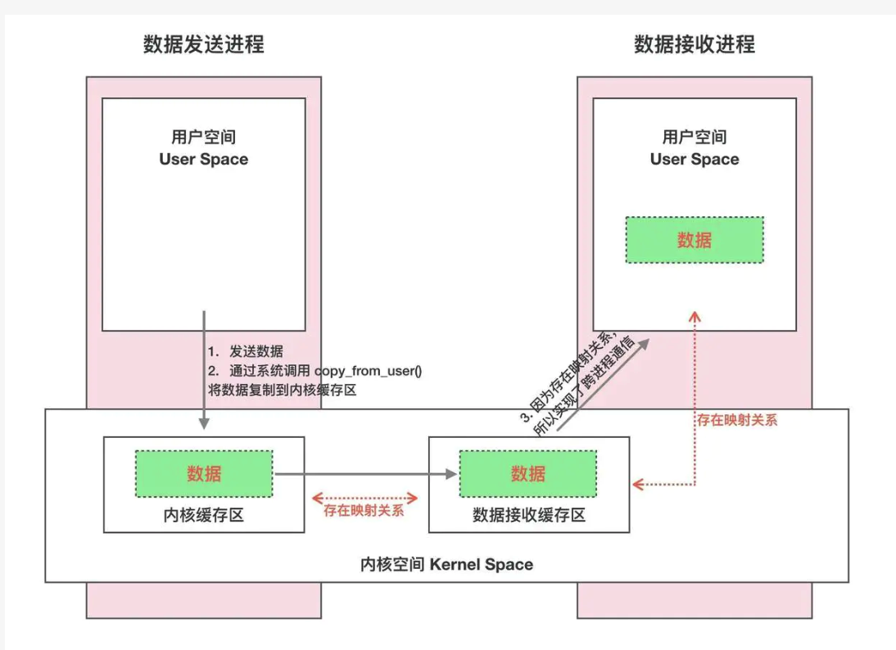
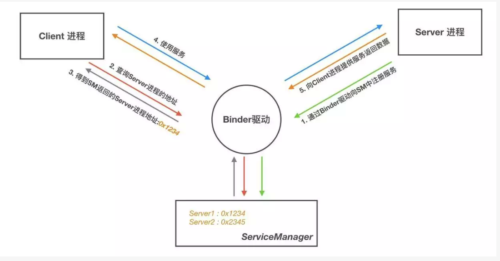
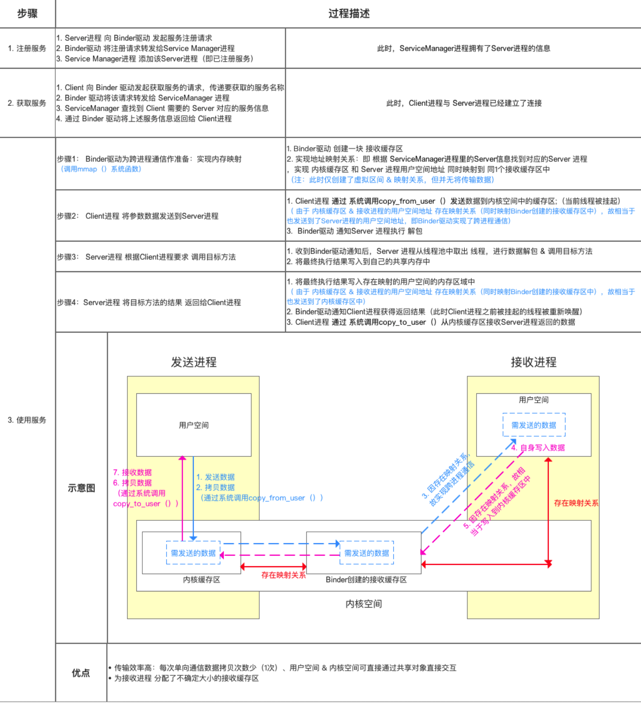
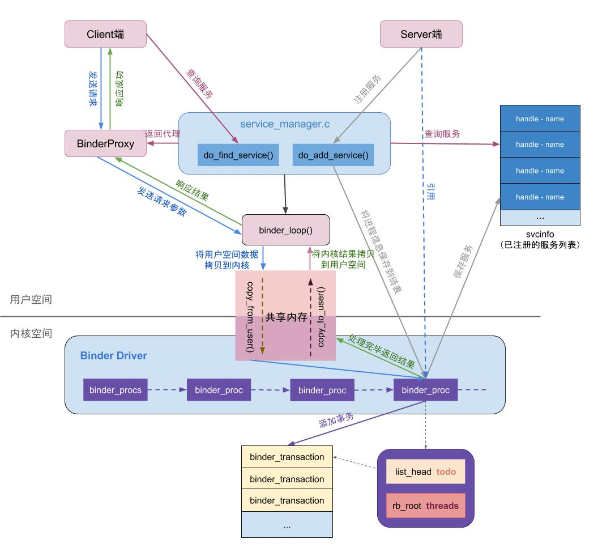
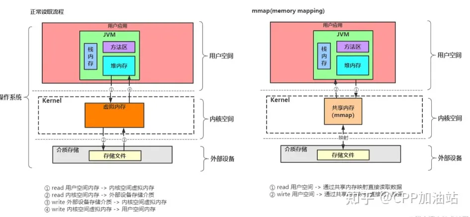

# Binder 机制

Binder 机制是 Android 特有的一种进程间通信（IPC）方式

### 1.1 Binder 机制的作用和原理？

- Linux系统将一个进程分为用户空间和内核空间。对于进程之间来说，用户空间的数据不可共享，内核空间的数据可共享，为了保证安全性和独立性，一个进程不能直接操作或者访问另一个进程，即 Android 的进程是相互独立、隔离的，这就需要跨进程之间的数据通信方式。

  

- 一次完整的 Binder IPC 通信过程通常是这样：

  - 首先 Binder 驱动在内核空间创建一个数据接收缓存区；
  - 接着在内核空间开辟一块内核缓存区，建立内核缓存区和内核中数据接收缓存区之间的映射关系，以及内核中数据接收缓存区和接收进程用户空间地址的映射关系；
  - 发送方进程通过系统调用 copyfromuser() 将数据 copy 到内核中的内核缓存区，由于内核缓存区和接收进程的用户空间存在内存映射，因此也就相当于把数据发送到了接收进程的用户空间，这样便完成了一次进程间的通信。

  

### 1.2 Binder 框架中 Client、Server、ServiceManager、Binder驱动 之间的关系和工作原理？

Binder 框架 是基于 C/S 架构的。由一系列的组件组成，包括 Client、Server、ServiceManager、Binder 驱动，其中 Client、Server、Service Manager 运行在用户空间，Binder 驱动运行在内核空间



- Server&Client：服务器&客户端。在 Binder 驱动和 Service Manager 提供的基础设施上，进行 Client-Server 之间的通信。
- ServiceManager（如同DNS域名服务器）服务的管理者，将 Binder 名字转换为 Client 中对该 Binder 的引用，使得 Client 可以通过 Binder 名字获得 Server 中 Binder 实体的引用。
- Binder 驱动（如同路由器）：负责进程之间 binder 通信的建立，传递，计数管理以及数据的传递交互等底层支持。



完整的过程如下



# 既然使用内存映射技术可以减少数据拷贝次数，为什么发送方进程不做内存映射？

发送方进程也做内存映射确实可以实现数据 0 拷贝传输，这就属于是以共享内存的方式进行 IPC 了。但是从以下两个角度来看，还是使用 Binder 的方式比较适合 Android

1. 从性能角度来看： Binder 的数据只要拷贝一次，性能仅次于共享内存，且 RPC 调用的数据通常较小，因此拷贝操作对性能的影响并不大。
2. 从稳定性和复杂性角度来看：Binder是基于C/S架构的，简单解释下C/S架构，是指客户端(Client)和服务端(Server)组成的架构，Client端有什么需求，直接发送给Server端去完成，架构清晰明朗，Server端与Client端相对独立，稳定性较好；而共享内存实现方式复杂，没有客户与服务端之别， 需要充分考虑到访问临界资源的并发同步问题，否则可能会出现死锁等问题

# mmap 内存映射原理？



mmap 是一种内存映射文件的方法，即将一个文件或者其它对象映射到进程的地址空间，实现文件磁盘地址和进程虚拟地址空间中一段虚拟地址的一一对映关系。实现这样的映射关系后，进程就可以采用指针的方式读写操作这一段内存，而系统会自动回写脏页面到对应的文件磁盘上，即完成了对文件的操作而不必再调用 read,write 等系统调用函数。相反，内核空间对这段区域的修改也直接反映用户空间，从而可以实现不同进程间的文件共享

# mmap 的内存映射原理是不是，进程的用户空间和内核空间有个映射，内核空间和外部存储介质也有一个映射？

`mmap` 系统调用的内存映射原理是在进程的用户空间和内核空间之间以及内核空间和外部存储介质之间建立映射关系。

以下是 `mmap` 内存映射的主要过程：

1. 进程调用 `mmap` 系统调用，请求将一个文件或其他外部存储介质映射到进程的用户空间内存。
2. 操作系统在内核空间中为请求的文件或存储介质分配一个内核缓冲区（页缓存），并将文件或存储介质的内容读取到该缓冲区。
3. 操作系统在进程的用户空间内存中分配一段虚拟地址空间，并将其与内核缓冲区建立映射关系。这样，进程可以通过虚拟地址访问内核缓冲区中的文件或存储介质内容。
4. 当进程访问映射的虚拟地址时，操作系统会将访问请求转发到内核缓冲区，并根据需要进行读写操作。这些操作可能涉及缓冲区的同步、写时复制（Copy-on-Write, COW）等内存管理策略。

通过 `mmap` 内存映射，进程可以将文件或其他外部存储介质的内容直接映射到用户空间内存，从而实现高效的数据访问和共享。这种映射机制避免了传统的文件 I/O 操作中的额外数据拷贝和内存分配，提高了 I/O 性能。同时，`mmap` 内存映射还可以用于进程间通信（IPC）、共享内存等场景，实现进程间的数据共享和同步。

# 进程间通信时 mmap 的内容映射只需要映射进程用户空间和内核空间吧，还需要映射外部存储介质吗？

在进程间通信（IPC）场景下使用 `mmap` 时，通常只需要在进程的用户空间和内核空间之间建立映射关系。不一定需要映射到外部存储介质，除非你希望将共享内存的内容持久化到磁盘上。

当使用 `mmap` 进行进程间通信时，通常会创建一个匿名内存映射（Anonymous Memory Mapping）。匿名内存映射不与任何文件关联，它只是在内核空间分配一段内存（页缓存），并在进程的用户空间与之建立映射关系。这样，多个进程可以共享同一段内核空间内存，实现数据共享和同步。

以下是一个使用匿名内存映射进行进程间通信的简单示例：

```c
#include <sys/mman.h>
#include <fcntl.h>
#include <unistd.h>
#include <stdio.h>
#include <string.h>

int main() {
    // 创建匿名内存映射
    void *addr = mmap(NULL, 4096, PROT_READ | PROT_WRITE, MAP_SHARED | MAP_ANONYMOUS, -1, 0);
    if (addr == MAP_FAILED) {
        perror("mmap");
        return 1;
    }

    // fork 子进程
    pid_t pid = fork();
    if (pid < 0) {
        perror("fork");
        return 1;
    } else if (pid == 0) {
        // 子进程：读取共享内存的内容
        printf("Child: Read from shared memory: %s\\\\n", (char *)addr);
    } else {
        // 父进程：写入共享内存
        strcpy((char *)addr, "Hello, mmap!");
        printf("Parent: Write to shared memory: %s\\\\n", (char *)addr);
    }

    // 释放内存映射
    munmap(addr, 4096);
    return 0;
}
```

在这个示例中，我们创建了一个匿名内存映射，并在父进程和子进程之间共享。父进程向共享内存写入数据，子进程从共享内存读取数据。这里的内存映射并没有映射到外部存储介质，只是在进程的用户空间和内核空间之间建立了映射关系。

当然，如果你希望将共享内存的内容持久化到磁盘上，可以使用文件映射（File-backed Mapping）来实现。在这种情况下，`mmap` 会在进程的用户空间、内核空间和外部存储介质之间建立映射关系。

# oneway 机制？

- 非 oneway 的 aidl 接口，调用方线程会被阻塞，直到被调用方进程返回为止
- oneway 的 aidl 接口，不会阻塞调用方线程，而是立即返回。在Android Framework 中 AMS 启动 Activity 时就是使用的 oneway 的方式，不会因为应用进程而阻塞了AMS进程的线程
- oneway 的还有一个特点，它是串行化的，binder 驱动内部有一个队列，会将它一个一个发送给接收进程

那么问题来了，oneway 的接口立即返回，怎么拿到被调用方进程的处理结果呢？

首先，如果我们不需要关注返回结果的，建议使用 oneway，如果需要返回结果，也可以用 oneway，有两种方式：

1. 注册监听，将 callback 也定义成 aidl 接口，然后通过注册方式向接收方进程传递，接收方进程拿到 callback，通过 binder 机制可以向发送方回调数据
2. 直接在定义方法的时候，传入 aidl 定义的 callback 接口，同上机制

但是要注意，通过单独注册监听的方式，如果需要反注册的话，接受方进程维护的监听列表，要使用 RemoteCallbackList 来存储。因为发送方的 callback 和接收方拿到的 callback 不是同一个对象，而 RemoteCallbackList 内部通过以 callback 对应的 binder 作为 key (虽然不是同一个对象，但是 binder 是同一个)，所以可以保证注册和反注册正常，同时 RemoteCallbackList 内部做了线程安全保障（注册和反注册都是`synchronized` 方法），不需要自己额外处理多线程问题

# Binder 通信的数据大小限制？

https://cloud.tencent.com/developer/article/1639706


Binder 调用中同步调用优先级大于 oneway（异步）的调用，为了充分满足同步调用的内存需要，所以将 oneway 调用的内存限制到申请内存上限的一半

Android系统 中大部分IPC场景是使用 Binder 作为通信方式，在进程创建的时候会为 Binder 创建一个1M 左右的缓冲区用于跨进程通信时的数据传输，如果超过这个上限就就会抛出这个异常，而且这个缓存区时当前进程内的所有线程共享的，线程最大数量为16个，如同时间内总传输大小超过了1M，也会抛异常。另外在Activity启动的场景比较特殊，因为Binder 的通信方式为两种，一种是异步通信，一种是同步通信，异步通信时数据缓冲区大小被设置为了原本的1半

# 关于 Binder 线程池的问题？

Binder 线程池是由 Android 系统自动创建和管理的。当一个进程需要使用 Binder IPC 通信时，系统会为该进程创建一个 Binder 线程池。线程池的创建和管理是在 Android 系统底层的 native 代码中实现的，主要涉及到 libbinder 库中的 C++ 代码。

在 Android 源码中，Binder 线程池的创建和管理主要位于以下路径的文件中：

```
frameworks/native/libs/binder/ProcessState.cpp
```

在这个文件中，`ProcessState` 类负责管理 Binder 线程池。当一个进程第一次使用 Binder IPC 通信时，`ProcessState` 会创建一个线程池并启动一定数量的 Binder 线程。线程池的大小可以通过 `ProcessState::setThreadPoolMaxThreadCount()` 方法进行设置，默认值是 16。

需要注意的是，这部分代码是 Android 系统底层的实现，通常情况下，开发者不需要直接修改这部分代码。在应用层，开发者只需关注如何使用 Binder IPC 进行通信即可。

# 客户端进程使用方法参数带 callback 的方式调用服务端进程提供的方法，那么这个方法的调用线程和 callback 的回调线程是同一个线程吗？

在 Android 的 Binder 通信中，客户端进程使用带有回调接口（Callback）的方法参数调用服务端进程提供的方法时，方法的调用线程和回调线程是否是同一个线程，取决于服务端的实现方式。

以下是一些可能的情况：

1. 如果服务端在收到客户端请求时，立即在当前线程中处理请求并调用回调接口，那么方法的调用线程和回调线程是同一个线程。这种情况下，客户端的调用可能会被阻塞，直到服务端处理完请求并调用回调接口。
2. 如果服务端在收到客户端请求时，将请求放入一个队列或线程池中异步处理，并在处理完成后调用回调接口，那么方法的调用线程和回调线程可能不是同一个线程。这种情况下，客户端的调用不会被阻塞，服务端可以并发处理多个请求。

一般来说，为了提高响应性能和避免客户端调用被阻塞，服务端通常会采用异步处理方式，将请求放入队列或线程池中处理，并在处理完成后调用回调接口。这样，方法的调用线程和回调线程可能不是同一个线程。

在实际应用中，需要根据具体需求和场景选择合适的线程模型，并确保回调接口的实现是线程安全的。

# 如果是 oneway 的接口，即使服务端立即在当前线程中处理请求并调用回调接口，客户端也不会阻塞吧？

是的，你说得对。如果在 AIDL 接口中使用 `oneway` 关键字，那么即使服务端立即在当前线程中处理请求并调用回调接口，客户端的调用也不会被阻塞。

`oneway` 关键字表示这是一个单向异步调用。在这种情况下，客户端在调用服务端的方法时，不会等待服务端的响应，而是立即返回。这意味着客户端的调用线程不会被阻塞，可以继续执行其他任务。

在实际应用中，`oneway` 关键字通常用于那些不需要返回结果或者可以通过回调接口返回结果的场景，例如通知、事件回调等。这样可以避免客户端调用被阻塞，提高程序的响应性能。然而，需要注意的是，由于 `oneway` 调用是异步的，客户端在调用完成后无法直接获取返回结果，需要通过其他方式（如回调接口或事件总线）来获取异步调用的结果。

# 有两个运行在同一个进程的 Activity A 和 B，A 启动 B，使用 intent 传递参数，这个时候 intent 的数据携带大小会受 Binder 同信的大小限制吗？

是的，因为这里涉及应用进程和 AMS 所在的 system_server 进程的 Binder IPC 通信息，所以 Intent 传递数据会受到 Binder 事务的大小限制。Binder 事务的缓冲区大小通常限制在 1MB 左右（具体大小可能因 Android 版本和设备而异），这意味着 Intent 携带的数据不能超过这个限制。如果超过这个限制，会抛出 TransactionTooLargeException 异常。

为了避免这个问题，可以考虑以下方法来传递较大数据：

1. 使用文件：将数据写入文件，然后通过 Intent 传递文件的 URI。在接收 Activity 中，使用该 URI 读取文件内容。
2. 使用全局变量或单例模式：将数据存储在全局变量或单例对象中，这样在不同的 Activity 之间可以直接访问。
3. 使用数据库或 SharedPreferences：将数据存储在数据库或 SharedPreferences 中，然后在需要的 Activity 中读取。
4. 对于较大的 Bitmap 图片，可以使用 LruCache 缓存机制来在不同的 Activity 之间共享。