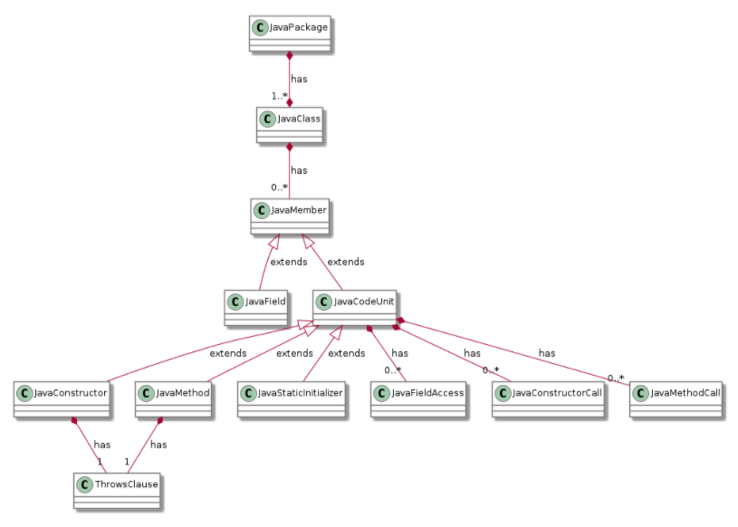
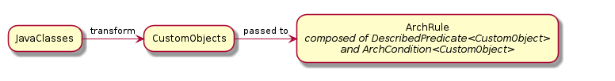

## 1. 为什么要对你的代码或者架构做自动化测试

在项目开发过程中，是否曾遇到过以下几个问题

- 你设计了一个类或者方法，你觉得自己已经封装得很不错了，但是你特别担心后人在修改你的代码的时候把你设计的框架 “改坏了”
- 你设计了一套命名规范或者编码规则，你希望后人严格按照你的规则来写代码
- 你设计了一个工程架构层级，你希望后人都按照你设计的层次来归置他们的业务代码

如果你遇到了以上几个问题，但你又不想通过人工 review 的方式来保证所有人的代码是否符合要求，那么这个时候你就需要一个自动化的工具来帮助你完成这些检查。

## 2. ArchUnit 是什么

[ArchUnit](https://www.archunit.org/) 是一个「检查 Java 代码结构和编码规则」的开源库。简单来说，它可以检查包、类、层级之间的依赖关系、检查循环依赖等等；它的核心原理是通过分析指定的 Java 字节码，来实现上述所有的代码结构检查

ArchUnit 可以配合 JUnit 使用，这样就可以像写单测一样，写一些规则，然后断言指定代码是否符合这些规则，当所有规则通过时，单测通过，否则单测失败，于是我们就可以借助一些 CI 工具来帮助我们自动化地对代码进行一些测试，可以有效地防止代码架构变坏，有效地保证架构、编码规则等稳定性

## 3. 如何通过 ArchUnit 来对你的代码做自动化测试

### 3.1 导入库

```gr
dependencies {
    testImplementation 'com.tngtech.archunit:archunit-junit4:0.14.1'
}
```

### 3.2 明确我们要测什么

ArchUnit 是一个单测工具，在写单测之前，我们必须明确，我们到底要测什么。ArchUnit 提供支持检测的类型有很多种

- 包之间的依赖关系
- 类之间的依赖关系
- 包和类之前的包含关系
- 继承关系
- 命名规则
- 注解
- 层级关系（layer）
- 循环依赖
- 等等...

### 3.3 怎么写一个 ArchUnit 单测

明确我们要测什么之后，就要开始真正编码的工作了

#### 3.3.1 一个超级简单的示例

这里我们举一个例子，比如我们要写一个规则「所有接口命名必须以 I 开头」

```kotlin
class ArchUnitTest {
    @Test
    fun entityFieldsRule() {
      	val importedClass = ClassFileImporter().importPath("/some/path")
        classes().that().areInterfaces().should().haveSimpleNameStartWith("I")
                .check(importedClass) // ArchUnit 提供了很多方便的 API 供我们使用
    }
}
```

这样一个简单的单测就写好了，当我们运行这个单测方法的时候，ArchUnit 会在我们指定的包名下扫面出所有的文件，当发现有一个接口命名不是以 I 开头的时候，这个单测方法就会失败，否则单测运行成功。

这个简单的例子带大家对 ArchUnit 有个大概的认识，接下来我们一步一步来看看，如果用 ArchUnit 写出我们想要的单测

#### 3.3.2 导入所要分析的类

我们可以通过 ArchUnit 提供的 `ClassFileImporter` 来导入类。前面说了 ArchUnit 的原理是分析 Java 字节码，`ClassFileImporter` 就是将 Java 字节码导入到一个叫 `JavaClasses` 的类里

```kotlin
val classes: JavaClasses = ClassFileImporter().importPath("/some/path")
```

`JavaClasses` 代表由指定路径下的字节码对应的 Java 类集合，我们可以通过其提供的 `get`等方法获取到指定类 `JavaClass`

```java
JavaClass clazz = classes.get(Object.class);
System.out.print(clazz.getSimpleName()); // returns 'Object'
```

`JavaClass` 就代表具体某一个类了，和 Java 中 `Class` 类似，我们可以通过 `JavaClass`来获取类里的所有属性和方法

#### 3.3.3 过滤某些文件

如果我们想要过滤掉某些文件，不让这些文件参与扫描怎么办呢，ArchUnit 提供了一个 `ImportOption`，我们可以按照自己的需求过滤掉一些文件不参与扫描

比如这样的话我们就可以过滤掉单测相关的代码

```kotlin
class ArchUnitIgnoreTest : ImportOption {
  override fun includes(location: Location?): Boolean {
    val testLocation = location?.contains("/debugUnitTest/") == true
    return !testLocation
  }
}

ClassFileImporter().importPath("/some/path").withImportOption(ArchUnitIgnoreTest())
```

#### 3.3.4 制定一个规则

ArchUnit 提供了一系列链式调用的方法，供我们对所导入的 class 进行一系列判断和约束，从而生成一条规则 —— `ArchRule`

在制定一条规则之前，我们要使用 `ArchRuleDefinition`来作为起始点

```java
ArchRule myRule = ArchRuleDefinition.classes()
    .that().resideInAPackage("..service..")
    .should().onlyBeAccessed().byAnyPackage("..controller..", "..service..");
```

上面这条规则的意思就是："首先我要针对类来制定规则，对于所有在 service 包下的类，只能被在 controller 包或者 service 包下的类所使用"

两个 `..` 的意思是：任意一个包名中包含了 `service` 的包，例如`com.myapp.service.any`

#### 3.3.5 对规则进行断言

```java
@Test
public void services_should_only_be_accessed_by_Controllers() {
    JavaClasses importedClasses = new ClassFileImporter().importPackages("com.mycompany.myapp");

    ArchRule myRule = classes()
        .that().resideInAPackage("..service..")
        .should().onlyBeAccessed().byAnyPackage("..controller..", "..service..");

    myRule.check(importedClasses);
}
```

#### 3.3.6 ArchUnit 支持 Junit

ArchUnit 对 JUnit 提供了支持，我们可以通过声明 `@RunWith(ArchUnitRunner::class)`(在 JUnit4 上) 来在 JUnit 上运行 ArchUnit，以及使用`@AnalyzeClasses`指定我们需要导入的 classes

这样上述例子就可以写成

```kotlin
@AnalyzeClasses(
        packages = ["/some/path"],
        importOptions = [ArchUnitIgnoreTest::class], // 过滤不想要测试的代码
        cacheMode = CacheMode.PER_CLASS 
)
@RunWith(ArchUnitRunner::class)
class ArchUnitTest {
    @ArchTest
    fun entityFieldsRule(importedClass: JavaClasses) {
        classes().that().areInterfaces().should().haveSimpleNameStartWith("I")
                .check(importedClass)
    }
}
```

使用这样的方式的好处是：

1. 自动缓存了已经导入的 classes，被缓存的 classes 可以被复用，不需要每次都重新导入
2. 减少模板代码

## 4. ArchUnit 核心 API 

想知道通过 ArchUnit 能够写出那些类型的单测，我们必须去了解 ArchUnit 的核心 API 设计。

ArchUnit 整体划分了三层 API，分别是 Core API、Lang API 和 Library API，下面我们逐层介绍一下

#### 4.1 Core API

提供核心能力，比如导入 Java 字节码并转换成 Java 对象，然后提供获取类方法或者属性的能力（类似 Java Reflection API），包含核心类和 API

看下核心类的结构



所以基本上上述类能够做到的事，能够获取到的字段，都可以作为单测测试的维度

#### 4.2 Lang API

Lang API 是对 Core layer API 的一层封装，在制定规则的时候，直接使用 Core API 不够方便，于是 Lang layer 提供了一系列强大且可扩展的 API，通过链式调用的形式，简介明了地帮助我们写出复杂的规则

```java
ArchRule rule =
    classes().that().resideInAPackage("..service..")
        .should().onlyBeAccessed().byAnyPackage("..controller..", "..service..");
```

大多数规则都是遵循以下模板的

```
classes that ${PREDICATE} should ${CONDITION}
```

意思就是，我们希望针对所有满足 `PREDICATE` 的类都遵循 `CONDITION` 条件，因此，我们可以自定义 `PREDICATE`和`CONDITION`来实现任何规则，例如

```java
DescribedPredicate<JavaClass> haveAFieldAnnotatedWithPayload =
    new DescribedPredicate<JavaClass>("have a field annotated with @Payload"){
        @Override
        public boolean apply(JavaClass input) {
            boolean someFieldAnnotatedWithPayload = // iterate fields and check for @Payload
            return someFieldAnnotatedWithPayload;
        }
    };

ArchCondition<JavaClass> onlyBeAccessedBySecuredMethods =
    new ArchCondition<JavaClass>("only be accessed by @Secured methods") {
        @Override
        public void check(JavaClass item, ConditionEvents events) {
            for (JavaMethodCall call : item.getMethodCallsToSelf()) {
                if (!call.getOrigin().isAnnotatedWith(Secured.class)) {
                    String message = String.format(
                        "Method %s is not @Secured", call.getOrigin().getFullName());
                    events.add(SimpleConditionEvent.violated(call, message));
                }
            }
        }
    };

classes().that(haveAFieldAnnotatedWithPayload).should(onlyBeAccessedBySecuredMethods);
```

如果在断言失败之后，会输出如下信息：

```java
classes that have a field annotated with @Payload should only be accessed by @Secured methods
```

##### 4.2.1 使用 `ClassesTransformer` 自定义检查类型

但是有时候我们可能并不局限于检查类、方法、或者包，我们可能会有需要检查任意一个自定义的类型的需求。任何一个通用的 API 不可能完全做到针对所有需求都开箱即用，因此 ArchUnit 将这种扩展能力提供给了我们，我们可以通过`ClassesTransformer`将 `JavaClasses` 转换成任意类型，然后传递给 ArchRule 去检测



```java
// how we map classes to business modules
ClassesTransformer<BusinessModule> businessModules = new ClassesTransformer<BusinessModule>("module") {
    @Override
    public Iterable<BusinessModule> doTransform(JavaClasses classes) {
        Set<BusinessModule> result = new HashSet<>();
    		// convert JavaClasses to BusinessModule
        return result;
    }
};

// filter business module dealing with orders
DescribedPredicate<BusinessModule> dealWithOrders = ...

// check that the actual business module is independent of payment
ArchCondition<BusinessModule> beIndependentOfPayment = ...

all(businessModules).that(dealWithOrders).should(beIndependentOfPayment);
```

##### 4.2.2 制定输出信息

我们可以自定义单测运行的输出信息，更加直观地看到规则断言失败的原因

```java
classes().that(haveAFieldAnnotatedWithPayload).should(onlyBeAccessedBySecuredMethods)
    .because("@Secured methods will be intercepted, checking for increased privileges " +
        "and obfuscating sensitive auditing information");

classes().that(haveAFieldAnnotatedWithPayload).should(onlyBeAccessedBySecuredMethods)
    .as("Payload may only be accessed in a secure way");
```

#### 4.2 Library API

Library API 提供在一些更高级的用法，注入层级（layer）依赖，循环依赖等检测

## 5. 其他实践

### 5.1 忽略某些违反规则的检查

我们可以在根目录下创建一个 `archunit_ignore_patterns.txt`文件，然后将我们想要忽略的错误信息通过正则匹配的方式添加到文件中即可，例如

```txt
.*some\.pkg\.LegacyService.*
```

这将忽略所有错误信息中包含 `some.pkg.LegacyService` 的违反规则的检查

### 5.2 缓存配置

使用 Junit 跑 ArchUnit 时，默认会将所有 import 进来的类缓存起来，这可能会导致堆内存占用过大，从而导致执行速度变慢，因此我们要视情况而定「是否需要缓存」或者「控制缓存的生命周期」

如果我们确定被导入的类只会在当前测试类被使用到，我们可以使用 `CacheMode.PER_CLASS`

```java
@AnalyzeClasses(packages = "com.myapp.special", cacheMode = CacheMode.PER_CLASS)
```

这样的话，这些类会在当前测试类运行期间被缓存，当当前测试类的所有单测跑完之后，这些缓存会被清除

### 5.3 忽略某些规则

使用 `@ArchIgnore` 注解

```java
public class ArchitectureTest {

    // will run
    @ArchTest
    public static final ArchRule rule1 = classes().should()...

    // won't run
    @ArchIgnore
    @ArchTest
    public static final ArchRule rule2 = classes().should()...
}
```

### 5.4 对规则进行分组

我们可以在单独的类里去声明某一类型的规则，然后在别的测试类中去使用这一组规则

```java
public class ServiceRules {
    @ArchTest
    public static final ArchRule ruleOne = ...

    // further rules
}

public class PersistenceRules {
    @ArchTest
    public static final ArchRule ruleOne = ...

    // further rules
}

@RunWith(ArchUnitRunner.class) // Remove this line for JUnit 5!!
@AnalyzeClasses
public class ArchitectureTest {

    @ArchTest
    public static final ArchRules serviceRules = ArchRules.in(ServiceRules.class);

    @ArchTest
    public static final ArchRules persistenceRules = ArchRules.in(PersistenceRules.class);

}
```

### 5.5 高级配置

我们可以在 `src/test/resources`目录下添加一个 `archunit.properties`文件来集中管理一些全局配置


